# M3 Cards

> **⚠️ Beta:** Dieses Projekt ist neu und befindet sich in aktiver
> Entwicklung. Konfigurationsoptionen können sich zwischen Versionen noch
> ändern — bitte Issues melden, wenn dir etwas auffällt.

Material-3-inspirierte, native Lovelace-Karten für Home Assistant — gebaut mit
TypeScript + [Lit](https://lit.dev), **ohne** Abhängigkeit zu `button-card`,
`card-mod`, `mod-card` oder `stack-in-card`. Ein einziges Bundle
(`m3-cards.js`) registriert **39 Karten**, alle in derselben Designsprache.

Neu hier? Fang mit der Kategorie an, die zu dem passt, was du zeigen willst —
jede Karte verlinkt weiter unten auf ihre ausführliche Dokumentation.

### 🔌 Energie & Strom

| Karte | Typ | Wozu |
| --- | --- | --- |
| [Energy](#m3-energy-card) | `m3-energy-card` | Balkendiagramm pro Tag/Stunde/Monat oder Solar-Tagesverlauf mit Prognose |
| [Cost](#m3-cost-card) | `m3-cost-card` | Kostenaufschlüsselung mit Hochrechnung, Vergleich und Tagesbalken |
| [Gauge](#m3-gauge-card) | `m3-gauge-card` | Halbrunde Anzeige für das Verhältnis zweier Größen |
| [Energy Flow](#m3-energy-flow-card) | `m3-energy-flow-card` | Flussdiagramm von Solar/Netz/Haus |
| [Power Summary](#m3-power-summary-card) | `m3-power-summary-card` | Netzbilanz, Verbrauch, Erzeugung, Autarkie |
| [Power List](#m3-power-list-card) | `m3-power-list-card` | Sortierte Liste von Leistungssensoren mit Schwelle und Anteilsbalken |
| [Top Consumers](#m3-top-consumers-card) | `m3-top-consumers-card` | Rangliste der größten Verbraucher, nach kWh oder Kosten |
| [Counter](#m3-counter-card) | `m3-counter-card` | Zählerstand als rollende Ziffernanzeige |

### 🌡️ Klima & Wetter

| Karte | Typ | Wozu |
| --- | --- | --- |
| [Climate](#m3-climate-card) | `m3-climate-card` | Vollsteuerung einer `climate`-Entität (Klima/Thermostat) |
| [Climate Mini](#m3-climate-card-mini) | `m3-climate-card-mini` | Kompakte Klima-Variante für schmale Layouts |
| [Climate Overview](#m3-climate-overview-card) | `m3-climate-overview-card` | Raum-für-Raum Temperatur/Feuchte, nach Bereich gruppiert |
| [Weather](#m3-weather-card) | `m3-weather-card` | Temperaturkurve, Niederschlagsbalken, Sonnenmarker |

### 💡 Licht, Medien & Steuerung

| Karte | Typ | Wozu |
| --- | --- | --- |
| [Light](#m3-light-card) | `m3-light-card` | Lichtsteuerung mit welligem Helligkeits-Slider, Farbtemperatur, Farbrad |
| [Media](#m3-media-card) | `m3-media-card` | Media-Player mit Cover-Farben, Wellen-Slidern und Bibliotheks-Browser |
| [Button](#m3-button-card) | `m3-button-card` | Generische Button-/Entity-Karte für jede Domain |
| [Cover](#m3-cover-card) | `m3-cover-card` | Rollläden/Jalousien, die sich den Gerätefähigkeiten anpassen, plus Gruppenmodus |
| [Lights Overview](#m3-lights-overview-card) | `m3-lights-overview-card` | Alle Leuchten nach Bereich gruppiert, mit getrennten Filtern für Anzeige und Schalten |
| [Chip Buttons](#m3-chip-buttons-card) | `m3-chip-buttons-card` | Eine Reihe kompakter Entitäts-Pillen, jede mit eigenen Aktionen |

### 🚪 Präsenz & Sicherheit

| Karte | Typ | Wozu |
| --- | --- | --- |
| [Presence](#m3-presence-card) | `m3-presence-card` | Wer ist zu Hause — Avatar-Raster für `person`/`device_tracker` |
| [Occupancy](#m3-occupancy-card) | `m3-occupancy-card` | Raum-für-Raum Präsenz mit Aktivitäts-Zeitleiste |
| [Leak](#m3-leak-card) | `m3-leak-card` | Wassermelder-Übersicht mit ruhigem OK und lautem Alarm + Absperrung |

### 🧺 Haushalt & Planung

| Karte | Typ | Wozu |
| --- | --- | --- |
| [Progress](#m3-progress-card) | `m3-progress-card` | Geräte-Fortschritt mit welligem Material-3-Indikator |
| [Supply](#m3-supply-card) | `m3-supply-card` | Vorräte: Restmenge, Reichweite, Nachfüllen per Tap |
| [Todo](#m3-todo-card) | `m3-todo-card` | Einkaufs- und Aufgabenlisten mit Schnell-Hinzufügen |
| [Waste](#m3-waste-card) | `m3-waste-card` | Abfuhrtermine mit Zwei-Wochen-Zeitleiste und Erinnerungs-Modus |
| [Time](#m3-time-card) | `m3-time-card` | Zeitauswahl für einen `input_datetime`-Helfer |
| [Clock](#m3-clock-card) | `m3-clock-card` | Uhr in fünf Stilen, von runden Kacheln bis zum organischen Zifferblatt |
| [Status](#m3-status-card) | `m3-status-card` | Große Zahlen, Texte und Ja/Nein-Zustände, mit einer Regelliste dahinter |
| [Heading](#m3-heading-card) | `m3-heading-card` | Abschnitts-Überschriften zwischen den Karten: schlicht, mit Status, als Trenner oder aufklappbar |
| [Nav](#m3-nav-card) | `m3-nav-card` | Eine Navigationsleiste fürs Dashboard, in fünf Varianten, mit ausziehbarer Schublade |
| [Group](#m3-group-card) | `m3-group-card` | Mehrere Karten auf einer gemeinsamen Fläche, damit sie als ein Block gelesen werden |
| [Room](#m3-room-card) | `m3-room-card` | Eine Karte je Bereich: alle gefundenen Gerätetypen, Klimawerte und Präsenz |
| [Humidifier](#m3-humidifier-card) | `m3-humidifier-card` | Zielfeuchte, Modus, Lüfterstufe und Zusatzfunktionen — auch ohne humidifier-Entität |
| [Calendar](#m3-calendar-card) | `m3-calendar-card` | Agenda und Monatsraster für beliebig viele Kalender |

### 🛠️ System & Wartung

| Karte | Typ | Wozu |
| --- | --- | --- |
| [Battery](#m3-battery-card) | `m3-battery-card` | Akkustände aller `device_class: battery`-Sensoren |
| [Updates](#m3-updates-card) | `m3-updates-card` | Alle verfügbaren Updates (Core, OS, Add-ons, HACS, Firmware) |
| [NAS](#m3-nas-card--m3-system-card) | `m3-nas-card` | NAS-Volumes, CPU, RAM, Netzwerk über Glances + Syncthing |
| [System](#m3-nas-card--m3-system-card) | `m3-system-card` | Dasselbe, gespeist vom System-Monitor |

### 🐠 Spezial

| Karte | Typ | Wozu |
| --- | --- | --- |
| [Aquarium](#m3-aquarium-card) | `m3-aquarium-card` | Aquarien-Geräte, Lichtbogen, Kamera und Wartung |

*Alle Karten auf einen Blick:*

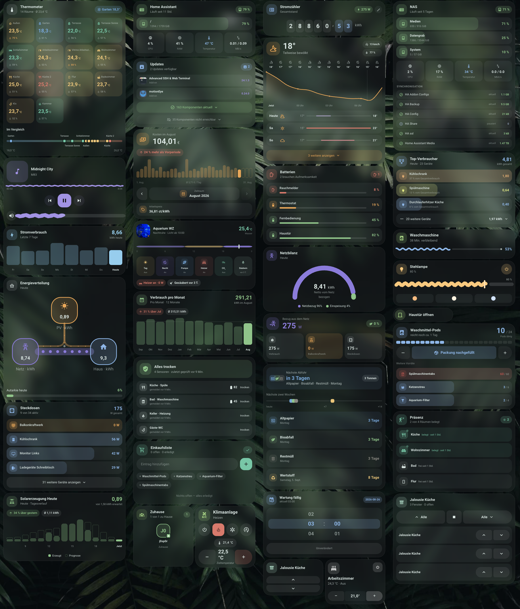

<sub>Aufgenommen auf einer echten Home-Assistant-Instanz. Waschmaschine,
Stehlampe, Lautsprecher, Klimaanlage und die Updates zeigen simulierte
Zustände, damit die aktiven Darstellungen (Wellenindikator, Versionssprung,
laufende Installation) im Bild sichtbar sind — alles andere sind
Live-Werte.</sub>

🇬🇧 [English README](README.md)

## Features

- Milchige Glas-Karte (frei abschaltbar für solide Themes), gemeinsame Design-Sprache
- Modus-Pills mit Shape-Morph-Animation (rund → abgerundetes Rechteck)
- Temperatur-Stepper mit Schrittweite/Grenzen aus der Entity
- Optionale externe Temperatur-/Feuchte-Sensoren, Fenster- und Batterie-Chip
- Preset-Unterstützung (Tap zum Durchschalten, wahlweise als eigene Zeile oder
  als Button in der Modus-Zeile)
- Konfigurierbare Kartenhöhe + volle Höhen-Anpassung an `horizontal-stack`/Grid-Layouts
  für exakt gleich hohe Kacheln nebeneinander
- Vollständiger, grafischer Editor (kein YAML nötig) — Vorbild: nativer Tile-Card-Editor,
  einheitliches Erscheinungsbild-Panel (Eckenradius-Presets, Ecken einzeln) auf allen Karten
- `unavailable`-Handling ohne Crash: Werte als „–“, Controls gedimmt
- Deutsch/Englisch lokalisiert (folgt `hass.locale.language`)
- Barrierefreiheit: alle interaktiven Elemente per Tastatur erreichbar
  (Tab/Enter/Leertaste) mit sichtbarem Fokusring und `aria-label`
- Respektiert `prefers-reduced-motion` durchgängig, zusätzlich pro Karte über
  `animation: auto | on | off` erzwingbar
- Alte Configs (z.B. `animations: true/false`) werden beim Laden automatisch
  auf das aktuelle Schema migriert — kein manuelles Nachpflegen nötig
- [Jinja2-Templates](#templates) in allen eigenen Textfeldern jeder Karte, live
  über den Websocket — kein Template-Sensor-Helfer pro Karte mehr

## Installation

### HACS (empfohlen)

[](https://my.home-assistant.io/redirect/hacs_repository/?owner=j0sp0r&repository=m3-cards&category=plugin)

Der Knopf öffnet das Repository direkt in deinem eigenen Home Assistant —
dort auf *Herunterladen* drücken, fertig. Von Hand geht es so:

1. HACS → Menü (⋮) oben rechts → *Benutzerdefinierte Repositories*
2. Repository-URL eintragen, als Typ **Dashboard** wählen, dann *Hinzufügen*
   (**nicht** *Integration* — das hier ist eine Lovelace-Karte, keine Integration)
3. „M3 Cards“ suchen, öffnen und auf *Herunterladen* klicken
4. Home Assistant neu laden

### Manuell

1. Lade die aktuelle `m3-cards.js` aus den [Releases](../../releases) herunter
2. Kopiere sie nach `config/www/m3-cards.js`
3. Füge die Ressource in Home Assistant hinzu:
   *Einstellungen → Dashboards → Ressourcen → Ressource hinzufügen*
   - URL: `/local/m3-cards.js`
   - Typ: JavaScript-Modul

## Templates

Jede Karte akzeptiert Jinja2 in **ihren eigenen Textfeldern** — Name, Icon,
Farbe, Einheit, was die jeweilige Karte eben aus ihrer Konfiguration liest. Ein
Feld gilt als Template, sobald es `{{` oder `{%` enthält; alles andere bleibt
unangetastet.

```yaml
type: custom:m3-button-card
entity: light.kitchen
name: "{{ states('sensor.kitchen_temperature') | round(1) }} °C"
icon: >-
  {{ 'mdi:lightbulb-on' if is_state('light.kitchen', 'on') else 'mdi:lightbulb' }}
```

Vorher konnte ein Feld nur ein fester Text oder der rohe Zustand einer Entität
sein. Für jede zusammengesetzte Beschriftung brauchte es einen
Template-Sensor-Helfer in der `configuration.yaml` — und ein Icon, das von einer
Entität abhängt, ließ sich überhaupt nicht ausdrücken:

```yaml
# configuration.yaml — einer davon pro Karte, jetzt nicht mehr nötig
template:
  - sensor:
      - name: Kitchen label
        state: "{{ states('sensor.kitchen_temperature') | round(1) }} °C"
```

Die Werte werden **gepusht**, nicht gepollt: Die Karte abonniert das Template
über den Websocket, und Home Assistant rendert es neu, sobald sich irgendetwas
ändert, das das Template liest. Ein Abo pro unterschiedlichem Template — zwei
Felder mit derselben Zeichenkette teilen sich eines —, und alle werden
geschlossen, sobald die Karte die Seite verlässt.

Eine Karte ohne Templates verhält sich exakt wie bisher und zahlt nichts dafür:
Es wird nichts durchlaufen, abonniert oder kopiert.

### Verschachtelte Karten bleiben unangetastet

Karten-Konfigurationen können andere Karten enthalten: `cards:` bei Gruppen- und
Raumkarte, der Inhalt eines Popup-Actions, eine Mushroom-Karte in einem Slot.
**Templates darin werden hier nicht gerendert** — sie gehen unverändert an die
Karte, der sie gehören.

```yaml
type: custom:m3-room-card
area: kitchen
name: "{{ states('sensor.kitchen_temperature') | round(1) }} °C"   # hier gerendert
cards:
  - type: custom:mushroom-template-card
    primary: "{{ states('sensor.kitchen_humidity') }} %"           # bleibt Mushroom
```

Der Grund: Die innere Karte rendert ihre Templates selbst, und zwar *live*.
Würde `primary` oben hier aufgelöst, bekäme Mushroom genau die eine Zeichenkette,
die zum Zeitpunkt der Konfiguration herauskam — das Feld würde auf diesem Wert
einfrieren und dem Sensor nie wieder folgen. Die Regel ist mechanisch: Der Durchlauf
stoppt an jedem verschachtelten Objekt mit eigenem `type`, denn so sieht eine
Karten-Konfiguration aus, egal für welche Karte.

Die Nav-Karte ist die Ausnahme in die andere Richtung: Ihre Einträge hatten
Templates schon vorher, mit `hidden` / `disabled` als Wahrheitswerte, und sie
funktionieren wie unter [M3 Nav Card](#m3-nav-card) beschrieben.

## M3 Climate Card

Karte über den Dashboard-Editor hinzufügen (Suche nach „M3 Climate Card“) oder
per YAML:

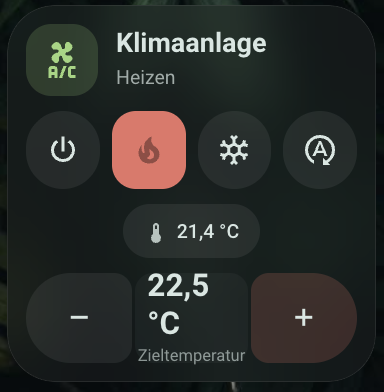
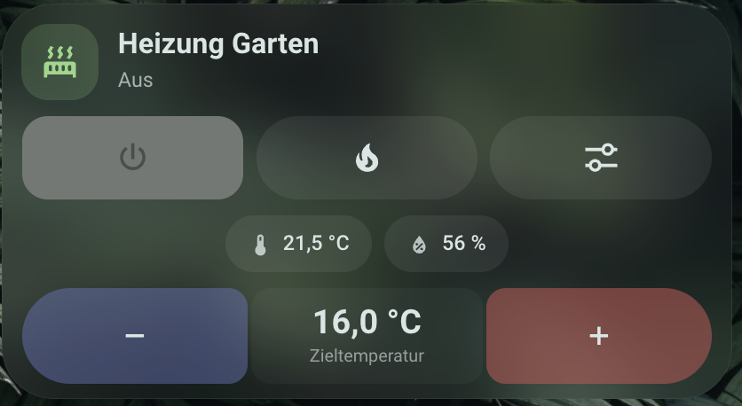

<details>
<summary>Konfiguration, Beispiele & Optionen</summary>

```yaml
type: custom:m3-climate-card
entity: climate.wohnzimmer
name: Wohnzimmer
show_presets: true
preset_style: chip # chip | pill
show_sensors: true
temperature_chip_placement: info_row # info_row | header
temperature_sensor: sensor.wohnzimmer_temperatur
humidity_sensor: sensor.wohnzimmer_luftfeuchte
window_sensor: binary_sensor.wohnzimmer_fenster
battery_sensor: sensor.thermostat_batterie
battery_threshold: 20
glass_background: true
hidden_modes: []
height: 380
mode_colors:
  heat: "#e57368"
  cool: "#6ba7dc"
```

### Räume einklappen

`collapsible: true` setzt einen Pfeil in die Kopfzeile und klappt die Karte
beim Antippen auf ebendiese zusammen. Der Untertitel bleibt stehen — „belegt ·
3 Geräte aktiv" ist genau das, was ein eingeklappter Raum noch sagen muss, und
ein Einklappen, das ihn versteckt, macht aus der Karte ein Etikett.

Der Zustand bleibt je Browser erhalten, oder geräteübergreifend in einem
`input_boolean` über `collapse_state_entity` — womit auch eine Automatisierung
das Gästezimmer einklappen kann, solange niemand darin ist.

```yaml
type: custom:m3-room-card
area: gaestezimmer
collapsible: true
default_collapsed: true
```

Eine `tap_action` auf der Kopfzeile übergibt diese der Aktion und blendet den
Pfeil aus, da die Kopfzeile dann nichts mehr einklappt — siehe „Die Kopfzeile
antippen".

### Konfigurationsoptionen

| Option | Typ | Standard | Beschreibung |
|---|---|---|---|
| `entity` | string | **Pflicht** | `climate.*`-Entity |
| `name` | string | `friendly_name` der Entity | Angezeigter Name |
| `icon` | string | `mdi:radiator` (nur Heizen) / `mdi:air-conditioner` | Header-Icon |
| `show_presets` | boolean | `true` | Preset-Auswahl anzeigen (falls Entity `preset_modes` unterstützt) |
| `preset_style` | `chip` \| `pill` | `chip` | Preset als eigene breite Zeile (`chip`) oder als zusätzlicher Button in der Modus-Zeile (`pill`) |
| `show_sensors` | boolean | `true` | Sensor-Chips (Temperatur/Feuchte) anzeigen |
| `temperature_chip_placement` | `info_row` \| `header` | `info_row` | Ist-Temperatur in der Sensor-Zeile oder als Chip oben rechts im Header |
| `temperature_sensor` | string | – | Externer Temperatursensor, überschreibt `current_temperature` |
| `humidity_sensor` | string | – | Externer Feuchtesensor, überschreibt `current_humidity` |
| `window_sensor` | string | – | `binary_sensor`, zeigt „Offen“-Chip bei `state: "on"` |
| `battery_sensor` | string | – | Sensor für Batteriestand |
| `battery_threshold` | number | `20` | Schwellwert (%), ab dem der Batterie-Chip erscheint |
| `hidden_modes` | string[] | `[]` | HVAC-Modi, die trotz Entity-Unterstützung nicht als Pill angezeigt werden |
| `glass_background` | boolean | `true` | Milchiger Glashintergrund (aus für solide Themes) |
| `animations` | boolean | `true` | Shape-Morph/Press-Animationen; `false` deaktiviert alle Übergänge |
| `unavailable_style` | `dimmed` \| `normal` \| `hidden` | `dimmed` | Anzeige, wenn die Entity im Zustand `unavailable`/`unknown` ist: `dimmed` (ausgegraut, nicht antippbar, wie bisher), `normal` (normale Darstellung, Modus-Pills/Stepper bleiben antippbar) oder `hidden` (Karte wird komplett ausgeblendet) |
| `height` | number (px) | – (automatisch) | Feste Mindesthöhe der Karte. Siehe [Gleich hohe Kacheln](#gleich-hohe-kacheln) |
| `radius` | number (px) | `32` | Eckenradius der Karte (Editor bietet Eckig/Leicht rund/Rund/Benutzerdefiniert) |
| `corners` | object | – | Optionaler Override je Ecke: `top_left`, `top_right`, `bottom_right`, `bottom_left` (px) — für asymmetrische Material-3-Expressive-Formen, überschreibt `radius` nur für die angegebenen Ecken |
| `mode_colors` | object | siehe unten | Farb-Override je HVAC-Modus. Editor zeigt Textfeld + Farb-Swatch; akzeptiert Hex/CSS **oder** HA-Farbnamen wie bei `color` der Button-Karte |
| `icon_active_color` | string | `var(--primary-color)` | Header-Icon-Farbe, wenn aktiv (nicht „Aus“) |
| `icon_inactive_color` | string | `var(--primary-color)` | Header-Icon-Farbe im Zustand „Aus“ |
| `plus_active_color` | string | Farbe des aktuellen Modus | Plus-Button-Farbe, wenn aktiv |
| `plus_inactive_color` | string | `mode_colors.off` | Plus-Button-Farbe im Zustand „Aus“ |
| `minus_active_color` | string | `var(--primary-text-color)` | Minus-Button-Farbe, wenn aktiv |
| `minus_inactive_color` | string | `var(--primary-text-color)` | Minus-Button-Farbe im Zustand „Aus“ |

Ohne eigene Angabe bleibt das Icon wie bisher immer in der Theme-Akzentfarbe
(`--primary-color`); Minus bleibt neutral. `icon_active_color` /
`icon_inactive_color` / `plus_active_color` / `plus_inactive_color` /
`minus_active_color` / `minus_inactive_color` erlauben eine komplett
unabhängige Farbe je Element und Zustand („Aus“ vs. aktiv).

#### Standard-Modusfarben

| Modus | Farbe |
|---|---|
| `off` | `#9e9e9e` |
| `heat` | `#e57368` |
| `cool` | `#6ba7dc` |
| `dry` | `#5dcaa5` |
| `auto` | `#5dcaa5` |
| `fan_only` | `#b8c4c9` |
| `heat_cool` | `#e5a768` |

### Gleich hohe Kacheln

Das native HA-Masonry-Dashboard gleicht die Höhe nebeneinanderliegender Karten
**nicht** automatisch an — jede Spalte wird unabhängig nach ihrem eigenen Inhalt
hoch. Zwei Optionen:

1. **`horizontal-stack` verwenden** (empfohlen, kein manueller Wert nötig): Karten
   in einem `horizontal-stack` werden von Home Assistant per Flexbox automatisch
   auf die Höhe der höchsten Karte gestreckt — die M3-Karten füllen diese Höhe
   vollständig aus (inkl. Stepper, der unten andockt):
   ```yaml
   type: horizontal-stack
   cards:
     - type: custom:m3-climate-card
       entity: climate.klimaanlage
     - type: custom:m3-climate-card
       entity: climate.wohnzimmer
   ```
2. **`height` manuell setzen**: falls kein `horizontal-stack` genutzt wird, kann
   pro Karte ein fester Pixelwert (`height: 380`) angegeben werden.

</details>

## M3 Climate Card Mini

Kompakte Companion-Karte zur großen Klimakarte: Icon-Kachel + Ein/Aus-Button
oben, Name + „Ist-Temperatur · Modus“ darunter, Minus/Zieltemperatur/Plus-Stepper
unten. Kein Preset-, Sensor- oder Modus-Zeilen-Support — dafür passen zwei
Kacheln bequem nebeneinander auf ein Handydisplay.

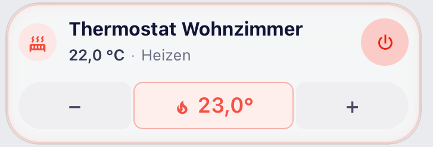

<details>
<summary>Konfiguration, Beispiele & Optionen</summary>

```yaml
type: custom:m3-climate-card-mini
entity: climate.schlafzimmer
name: Schlafzimmer
glass_background: true
mode_colors:
  heat: "#e57368"
  cool: "#6ba7dc"
```

### Konfigurationsoptionen

| Option | Typ | Standard | Beschreibung |
|---|---|---|---|
| `entity` | string | **Pflicht** | `climate.*`-Entity |
| `name` | string | `friendly_name` der Entity | Angezeigter Name |
| `icon` | string | `mdi:radiator` (nur Heizen) / `mdi:air-conditioner` | Icon in der Icon-Kachel |
| `glass_background` | boolean | `true` | Milchiger Glashintergrund (aus für solide Themes) |
| `animations` | boolean | `true` | Übergänge für Icon-Kachel/Ein-Aus-Button/Stepper; `false` deaktiviert sie |
| `unavailable_style` | `dimmed` \| `normal` \| `hidden` | `dimmed` | Anzeige, wenn die Entity im Zustand `unavailable`/`unknown` ist |
| `radius` | number (px) | `28` | Eckenradius der Karte (Editor bietet Eckig/Leicht rund/Rund/Benutzerdefiniert) |
| `corners` | object | – | Optionaler Override je Ecke: `top_left`, `top_right`, `bottom_right`, `bottom_left` (px) |
| `mode_colors` | object | siehe [Standard-Modusfarben](#standard-modusfarben) | Farb-Override je HVAC-Modus |
| `icon_active_color` | string | Farbe des aktuellen Modus | Icon-Farbe, wenn die Heizung/Klimaanlage aktiv (nicht „Aus“) ist |
| `icon_inactive_color` | string | `mode_colors.off` | Icon-Farbe im Zustand „Aus“ |
| `power_active_color` | string | Farbe des aktuellen Modus | Ein-Aus-Button-Farbe, wenn aktiv |
| `power_inactive_color` | string | `mode_colors.off` | Ein-Aus-Button-Farbe im Zustand „Aus“ |
| `plus_active_color` | string | Farbe des aktuellen Modus | Plus-Button-Farbe, wenn aktiv |
| `plus_inactive_color` | string | `mode_colors.off` | Plus-Button-Farbe im Zustand „Aus“ |
| `minus_active_color` | string | `var(--primary-text-color)` | Minus-Button-Farbe, wenn aktiv |
| `minus_inactive_color` | string | `var(--primary-text-color)` | Minus-Button-Farbe im Zustand „Aus“ |

Icon-, Ein-Aus-Button- und Plus-Farbe folgen standardmäßig den `mode_colors`
(inkl. „Aus“) und lassen sich damit schon allein über `mode_colors.off`
anpassen; Minus bleibt standardmäßig neutral. `icon_active_color` /
`icon_inactive_color` / `power_active_color` / `power_inactive_color` /
`plus_active_color` / `plus_inactive_color` / `minus_active_color` /
`minus_inactive_color` erlauben zusätzlich eine komplett unabhängige Farbe je
Element und Zustand.

Der Ein/Aus-Button ruft `homeassistant.toggle` auf die Entity auf. Ein Tap auf
die Icon-Kachel, den Namen/Status oder die Zieltemperatur-Anzeige öffnet den
More-Info-Dialog.

</details>

## M3 Button Card

Generische Karte für Entities außerhalb von `climate` (Buttons, Schalter,
Lichter, Szenen, Türsensoren, ...) im selben Design.

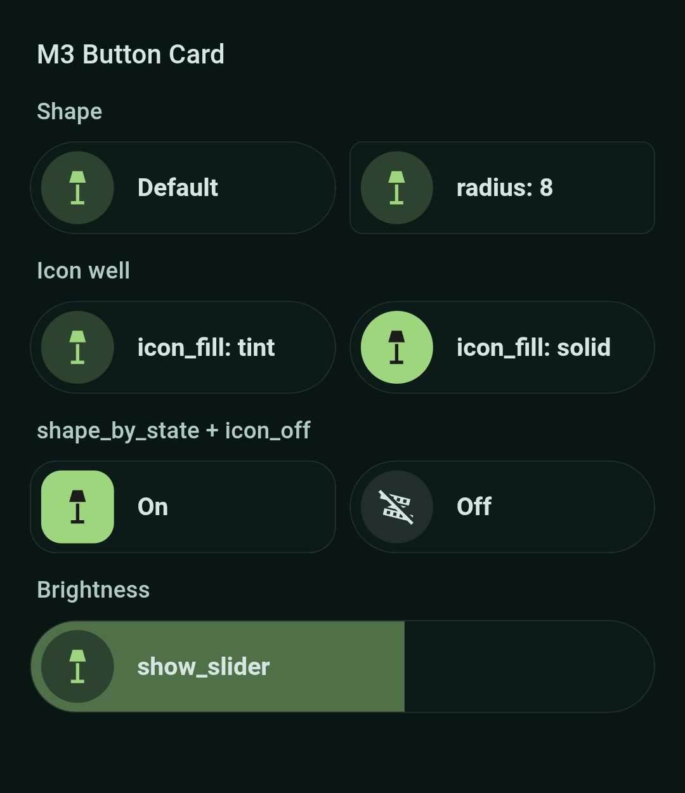

<details>
<summary>Konfiguration, Beispiele & Optionen</summary>

```yaml
type: custom:m3-button-card
entity: button.hausflur_tur_offnen
name: Haustür öffnen
icon: mdi:door
color: dark-grey
state_colors:
  open: red
  locked: green
show_state: false
show_icon_background: true
show_slider: false
vertical: false
radius: 28
glass_background: true
tap_action:
  action: toggle
hold_action:
  action: more-info
```

### Konfigurationsoptionen

| Option | Typ | Standard | Beschreibung |
|---|---|---|---|
| `entity` | string | – (optional) | Beliebige Entity — auch `automation.*`, `script.*`, `scene.*`. Kann leer gelassen werden für einen reinen Aktions-Button ohne Entity-Zustand (siehe unten) |
| `name` | string | `friendly_name` der Entity | Angezeigter Name |
| `icon` | string | Entity-Icon, sonst HA-Standardicon für die Domain/`device_class` | Icon. Ohne Angabe wird — wie bei der nativen Tile-Karte — automatisch das von HA berechnete Standardicon verwendet (z.B. Thermometer für `device_class: temperature`), nicht nur das explizit auf der Entity gesetzte Icon |
| `color` | string | `primary` (übernimmt die Theme-Akzentfarbe von HA) | HA-Farbname (`red`, `dark-grey`, `deep-orange`, ...) **oder** beliebige CSS-Farbe (`#hex`, `rgb(...)`) für Icon/Hintergrund im **ein-/aktiven** Zustand |
| `inactive_color` | string | – (Standard-Theme-Grau) | Farbe für Icon/Hintergrund im **aus-/inaktiven** Zustand, gleiches Format wie `color`. Wird auch verwendet, wenn `static_color: true` gesetzt ist |
| `invert_colors` | boolean | `false` | Vertauscht `color` und `inactive_color` (bzw. deren Standardwerte), ohne dass eigene Farben angegeben werden müssen — z.B. um schnell "hell im Aus-Zustand, Akzentfarbe im An-Zustand" in "Akzentfarbe im Aus-Zustand, hell im An-Zustand" umzudrehen |
| `state_colors` | object | – | Farb-Override je Entity-Zustand (z.B. `open`, `locked`), überschreibt `color` nur für diesen Zustand. Editor bietet die gängigsten Zustände als Felder an; per YAML ist jeder beliebige Zustandsname möglich |
| `static_color` | boolean | `false` | Icon/Hintergrund immer in der Farbe von `inactive_color` (bzw. Standard-Grau) anzeigen, unabhängig vom Entity-Zustand — z.B. für Geräte, die dauerhaft an sind und optisch nicht "aktiv" hervorgehoben werden sollen. Mit `inactive_color` frei wählbar |
| `unavailable_style` | `dimmed` \| `normal` \| `hidden` | `dimmed` | Anzeige, wenn die Entity im Zustand `unavailable` ist: `dimmed` (ausgegraut, nicht antippbar, wie bisher), `normal` (normale Darstellung, weiterhin antippbar — z.B. damit `hold_action: more-info` zur Diagnose nutzbar bleibt) oder `hidden` (Karte wird komplett ausgeblendet) |
| `show_state` | boolean | `true` | Statuszeile unter dem Namen anzeigen |
| `state_content` | `state` \| `last_changed` \| `last_updated` | `state` | Inhalt der Statuszeile: der Entity-Zustand selbst, oder eine relative Zeitangabe seit der letzten Zustandsänderung bzw. dem letzten Update (z.B. „vor 3 Stunden“) |
| `show_icon_background` | boolean | `true` | Farbiger Kreis hinter dem Icon |
| `icon_size` | number (px) | – (automatisch, skaliert mit Kartenhöhe) | Feste Icon-Größe unabhängig von der Kartenhöhe, damit unterschiedlich hohe Buttons (z.B. `rows: 1` vs. `rows: 2`) optisch gleich große Icons haben |
| `align_icons` | boolean | `false` | Icons unabhängig von der Kartenhöhe am gleichen Abstand vom linken Rand ausrichten — nützlich in Kombination mit `icon_size`, damit übereinander liegende Karten unterschiedlicher Höhe optisch exakt fluchten. Die vertikale Zentrierung bleibt unverändert |
| `show_slider` | boolean | `false` | Schieberegler unter dem Icon/Text anzeigen — nur wirksam bei `light` (Helligkeit), `cover` (Position), `fan` (Stufe), `input_number`/`number` (Wert) |
| `vertical` | boolean | `false` | Icon über statt neben dem Text |
| `shape_by_state` | `false` | Lässt den Umriss dem Zustand folgen: Kapsel im Aus, konfigurierter Eckenradius im An, das Icon-Feld vom Kreis zum abgerundeten Quadrat. Animiert |
| `icon_off` | – | Icon im Aus-Zustand, für Symbole mit durchgestrichenem Gegenstück (`mdi:power-plug` / `mdi:power-plug-off`). Ohne Angabe gilt `icon` |
| `icon_fill` | `tint` | `tint` ist eine zarte Fläche mit farbiger Glyphe; `solid` füllt die Fläche mit der Akzentfarbe und dunkelt die Glyphe ab — die lautere Kombination, die Handy-Schnelleinstellungen verwenden |
| `radius` | number (px) | `28` | Eckenradius der Karte. Im Editor als Voreinstellung („Eckig“ 8px / „Leicht rund“ 16px / „Rund“ 28px) oder frei wählbar |
| `corners` | object | – | Optionaler Override je Ecke: `top_left`, `top_right`, `bottom_right`, `bottom_left` (px) — für asymmetrische Material-3-Expressive-Formen wie z.B. ein Button mit nur einer runden Seite |
| `glass_background` | boolean | `true` | Milchiger Glashintergrund |
| `animations` | boolean | `true` | Press-Animation (leichtes Einsinken beim Antippen); `false` deaktiviert alle Übergänge |
| `tap_action` | Action | domänenabhängig | Ohne Angabe automatisch sinnvoll gewählt: `automation.trigger`/`script.turn_on`/`scene.turn_on`/`button.press` für die jeweilige Domain, `toggle` für Licht/Schalter/etc., sonst `more-info` |
| `hold_action` | Action | `more-info` | Aktion bei langem Drücken (auf der ganzen Kachel) — wie bei der nativen Tile-Karte |
| `double_tap_action` | Action | `none` | Aktion bei Doppeltipp (auf der ganzen Kachel) |
| `icon_tap_action` | Action | `more-info` | Eigene Tap-Aktion nur für das Icon/den Icon-Kreis, unabhängig von `tap_action` — wie bei der nativen Tile-Karte |
| `icon_hold_action` | Action | `none` | Aktion bei langem Drücken auf das Icon |
| `icon_double_tap_action` | Action | `none` | Aktion bei Doppeltipp auf das Icon |

Aktive Zustände (`on`, `open`, `home`, `playing`, ...) färben Icon und
Icon-Hintergrund in der konfigurierten `color` (oder dem passenden
`state_colors`-Override); Entities ohne dauerhaften Zustand (`button`,
`script`, `scene`) sind immer eingefärbt.

Automatisierungen/Skripte/Szenen auslösen funktioniert wie jede andere
Entity — `entity: automation.guten_morgen` reicht bereits, ein Tap löst die
Automatisierung dank des domänenabhängigen Standard-`tap_action` direkt aus
(kein manuelles `call-service` nötig, es sei denn du willst etwas anderes).

#### Reiner Aktions-Button (ohne Entity)

`entity` kann komplett weggelassen werden, wenn die Karte nur eine Aktion
auslösen soll (z.B. ein Skript/eine Automatisierung starten) und kein
Entity-Zustand angezeigt werden muss. Ohne `entity` wird kein Status-Text
angezeigt und das Icon ist immer eingefärbt (wie bei `button`/`script`):

```yaml
type: custom:m3-button-card
name: Katze füttern
icon: mdi:cat
color: dark-grey
tap_action:
  action: perform-action
  perform_action: script.futterung_10g
  target: {}
```

</details>

## M3 Progress Card

Fortschrittskarte für Haushaltsgeräte mit Status/Prozent/Restzeit-Sensoren
(Waschmaschine, Trockner, Spülmaschine, 3D-Drucker, ...). Der Fortschrittsbalken
ist ein Material-3-Expressive-„Wavy“-Indikator: ein wellenförmiger, animierter
aktiver Teil, eine Lücke, ein flacher Track und ein Endpunkt-Dot.

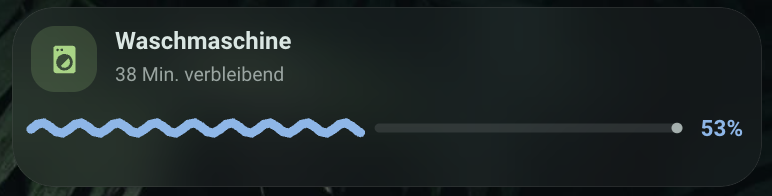

<details>
<summary>Konfiguration, Beispiele & Optionen</summary>

```yaml
type: custom:m3-progress-card
entity: sensor.waschmaschine_vorgangsstatus
percentage_entity: sensor.waschmaschine_fortschritt_prozent
remaining_entity: sensor.waschmaschine_verbleibende_minuten
name: Waschmaschine
icon: mdi:washing-machine
glass_background: true
```

### Status-Logik

Der Status-Sensor wird (Groß-/Kleinschreibung ignorierend) einer von vier
Kategorien zugeordnet, jeweils mit eigenem Statustext:

| Kategorie | Standard-Statuswerte | Standard-Statustext | Balken |
|---|---|---|---|
| Läuft | `wash`, `waschen`, `spin`, `schleudern`, `rinse`, `spülen` | „{remaining} Min. verbleibend“ | animierte Welle |
| Vorbereitung | `beladungserkennung` | „Erkenne Beladung…“ | animierte Welle (auch ohne Prozentwert: „Indeterminate“-Segment pendelt über den Track) |
| Fertig | `end`, `beenden` | „Fertig! Wäsche ist sauber.“ | Balken auf 100 %, Welle läuft zu einer geraden Linie aus |
| Bereit (alle anderen Werte) | – | „Bereit“ | ausgeblendet, Karte kollabiert auf Header-Höhe |

Die Statuswerte-Listen sind über `running_states` / `preparing_states` /
`done_states` frei konfigurierbar; `{remaining}` im Statustext wird durch den
Wert von `remaining_entity` ersetzt (fehlt der Sensor, entfällt nur die
Minutenangabe, kein Crash). `percentage_entity`/`remaining_entity` sind
optional — ohne `percentage_entity` läuft der Balken im „Vorbereitung“-Zustand
als Indeterminate-Animation.

### Konfigurationsoptionen

| Option | Typ | Standard | Beschreibung |
|---|---|---|---|
| `entity` | string | **Pflicht** | Status-Sensor |
| `percentage_entity` | string | – | Sensor mit Fortschritt in Prozent (0–100) |
| `remaining_entity` | string | – | Sensor mit Restzeit in Minuten |
| `name` | string | `friendly_name` der Entity | Angezeigter Name |
| `icon` | string | `mdi:washing-machine` | Icon in der Icon-Kachel |
| `status_text_running` / `_preparing` / `_done` / `_ready` | string | siehe Tabelle oben | Statustext je Kategorie; `{remaining}` als Platzhalter in `status_text_running` |
| `running_states` / `preparing_states` / `done_states` | string[] | siehe Tabelle oben | Statuswerte je Kategorie (Groß-/Kleinschreibung egal) |
| `animation` | `auto` \| `on` \| `off` | `auto` | `auto`/`on` respektieren `prefers-reduced-motion` des Systems (dann statische Linie); `off` deaktiviert die Animation immer |
| `wave_style` | `wavy` \| `flat` | `wavy` | Nur bei `animation: off` — eingefrorene Welle oder gerade Linie; zeigt in beiden Fällen weiterhin Füllstand/Lücke/Dot |
| `hide_when_ready` | boolean | `false` | Ganze Karte ausblenden im Zustand „Bereit“ (statt nur den Balken) |
| `glass_background` | boolean | `true` | Milchiger Glashintergrund (aus für solide Themes) |
| `radius` | number (px) | `28` | Eckenradius der Karte |
| `corners` | object | – | Optionaler Override je Ecke: `top_left`, `top_right`, `bottom_right`, `bottom_left` (px) |

#### Farben

Alle Farben sind optional; nicht gesetzte Felder folgen dem Theme. Intern als
CSS Custom Properties (`--m3p-accent`, `--m3p-track`, `--m3p-dot`, …) auf der
Karte hinterlegt — damit lassen sie sich bei Bedarf zusätzlich per `card-mod`
oder Theme überschreiben.

| Option | Standard | Beschreibung |
|---|---|---|
| `accent_color` | `#85b7eb` | Welle, Prozentzahl, Icon |
| `track_color` | 12 % `--primary-text-color` | Flacher Track |
| `dot_color` | 70 % `--primary-text-color` | Endpunkt-Dot |
| `icon_color` | Akzentfarbe | Icon-Farbe |
| `icon_background` | 18 % Icon-Farbe | Icon-Kachel-Hintergrund |
| `text_color` | `--primary-text-color` | Name |
| `secondary_text_color` | `--primary-text-color` | Statuszeile |
| `card_background` | wie Glas-/Solid-Hintergrund | Kartenhintergrund |
| `state_colors.running` / `.preparing` / `.done` | – | Überschreibt `accent_color` nur für diese Kategorie (z.B. Grün bei „Fertig“) |

```yaml
type: custom:m3-progress-card
entity: sensor.waschmaschine_vorgangsstatus
percentage_entity: sensor.waschmaschine_fortschritt_prozent
remaining_entity: sensor.waschmaschine_verbleibende_minuten
state_colors:
  done: green
```

</details>

## M3 Energy Card

Balkendiagramm für Energiewerte (Solarerzeugung, Verbrauch, ...). Über `mode`
gibt es zwei grundsätzlich verschiedene Darstellungen:

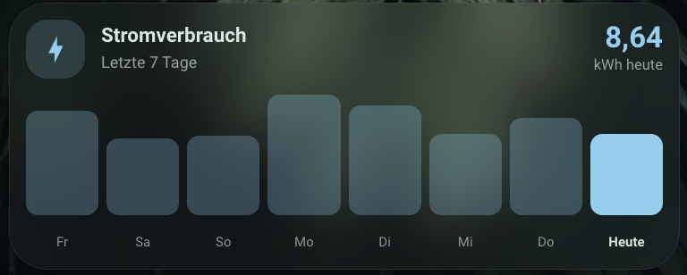

- **`mode: consumption`** (Standard) — Balken pro Tag oder pro Stunde für
  eine einzelne Entity, siehe `period` unten.
- **`mode: solar`** — Tagesverlauf der Solarerzeugung inkl. Prognose, siehe
  eigener Abschnitt weiter unten.

`mode: consumption` ist nicht auf Strom beschränkt — Einheit und Icon werden
von der Entity übernommen (Icon automatisch anhand `device_class`: `gas` →
Flamme, `water` → Wassertropfen, sonst Blitz, außer explizit über `icon`
gesetzt), daher eignet sich der Modus genauso für Gas- oder Wasserzähler.

<details>
<summary>Konfiguration, Beispiele & Optionen</summary>

### `mode: consumption` — Zeiträume über `period`

- **`period: day`** (Standard) — die letzten N Tage als Balken plus den
  heutigen Wert prominent im Header, live aus dem aktuellen Entity-State.
- **`period: hour`** — die letzten N Stunden des heutigen Tages plus die
  laufende Stunde, mit Wertezeile über den Balken.
- **`period: month`** — die letzten N Monate (rollierend, inkl. laufendem
  Monat) mit Hochrechnung, Durchschnittslinie und Vergleichs-Chips, siehe
  eigener Abschnitt weiter unten.

```yaml
type: custom:m3-energy-card
entity: sensor.solarertrag_gesamt_daily
name: Solarerzeugung
icon: mdi:solar-power
accent_color: "#66bb6a"
period: day
days: 7
```

```yaml
type: custom:m3-energy-card
entity: sensor.netzverbrauch_stundlich
name: Verbrauch pro Stunde
icon: mdi:lightning-bolt
period: hour
hours: 6
```

### Datenbeschaffung

Die vergangenen Tage/Stunden/Monate werden primär über HA-Langzeitstatistiken
(`recorder/statistics_during_period`, konfigurierbar über `statistic_type`)
geladen:

- `state` (Standard bei `period: day`/`hour`) — der letzte Rohwert des
  Zeitraums, passend für Zähler-Sensoren, die periodisch zurückgesetzt werden
  (z.B. `*_daily`/`*_hourly`-Sensoren wie bei Shelly). Entspricht dem, was
  ein `mini-graph-card` mit `aggregate_func: max` anzeigen würde.
- `change` — die Differenz innerhalb des Zeitraums, passend für einen nie
  zurückgesetzten Gesamtzähler. **Default bei `period: month`**: selbst ein
  täglich zurücksetzender Zähler braucht hier `change`, weil sein `state` bei
  Monats-Granularität nur den Wert des letzten Tages im Monat liefert (ein
  paar kWh), nicht die Monatssumme — `change` akkumuliert dagegen korrekt
  über alle Tages-Resets hinweg.

Hat die Entity keine Langzeitstatistik, greift bei `period: day`/`hour`
automatisch ein History-API-Fallback (Werte per Maximum pro Tag/Stunde
verdichtet). Bei `period: month` gibt es keinen Fallback (eine monatsweise
History-Abfrage wäre unpraktikabel groß) — stattdessen zeigt die Karte eine
klare Meldung. Ob eine Entity Langzeitstatistiken hat, lässt sich unter
**Entwicklerwerkzeuge → Statistik** prüfen — der Editor zeigt bei
`period: day`/`hour` zusätzlich einen Hinweis, falls nicht. Der laufende Tag/
die laufende Stunde/der laufende Monat wird stets live (bzw. bei `change`
über eine Kurzzeit-Statistik-Summe seit Periodenbeginn) berechnet, nicht aus
der Langzeitstatistik, da diese Periode noch nicht abgeschlossen ist. Die
Daten werden im Tages-Modus alle 15 Minuten, im Stunden-Modus alle 5 Minuten
und im Monats-Modus stündlich aktualisiert.

Fenster und Türen bekommen einen eigenen Chip: jeder `binary_sensor` im Bereich
mit device_class `window`, `door`, `garage_door` oder `opening`. Er erscheint,
sobald es einen solchen Sensor gibt — auch wenn alles zu ist, denn „alles
geschlossen" ist die Hälfte der Antwort, die man auf dem Weg aus dem Haus
sucht — und wird bernsteinfarben mit Anzahl, sobald etwas offen steht.
`window_entities` überschreibt die Erkennung, was öfter nötig ist als gedacht:
Fenstersensoren sind häufig keinem Bereich zugeordnet, und was nirgends
einsortiert ist, kann nicht gefunden werden.

### Interaktion

Tap auf einen Balken zeigt kurz eine Wert-Bubble mit dem Wert (morpht dabei
leicht: Eckenradius 9→6px, Aufhellung); Tap auf den Header öffnet die
More-Info-Ansicht der Entity. Beim ersten Rendern wachsen die Balken gestaffelt
(30ms pro Balken) auf ihre Zielhöhe ein — respektiert die `animation`-Option
und `prefers-reduced-motion`. Im Stunden-Modus wird bei mehr als 12 Balken
(z.B. `hours: 24`) die Wertezeile automatisch ausgeblendet und nur noch jedes
zweite Stunden-Label angezeigt, damit es nicht zu eng wird.

### `period: month` — Hochrechnung, Vergleich, Durchschnitt

```yaml
type: custom:m3-energy-card
entity: sensor.netzverbrauch_taeglich
name: Verbrauch pro Monat
icon: mdi:calendar-month
period: month
months: 12
```

- **Hochrechnung**: der laufende Monat wird als gefüllter Ist-Balken plus
  gestricheltem Umriss dargestellt — der Umriss zeigt, wo der Monat bei
  gleichbleibendem Tagesdurchschnitt landen würde (`Ist-Wert ÷ verstrichene
  Tage × Tage im Monat`). Abschaltbar über `show_projection: false`.
- **Durchschnittslinie**: gestrichelte waagerechte Linie auf Höhe des
  Mittelwerts der abgeschlossenen Monate. Abschaltbar über
  `show_average: false`.
- **Vergleichs-Chips** unter dem Header (abschaltbar über
  `show_comparison: false`):
  - Chip 1 vergleicht die Hochrechnung (bzw. den Ist-Wert, wenn
    `show_projection: false`) mit dem Vormonat in Prozent — grün, wenn
    weniger verbraucht wurde, rot bei mehr. Bei Erzeugungs-Werten (z.B.
    `mode: solar` oder eigene Zähler) diese Logik mit `higher_is_better: true`
    umdrehen, damit „mehr“ grün ist.
  - Chip 2 zeigt den Durchschnitt der abgeschlossenen Monate (`Ø X kWh`).
- Bei `months > 12` wird nur noch jeder zweite Monat beschriftet, damit die
  Achse nicht zu eng wird (gleiche Schwelle wie im Stunden-Modus).

### `mode: solar` — Tagesverlauf mit Prognose

Zeigt den heutigen Tagesverlauf der Solarerzeugung als Balken plus, falls
verfügbar, eine Prognose-Überlagerung (gestrichelter Umriss):

```yaml
type: custom:m3-energy-card
mode: solar
source: energy
name: Solarerzeugung
glass_background: true
```

- **`source: energy`** (Standard) — summiert automatisch alle Solar-Quellen
  aus dem HA-Energie-Dashboard (**Einstellungen → Dashboards → Energie**),
  ohne dass eine Entity manuell angegeben werden muss.
- **`source: entity`** — nutzt stattdessen eine einzelne, frei gewählte
  `entity`.
- **Prognose**: wird automatisch über `energy/solar_forecast` geladen, wenn
  im Energie-Dashboard eine Prognose-Integration (Forecast.Solar, Solcast, …)
  konfiguriert ist. Alternativ liefert `forecast_entity` eine eigene
  Prognose-Entity (erwartet ein `wh_hours`-Attribut, Zeitstempel → Wh — das
  Format von Forecast.Solar/Solcast-Sensoren). Ist keine Prognose verfügbar,
  funktioniert die Karte normal, nur ohne Umriss-Balken und ohne
  „von X kWh erwartet“ im Header.
- **Balken**: vergangene/laufende Stunden gefüllt (laufende Stunde volle
  Akzentfarbe, vergangene als 30 %-Tint); künftige Stunden nur als
  gestrichelter Umriss (reine Prognose); ist die laufende Stunde noch unter
  der Prognose, wird die Differenz als gestrichelter Umriss auf den gefüllten
  Balken gestapelt.
- **Zeitraum**: automatisch auf die erste bis letzte Stunde mit Erzeugung
  oder Prognose > 0 getrimmt (nicht 0–24 Uhr, sonst nur leere Balken morgens/
  nachts); `full_day: true` erzwingt den vollen 0–24-Uhr-Bereich.
- **Statistik-Typ**: Solar-Sensoren aus dem Energie-Dashboard sind fast immer
  Lifetime-Zähler (nie zurückgesetzt), daher ist der Default hier `change`
  statt `state` (siehe Datenbeschaffung oben).
- **Vergleichs-/Durchschnitts-Chips** (wie bei `period: month`, siehe unten):
  ein Chip zeigt den heutigen (Erzeugung + Prognose) Stand in % über/unter
  gestern, ein zweiter den Durchschnitt der letzten 7 Tage. Steuerbar über
  `show_comparison`/`show_average` (Standard beide an).

### Konfigurationsoptionen

| Option | Typ | Standard | Beschreibung |
|---|---|---|---|
| `mode` | `consumption` \| `solar` | `consumption` | Balken pro Tag/Stunde oder Solar-Tagesverlauf mit Prognose |
| `entity` | string | **Pflicht** außer bei `mode: solar` + `source: energy` | Energie-Sensor |
| `statistic_type` | `state` \| `change` | `state` (`change` bei `mode: solar` oder `period: month`) | Statistik-Typ für die Balkenwerte |
| `period` | `day` \| `hour` \| `month` | `day` | Balken pro Tag, Stunde oder Monat — nur bei `mode: consumption` |
| `days` | number | `7` | Anzahl vergangener Tage (3–14), nur bei `period: day` |
| `hours` | number | `6` | Anzahl vergangener Stunden (3–24), nur bei `period: hour` |
| `months` | number | `12` | Anzahl Monate inkl. laufendem Monat (3–24), nur bei `period: month` |
| `source` | `entity` \| `energy` | `entity` | Nur bei `mode: solar`: einzelne Entity oder alle Solar-Quellen des Energie-Dashboards |
| `forecast_entity` | string | — | Nur bei `mode: solar`: eigene Prognose-Entity (optional, Fallback wenn kein Energie-Dashboard-Forecast konfiguriert ist) |
| `full_day` | boolean | `false` | Nur bei `mode: solar`: immer 0–24 Uhr anzeigen statt zu trimmen |
| `show_values` | boolean | `false` | Wertezeile über den Balken auch im Tages-Modus anzeigen (im Stunden-Modus ist sie standardmäßig an; bei `mode: solar`/`period: month` nicht verfügbar) |
| `show_legend` | boolean | `true` | Nur bei `mode: solar`: Legende „Erzeugt“/„Prognose“ unter den Balken (nur sichtbar, wenn Prognose vorhanden ist) |
| `show_projection` | boolean | `true` | Nur bei `period: month`: Hochrechnung für den laufenden Monat als gestrichelten Umriss anzeigen |
| `show_average` | boolean | `true` | Nur bei `period: month`: gestrichelte Durchschnittslinie anzeigen |
| `show_comparison` | boolean | `true` | Nur bei `period: month`: Vergleichs-Chips (Vormonat, Durchschnitt) unter dem Header anzeigen |
| `higher_is_better` | boolean | `false` | Nur bei `period: month`: Farblogik des Vergleichs-Chips umdrehen (für Erzeugungs- statt Verbrauchswerte) |
| `comparison_better_color` | string | `#81c784` | Nur bei `period: month`: Farbe des Vergleichs-Chips bei „besser“ |
| `comparison_worse_color` | string | `#e57368` | Nur bei `period: month`: Farbe des Vergleichs-Chips bei „schlechter“ |
| `name` | string | `friendly_name` der Entity | Angezeigter Name |
| `icon` | string | `mdi:solar-power` (`mdi:solar-power-variant` bei `mode: solar`) | Icon in der Icon-Kachel |
| `subtitle` | string | „Letzte {days} Tage“ / „Heute · letzte {hours} Stunden“ / „Pro Monat · {months} Monate“ / „Heute · Tagesverlauf“ | Untertitel-Override |
| `accent_color` | string | `#81c784` | Akzentfarbe (aktueller Balken, aktueller Wert, Icon, Umriss-Prognose/-Hochrechnung) |
| `bar_tint_color` | string | 28 % Akzentfarbe (30 % bei `mode: solar`) | Farbe der vergangenen Balken |
| `text_color` / `secondary_text_color` | string | Theme-Standard | Name / Achsen-Labels |
| `card_background` | string | Glas-/Solid-Hintergrund | Kartenhintergrund |
| `animation` | `auto` \| `on` \| `off` | `auto` | Betrifft Tap-Morph + Einwachs-Effekt; `auto`/`on` respektieren `prefers-reduced-motion` |
| `glass_background` | boolean | `true` | Milchiger Glashintergrund |
| `radius` / `corners` | number / object | `28` | Eckenradius, optional je Ecke |

</details>

## M3 Gauge Card

Ersetzt eine `energy-grid-neutrality-gauge`-Kachel: zeigt das Verhältnis
zweier Größen (z.B. Netzbezug vs. Einspeisung) als Halbkreis-Bogen mit
Nettowert in der Mitte. Zwei Segmente mit einer kleinen Lücke am
Übergangspunkt — die Lücke selbst ist der „Zeiger“, keine separate Nadel.

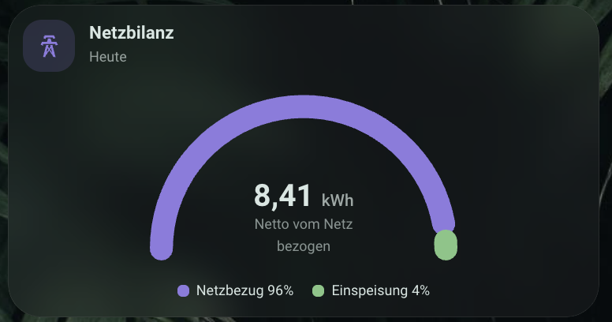

<details>
<summary>Konfiguration, Beispiele & Optionen</summary>

```yaml
type: custom:m3-gauge-card
name: Netzbilanz
```

### Datenquellen

- **`source: energy`** (Standard, keine weitere Konfiguration nötig, wenn das
  HA-Energie-Dashboard eingerichtet ist): liest die konfigurierten
  Netzbezug-/Einspeisung-Statistik-IDs aus `energy/get_prefs` (mehrere
  Zähler/Tarife werden automatisch summiert) und lädt deren Tageswerte.
- **`source: entities`**: zwei frei wählbare Sensoren (`value_a_entity` =
  Bezug, `value_b_entity` = Einspeisung), Zeitbezug liegt dann bei den
  Sensoren selbst. Nicht auf Strom beschränkt — die Einheit wird von den
  konfigurierten Entities übernommen, z.B. für einen Vergleich zweier
  Gas- oder Wasserzähler.

Sind beide Werte 0, zeigt der Bogen nur die Track-Farbe („Keine Daten
heute“ bzw. „Kein Energie-Dashboard konfiguriert“); ist nur ein Wert 0, füllt
sich der ganze Bogen durchgehend in einer Farbe ohne Lücke.

### Animation

Die Segmente wachsen beim ersten Rendern von 0 auf ihren Zielwinkel und ziehen
bei späteren Wertänderungen weich nach — respektiert die `animation`-Option
und `prefers-reduced-motion` wie die anderen Karten.

### Konfigurationsoptionen

| Option | Typ | Standard | Beschreibung |
|---|---|---|---|
| `source` | `energy` \| `entities` | `energy` | Datenquelle |
| `value_a_entity` / `value_b_entity` | string | – | Nur bei `source: entities` — Bezug- / Einspeisung-Sensor |
| `name` | string | `Netzbilanz` | Angezeigter Name |
| `icon` | string | `mdi:transmission-tower` | Icon in der Icon-Kachel |
| `subtitle` | string | „Heute“ | Untertitel-Override |
| `label_positive` / `label_negative` | string | „Netto vom Netz bezogen“ / „Netto eingespeist“ | Text unter dem Nettowert, je nach Vorzeichen |
| `label_a` / `label_b` | string | „Netzbezug“ / „Einspeisung“ | Legenden-Labels |
| `segment_a_color` / `segment_b_color` | string | `#8f79e0` / `#81c784` | Segmentfarben |
| `track_color` | string | 12 % `--primary-text-color` | Bogenfarbe ohne Daten |
| `text_color` / `secondary_text_color` | string | Theme-Standard | Nettowert / Name & Legende |
| `card_background` | string | Glas-/Solid-Hintergrund | Kartenhintergrund |
| `animation` | `auto` \| `on` \| `off` | `auto` | Segment-Animation; `auto`/`on` respektieren `prefers-reduced-motion` |
| `glass_background` | boolean | `true` | Milchiger Glashintergrund |
| `radius` / `corners` | number / object | `28` | Eckenradius, optional je Ecke |

</details>

## M3 Energy Flow Card

Knoten-Diagramm der heutigen Energieflüsse zwischen Solar, Netz, Batterie und
Haus, mit animierten Fließpunkten entlang der Verbindungslinien und einem
Autarkie-Balken darunter.

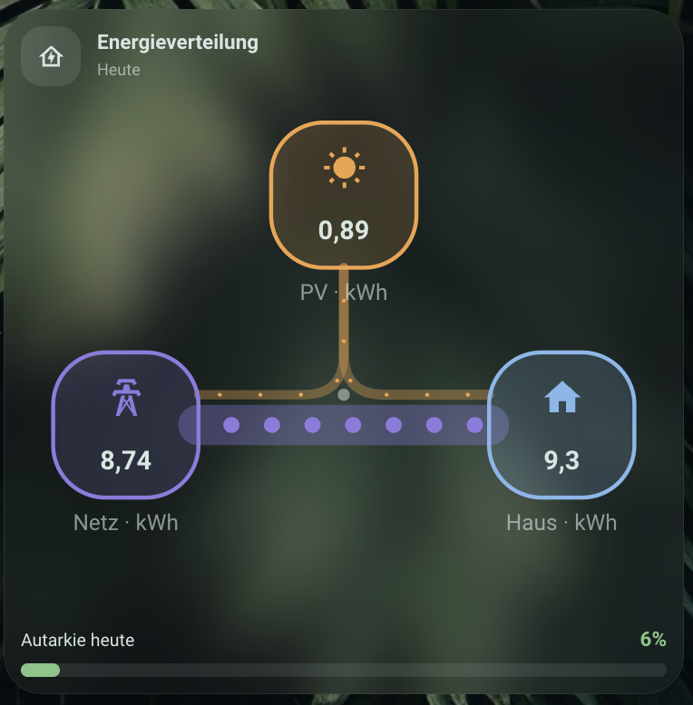

<details>
<summary>Konfiguration, Beispiele & Optionen</summary>

```yaml
type: custom:m3-energy-flow-card
source: energy
```

### Datenquellen

- **`source: energy`** (Standard): liest Solar-, Netzbezug-/Einspeisung- und
  Batterie-Statistiken direkt aus dem HA-Energie-Dashboard.
- **`source: entities`**: `solar_entity`, `grid_import_entity`,
  `grid_export_entity`, `battery_entity` frei wählbar — nützlich, wenn kein
  vollständiges Energie-Dashboard eingerichtet ist oder einzelne Quellen
  ersetzt werden sollen.

Der Batterie-Knoten erscheint automatisch nur, wenn eine Batteriequelle
konfiguriert ist (`show_battery: auto`, Standard) — `always`/`never`
erzwingen die Sichtbarkeit unabhängig davon.

### Animation

Die Fließpunkte laufen per CSS-Animation entlang der Linien
(`flow_speed: slow | normal | fast`) und werden bei `animation: "off"` bzw.
aktivem `prefers-reduced-motion` komplett weggelassen (nicht nur pausiert).

### Konfigurationsoptionen

| Option | Typ | Standard | Beschreibung |
|---|---|---|---|
| `source` | `energy` \| `entities` | `energy` | Datenquelle |
| `solar_entity` / `grid_import_entity` / `grid_export_entity` / `battery_entity` | string | – | Nur bei `source: entities` |
| `name` | string | „Energiefluss“ | Angezeigter Name |
| `icon` | string | `mdi:transmission-tower` | Icon in der Icon-Kachel |
| `show_self_sufficiency` | boolean | `true` | Autarkie-Balken anzeigen |
| `show_battery` | `auto` \| `always` \| `never` | `auto` | Batterie-Knoten-Sichtbarkeit |
| `flow_speed` | `slow` \| `normal` \| `fast` | `normal` | Geschwindigkeit der Fließpunkte |
| `pv_color` / `grid_color` / `home_color` / `battery_color` | string | Theme-Standard | Knotenfarben |
| `self_sufficiency_color` | string | `#81c784` | Farbe des Autarkie-Balkens |
| `text_color` / `secondary_text_color` | string | Theme-Standard | Name / Knoten-Labels |
| `card_background` | string | Glas-/Solid-Hintergrund | Kartenhintergrund |
| `animation` | `auto` \| `on` \| `off` | `auto` | Fließpunkte-Animation; `auto`/`on` respektieren `prefers-reduced-motion` |
| `glass_background` | boolean | `true` | Milchiger Glashintergrund |
| `radius` / `corners` | number / object | `28` | Eckenradius, optional je Ecke |

</details>

## M3 Counter Card

Ersetzt eine `tile`-Kachel für Zählerstände: zeigt einen kumulativen
Sensorwert als Ziffernanzeige im Odometer-Stil, jede Ziffer in einer eigenen
Zelle. Vorkommastellen und Nachkommastellen sind farblich getrennt
(Nachkommastellen in der Akzentfarbe). Nur die Stellen, die sich beim letzten
Update tatsächlich geändert haben, rollen animiert um — der Rest bleibt
stehen. Nicht auf Strom beschränkt: Einheit und Nachkommastellen kommen von
der Entity, `power_entity` (Leistungs-Chip) ist rein optional — genauso
geeignet für Gas- oder Wasserzähler (m³) wie für Stromzähler (kWh).

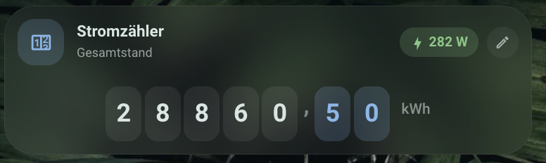

<details>
<summary>Konfiguration, Beispiele & Optionen</summary>

```yaml
type: custom:m3-counter-card
entity: sensor.virtueller_stromzahler
power_entity: sensor.gesamter_energieverbrauch
name: Stromzähler
```

### Ziffernanzeige

- Die Anzahl der Vorkommastellen (`digits`) wächst automatisch mit dem Wert
  (Standard: mindestens 5) und schrumpft innerhalb einer Session nie wieder
  zurück, auch wenn der Wert kurzzeitig fällt — verhindert ein "Springen" der
  Kartenbreite. Alternativ lässt sich eine feste Anzahl konfigurieren; auch
  die wächst bei Bedarf mit, um den Wert nie abzuschneiden.
- Dezimaltrennzeichen und Zahlenformat folgen `hass.locale` (z.B. Komma statt
  Punkt auf Deutsch).
- Ist die Karte schmaler als 340px, verkleinern sich die Ziffernzellen
  automatisch — gemessen an der Karte selbst, das klappt also auch in einer
  schmalen Spalte.
- `unavailable`: Zellen zeigen gedimmt „–“, der Leistungs-Chip wird
  ausgeblendet.

### Leistungs-Chip und Ticker

- `power_entity` (optional) zeigt einen Chip mit Blitz-Icon und aktueller
  Leistung im Header — Standardfarbe Grün, per `power_thresholds` umschaltbar
  (z.B. ab 2000 W Orange, ab 3500 W Rot).
- `show_ticker` + `daily_entity` (beide optional) blenden unter der
  Ziffernanzeige eine dünne „+X heute“-Zeile ein, gespeist aus einem separaten
  Tagessensor.

### Konfigurationsoptionen

| Option | Typ | Standard | Beschreibung |
|---|---|---|---|
| `entity` | string | – | Zählerstand-Sensor (Pflicht) |
| `power_entity` | string | – | Optionaler Leistungs-Sensor für den Header-Chip |
| `power_entities` | Liste | – | Leistungssensoren, die zusammengezählt werden — für einen Raum, dessen Verbrauch die Summe seiner Steckdosen ist. Schlägt `power_entity` und die automatische Suche, die beide nur einen benennen können |
| `daily_entity` | string | – | Optionaler Tages-Sensor für die Ticker-Zeile |
| `name` | string | Entity-Name | Angezeigter Name |
| `icon` | string | `mdi:counter` | Icon in der Icon-Kachel |
| `subtitle` | string | „Gesamtstand“ | Untertitel-Override |
| `decimals` | number | `2` | Anzahl Nachkommastellen |
| `digits` | `auto` \| number | `auto` | Vorkommastellen — automatisch (min. 5, wächst nie zurück) oder fest |
| `show_ticker` | boolean | `false` | „+X heute“-Zeile anzeigen (braucht `daily_entity`) |
| `accent_color` | string | `#85b7eb` | Farbe der Nachkommastellen-Zellen |
| `cell_background` | string | 8 % `--primary-text-color` | Hintergrund der Vorkommastellen-Zellen |
| `power_chip_color` | string | `#81c784` | Standardfarbe des Leistungs-Chips |
| `power_thresholds` | `{ above, color }[]` | – | Chip-Farbwechsel oberhalb der jeweiligen Leistung |
| `text_color` / `secondary_text_color` | string | Theme-Standard | Name / Untertitel & Ticker |
| `card_background` | string | Glas-/Solid-Hintergrund | Kartenhintergrund |
| `animation` | `auto` \| `on` \| `off` | `auto` | Roll-Animation; `auto`/`on` respektieren `prefers-reduced-motion` |
| `glass_background` | boolean | `true` | Milchiger Glashintergrund |
| `radius` / `corners` | number / object | `28` | Eckenradius, optional je Ecke |

</details>

## M3 Power List Card

Ersetzt eine `entities`-Kachel für Steckdosen-/Leistungsübersichten: zeigt
Leistungssensoren als sortierte Liste mit Anteilsbalken, blendet inaktive
Geräte standardmäßig hinter einem Aufklappbereich aus.

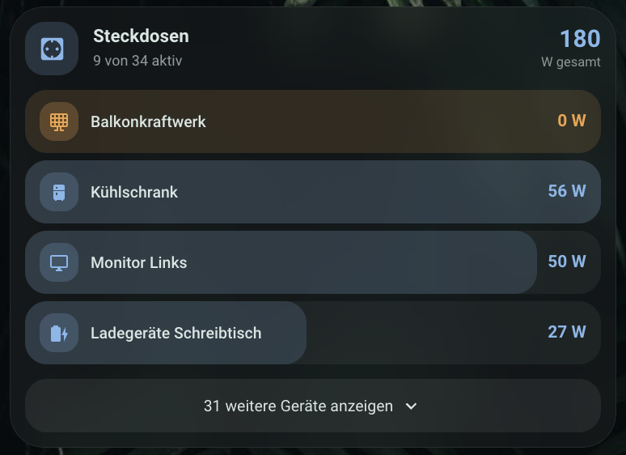

<details>
<summary>Konfiguration, Beispiele & Optionen</summary>

```yaml
type: custom:m3-power-list-card
auto_discover: true
name: Steckdosen
```

### Entitätsquelle

- **Manuelle Liste** (`entities`): Array mit `entity` (Pflicht) sowie
  optional `name`, `icon`, `type` (`consumer` | `producer`, Standard
  `consumer`) pro Eintrag. Der Editor verwaltet die Liste als einfache
  Sensor-Auswahl; Name-/Icon-/Typ-Overrides pro Eintrag lassen sich direkt im
  YAML-Editor der Karte feinjustieren.
- **`auto_discover: true`**: zieht automatisch alle `sensor`-Entities mit
  `device_class: power`, optional eingeschränkt auf `include_area` /
  `include_label`, sowie `exclude_entities` zum gezielten Ausschließen.

### Sortierung, Schwellwert, Erzeuger

- `threshold` (Standard `1` W) bestimmt, ab wann ein Gerät als „aktiv“ gilt —
  verhindert, dass Sensor-Rauschen (z.B. 0,2 W) als aktiv erscheint.
- `sort` sortiert die aktiven Verbraucher-Zeilen: `power_desc` (Standard),
  `power_asc`, `name` oder `config` (Reihenfolge wie konfiguriert).
- Einträge mit `type: producer` (z.B. ein Balkonkraftwerk) erscheinen in
  einer eigenen, farblich abgesetzten Sektion über der Verbraucherliste und
  zählen nicht zur Sortierung oder Gesamtsumme der Verbraucher.
- `max_visible` (Standard `0` = alle aktiven) begrenzt die sichtbaren
  Verbraucher-Zeilen; der Rest wandert in den Aufklappbereich für inaktive
  Geräte.
- Beim Über-/Unterschreiten des Schwellwerts ordnet sich die Liste weich um
  (respektiert die `animation`-Option und `prefers-reduced-motion`).

### Konfigurationsoptionen

| Option | Typ | Standard | Beschreibung |
|---|---|---|---|
| `entities` | Liste | – | Manuelle Sensor-Liste (ignoriert, wenn `auto_discover: true`) |
| `auto_discover` | boolean | `false` | Alle Sensoren mit `device_class: power` automatisch aufnehmen |
| `include_area` / `include_label` | string[] | – | Nur bei `auto_discover` — auf Bereiche/Labels einschränken |
| `exclude_entities` | string[] | – | Nur bei `auto_discover` — gezielt ausschließen |
| `threshold` | number | `1` | Schwellwert in W, ab dem ein Gerät als „aktiv“ gilt |
| `sort` | `power_desc` \| `power_asc` \| `name` \| `config` | `power_desc` | Sortierung der aktiven Verbraucher |
| `max_visible` | number | `0` | Max. sichtbare aktive Zeilen (`0` = alle) |
| `show_idle_toggle` | boolean | `true` | Aufklappbereich für inaktive/überzählige Geräte anzeigen |
| `name` | string | „Steckdosen“ | Angezeigter Name |
| `icon` | string | `mdi:power-socket-de` | Icon in der Icon-Kachel |
| `subtitle` | string | „{aktiv} von {gesamt} aktiv“ | Untertitel-Override |
| `accent_color` | string | `#85b7eb` | Farbe der Verbraucher-Icons/-Werte |
| `producer_color` | string | `#f0a24a` | Farbe der Erzeuger-Sektion |
| `bar_tint_color` | string | Akzentfarbe | Farbe des Anteilsbalkens |
| `text_color` / `secondary_text_color` | string | Theme-Standard | Name / Untertitel & Gesamtsumme |
| `card_background` | string | Glas-/Solid-Hintergrund | Kartenhintergrund |
| `animation` | `auto` \| `on` \| `off` | `auto` | Umsortier-Animation; `auto`/`on` respektieren `prefers-reduced-motion` |
| `glass_background` | boolean | `true` | Milchiger Glashintergrund |
| `radius` / `corners` | number / object | `28` | Eckenradius, optional je Ecke |

</details>

## M3 Power Summary Card

Ersetzt eine Reihe einzelner Tile-Karten für Momentanleistungen: fasst
Netzbilanz, Verbrauch, Erzeugung und optionale Teilsummen in einer Karte mit
klarer Hierarchie zusammen. Reine Live-Werte aus `hass.states`, keine
Statistik-Abfragen nötig.

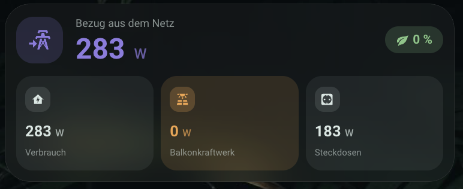

<details>
<summary>Konfiguration, Beispiele & Optionen</summary>

```yaml
type: custom:m3-power-summary-card
grid_entity: sensor.netzbezug_leistung
consumption_entity: sensor.gesamtstromverbrauch_vor_solar
solar_entity: sensor.balkonkraftwerk_leistung
metrics:
  - entity: sensor.gesamtstromverbrauch_vor_solar
    name: Verbrauch
    icon: mdi:home-lightning-bolt
  - entity: sensor.balkonkraftwerk_leistung
    name: Balkonkraftwerk
    icon: mdi:solar-power-variant
    type: producer
  - entity: sensor.gesamter_energieverbrauch
    name: Steckdosen
    icon: mdi:power-socket-de
```

### Vorzeichen-Konvention

Momentanleistungssensoren am Netzanschluss kodieren Einspeisung/Bezug
unterschiedlich. `grid_sign` stellt die Karte auf die jeweilige Konvention
ein:

- **`negative_is_export`** (Standard): negativer Wert = Einspeisung,
  positiver Wert = Bezug — die gängigste Konvention (z.B. Shelly 3EM,
  viele Wechselrichter-Integrationen).
- **`positive_is_export`**: umgekehrt.

Der angezeigte Wert ist immer ein positiver Betrag — Icon und Label zeigen
die Richtung. Liegt der Betrag innerhalb von `zero_threshold` (Standard
10 W) um 0, zeigt die Karte einen neutralen „Ausgeglichen“-Zustand statt
Einspeisung/Bezug.

### Anteilsbalken und Autarkie

- Ist `solar_entity` gesetzt und die Erzeugung > 0, zeigt ein zweigeteilter
  Balken, wie der aktuelle Verbrauch gedeckt wird: Eigenverbrauch aus Solar
  vs. Überschuss (bei Einspeisung) bzw. vs. Netzanteil (bei Bezug).
  Abschaltbar über `show_split_bar`.
- Der Autarkie-Chip (`show_self_sufficiency`, Standard an) berechnet sich
  als `(Verbrauch − Netzbezug) / Verbrauch × 100`, gedeckelt auf 0–100 %.
- Ist `consumption_entity` nicht gesetzt, wird der Verbrauch als
  `Netzbezug + Solarerzeugung` berechnet.

### Konfigurationsoptionen

| Option | Typ | Standard | Beschreibung |
|---|---|---|---|
| `grid_entity` | string | – | Momentanleistung am Netzanschluss in W (Pflicht) |
| `grid_sign` | `negative_is_export` \| `positive_is_export` | `negative_is_export` | Vorzeichen-Konvention des Netz-Sensors |
| `consumption_entity` | string | – | Hausverbrauch in W (leer = berechnet aus Netzbezug + Solar) |
| `solar_entity` | string / string[] | – | Erzeugungssensor(en) in W, werden summiert |
| `metrics` | Liste | – | Zusätzliche Kennzahl-Felder (`entity`, `name`, `icon`, `color`, `type`) |
| `label_export` / `label_import` | string | „Einspeisung ins Netz“ / „Bezug aus dem Netz“ | Label der Hauptzeile je Richtung |
| `show_self_sufficiency` | boolean | `true` | Autarkie-Chip anzeigen |
| `show_split_bar` | boolean | `true` | Anteilsbalken anzeigen (nur bei konfiguriertem `solar_entity`) |
| `zero_threshold` | number | `10` | Schwellwert in W für den neutralen „Ausgeglichen“-Zustand |
| `kw_threshold` | number | `1000` | Ab diesem Wert in W wird als „X,X kW“ statt „X W“ formatiert |
| `export_color` / `import_color` | string | `#81c784` / `#8f79e0` | Farben für Einspeisung / Bezug |
| `producer_color` | string | `#f0a24a` | Farbe für Erzeuger-Kennzahlen und Solaranteil |
| `accent_color` | string | `#81c784` | Farbe des Autarkie-Chips |
| `text_color` / `secondary_text_color` | string | Theme-Standard | Werte / Labels |
| `card_background` | string | Glas-/Solid-Hintergrund | Kartenhintergrund |
| `animation` | `auto` \| `on` \| `off` | `auto` | Weiche Wertinterpolation (300ms); `auto`/`on` respektieren `prefers-reduced-motion` |
| `glass_background` | boolean | `true` | Milchiger Glashintergrund |
| `radius` / `corners` | number / object | `28` | Eckenradius, optional je Ecke |

</details>

## M3 Top Consumers Card

Ersetzt die native `energy-devices-graph`-Karte: zeigt die größten
Einzelverbraucher eines Zeitraums als Ranking, standardmäßig gespeist aus
der Geräte-Sektion des HA-Energie-Dashboards.

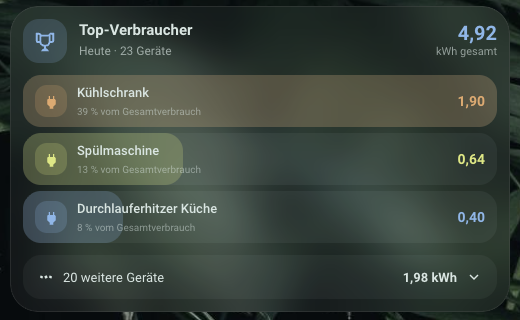

<details>
<summary>Konfiguration, Beispiele & Optionen</summary>

```yaml
type: custom:m3-top-consumers-card
source: energy
period: today
top_count: 7
```

### Datenquelle und Zeitraum

- **`source: energy`** (Standard): liest die konfigurierten Geräte-Statistik-
  IDs aus `energy/get_prefs` und lädt deren Verbrauch für den gewählten
  `period` (`today`, `yesterday`, `week`, `month`) via
  `recorder/statistics_during_period`. Die Gesamtsumme im Header ist die
  Summe der GEMESSENEN Geräte, nicht zwingend der gesamte Hausverbrauch.
- **`source: entities`**: manuelle Liste von Energie-Sensoren (kWh) über
  `entities`, falls kein Energie-Dashboard eingerichtet ist oder eine
  eigene Auswahl gewünscht ist.
- Aktualisierung alle 15 Minuten. Geräte mit 0 kWh im Zeitraum werden
  komplett weggelassen.

### Ranking, Sammelzeile, Namensbereinigung

- Sortiert absteigend nach Verbrauch. `top_count` (Standard 7) Geräte
  werden als volle Zeilen mit Anteilsbalken gezeigt.
- Alle weiteren Geräte landen je nach `rest_mode` in einer aufklappbaren
  Sammelzeile (`collapse`, Standard), werden komplett weggelassen (`hide`)
  oder ebenfalls als volle Zeilen gezeigt (`show_all`).
- `name_strip` entfernt Regex-/Text-Muster aus den Entity-Namen (Standard:
  `^Steckdose \d+ - ` und ` Energie$`); pro Gerät über `name` in `entities`
  überschreibbar (Override deaktiviert die Bereinigung für dieses Gerät).
- Gerätefarben werden zyklisch aus `palette` zugewiesen (Standard: 8 Töne
  aus dem Projekt-Farbsystem), pro Gerät über `color` fest überschreibbar.
- Umsortierung bei Datenaktualisierung erfolgt weich animiert (respektiert
  `animation`/`prefers-reduced-motion`).

### `unit_mode: cost` — Ranking nach Kosten statt kWh

```yaml
type: custom:m3-top-consumers-card
source: energy
unit_mode: cost
price_source: energy_dashboard
```

Rankt die Geräte nach Kosten statt Verbrauch (Wert pro Gerät = kWh ×
Preis). Die Preisquelle (`price_source`) funktioniert identisch zur
M3 Cost Card weiter unten — siehe dort für Details zu
`energy_dashboard`/`input_number`/`fixed`. Da HA für einzelne Geräte keine
eigene Kosten-Statistik führt (nur für den gesamten Netzbezug), wird bei
`price_source: energy_dashboard` ein effektiver Preis aus
Gesamtkosten ÷ Gesamtverbrauch des Netzbezugs im gewählten Zeitraum
abgeleitet. Die Zeilen-Unterzeile wird zweiteilig
(„{kWh} kWh · {x} % der Kosten“), Header-Summe und Sammelzeile erscheinen
in `currency`.

### Konfigurationsoptionen

| Option | Typ | Standard | Beschreibung |
|---|---|---|---|
| `source` | `energy` \| `entities` | `energy` | Datenquelle |
| `entities` | Liste | – | Nur bei `source: entities` — `entity`, optional `name`/`icon`/`color` |
| `period` | `today` \| `yesterday` \| `week` \| `month` | `today` | Zeitraum |
| `top_count` | number | `7` | Anzahl voller Zeilen vor der Sammelzeile |
| `rest_mode` | `collapse` \| `hide` \| `show_all` | `collapse` | Verhalten für Geräte jenseits von `top_count` |
| `name_strip` | string[] | siehe oben | Regex-/Text-Muster, die aus Entity-Namen entfernt werden |
| `unit_mode` | `energy` \| `cost` | `energy` | Ranking nach kWh oder nach Kosten |
| `price_source` / `price_entity` / `price` / `price_unit` / `currency` | siehe M3 Cost Card | `energy_dashboard` | Nur bei `unit_mode: cost` |
| `name` | string | „Top-Verbraucher“ | Angezeigter Name |
| `icon` | string | `mdi:trophy-outline` | Icon in der Icon-Kachel |
| `subtitle` | string | „{Zeitraum} · {n} Geräte“ | Untertitel-Override |
| `accent_color` | string | `#85b7eb` | Farbe der Gesamtsumme im Header |
| `palette` | string[] | siehe oben | Zyklisch zugewiesene Gerätefarben |
| `text_color` / `secondary_text_color` | string | Theme-Standard | Name / Untertitel & Prozentzeile |
| `card_background` | string | Glas-/Solid-Hintergrund | Kartenhintergrund |
| `animation` | `auto` \| `on` \| `off` | `auto` | Umsortier-Animation; `auto`/`on` respektieren `prefers-reduced-motion` |
| `glass_background` | boolean | `true` | Milchiger Glashintergrund |
| `radius` / `corners` | number / object | `28` | Eckenradius, optional je Ecke |

</details>

## M3 Cost Card

Kostenauswertung für einen Zeitraum (Standard: laufender Monat) mit
Prognose, Vergleich zur Vorperiode, Tagesbalken und Zeitraum-Navigation zum
Durchblättern vergangener Monate. Nicht auf Strom beschränkt — `entity`
kann jeder kumulative Energie-Sensor sein (bei
`price_source: energy_dashboard` wird die Netzbezugskosten-Statistik
automatisch verwendet).

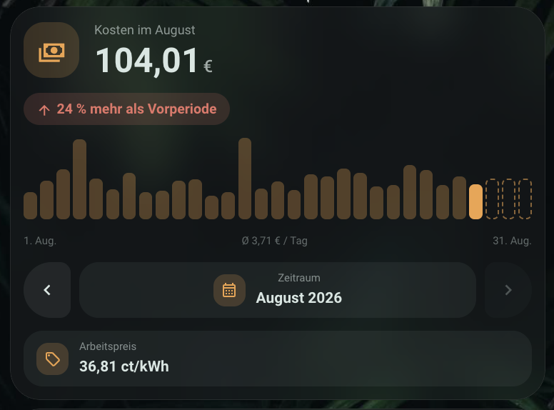

<details>
<summary>Konfiguration, Beispiele & Optionen</summary>

```yaml
type: custom:m3-cost-card
price_source: energy_dashboard
period: month
```

### Preisquelle (`price_source`)

- **`energy_dashboard`** (Standard): liest die von HA bereits berechnete
  Kosten-Statistik des Netzbezugs (`stat_cost` aus `energy/get_prefs`) —
  die Karte rechnet hier selbst nichts aus. Voraussetzung: im
  Energie-Dashboard ist beim Netzbezug ein Preis hinterlegt (fester Preis
  oder `entity_energy_price`), UND der Recorder hat seit der Preis-Änderung
  mindestens einen Statistik-Durchlauf verarbeitet — `stat_cost` kann daher
  auch bei bereits konfiguriertem Preis noch eine Weile `null` sein. Ohne
  verfügbare Kosten-Statistik zeigt die Karte einen Hinweis mit Link zu
  `/config/energy` statt einer erfundenen Zahl.
- **`input_number`**: `price_entity` zeigt auf einen `input_number`-Helfer
  (Arbeitspreis in €/kWh oder ct/kWh, über `price_unit` bzw. die Einheit
  des Helfers erkannt). Kosten = Verbrauch (`entity`, kWh) × Preis. Die
  Tarif-Zeile zeigt den aktuellen Preis; antippen öffnet den Helfer im
  More-Info-Dialog zum Anpassen (kein eigener Stepper — der Preis ändert
  sich erfahrungsgemäß selten, dafür lohnt sich kein dauerhaft sichtbarer
  Regler).
- **`fixed`**: fester `price` in der Karten-Config, keine Tarif-Interaktion.

`base_fee` (€/Monat) wird bei `period: month` anteilig pro bereits
vergangenem Tag zur Kostensumme addiert.

### Zeitraum-Navigation

Unter den Tagesbalken (bzw. direkt unter den Chips bei `period: day`) sitzt
eine Navigationszeile mit ‹/›-Pfeilen, die zum jeweils vorherigen/nächsten
Zeitraum blättert — praktisch zum Vergleichen abgeschlossener Monate. Für
bereits abgeschlossene Zeiträume entfällt automatisch die Prognose (der
Zeitraum ist ja komplett vorbei); der Vergleichs-Chip vergleicht dann den
tatsächlichen Gesamtbetrag mit dem Zeitraum davor. Der „weiter“-Pfeil ist
deaktiviert, sobald der aktuelle (laufende) Zeitraum erreicht ist.

### Prognose, Vergleich, Budget

- Prognose-Chip (`show_projection`, Standard an): hochgerechnet auf das
  Periodenende (Betrag ÷ verstrichene Tage × Tage gesamt). Am ersten Tag
  der Periode zu unzuverlässig — zeigt stattdessen „Prognose ab morgen“.
  Nur für den laufenden Zeitraum, nicht beim Durchblättern vergangener
  Monate.
- Vergleichs-Chip (`show_comparison`, Standard an): Prognose (bzw. beim
  Durchblättern: der tatsächliche Gesamtbetrag) vs. Vorperiode in Prozent,
  grün bei weniger, rot bei mehr.
- Budget-Chip (optional `budget`): „X % vom Budget“, Farbe wechselt bei
  über 100 %.
- Übersteigt die Einspeisevergütung die Kosten (negative Summe), zeigt die
  Karte den Betrag grün mit Label „Gutschrift“.

### Konfigurationsoptionen

| Option | Typ | Standard | Beschreibung |
|---|---|---|---|
| `price_source` | `energy_dashboard` \| `input_number` \| `fixed` | `energy_dashboard` | Preisquelle, siehe oben |
| `price_entity` | string | – | Nur bei `input_number` — der Preis-Helfer |
| `price` | number | – | Nur bei `fixed` — Preis pro kWh |
| `price_unit` | `eur_per_kwh` \| `ct_per_kwh` | vom Helfer erkannt / `eur_per_kwh` | Einheit des Preises |
| `base_fee` | number | – | Grundgebühr €/Monat, anteilig bei `period: month` |
| `currency` | string | `EUR` | ISO-Währungscode für Formatierung |
| `entity` | string | – | Energie-Sensor (kWh); nicht bei `price_source: energy_dashboard` nötig |
| `period` | `day` \| `month` \| `year` | `month` | Zeitraum |
| `show_projection` | boolean | `true` | Prognose-Chip anzeigen |
| `show_comparison` | boolean | `true` | Vergleichs-Chip anzeigen |
| `budget` | number | – | Optionales Budget für den Budget-Chip |
| `name` | string | „Kosten“ | Angezeigter Name |
| `icon` | string | `mdi:cash-multiple` | Icon in der Icon-Kachel |
| `subtitle` | string | „Kosten im {Monat}“ (periodenabhängig) | Untertitel-Override |
| `accent_color` | string | `#f0a24a` | Akzentfarbe |
| `text_color` / `secondary_text_color` | string | Theme-Standard | Betrag / Label & Fußzeile |
| `card_background` | string | Glas-/Solid-Hintergrund | Kartenhintergrund |
| `animation` | `auto` \| `on` \| `off` | `auto` | Balken-/Wertanimation; `auto`/`on` respektieren `prefers-reduced-motion` |
| `glass_background` | boolean | `true` | Milchiger Glashintergrund |
| `radius` / `corners` | number / object | `28` | Eckenradius, optional je Ecke |

</details>

## M3 Light Card

Lichtsteuerung mit Header (Icon, Name, Power-Button) und einem
Wellen-Slider für die Helligkeit — Ziehen mit Maus oder Finger, Tippen zum
Springen, Pfeiltasten für ±5 % (Shift für ±1 %). Der Slider nutzt
`touch-action: none`, damit Wischen auf dem Handy nicht mit dem
Seiten-Scroll kollidiert.

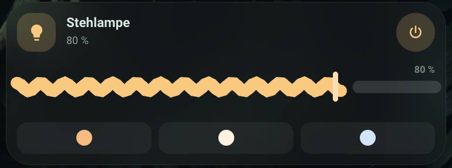

<details>
<summary>Konfiguration, Beispiele & Optionen</summary>

```yaml
type: custom:m3-light-card
entity: light.wohnzimmer
```

Helligkeitsänderungen werden gedrosselt (~200 ms) als `light.turn_on` mit
`brightness_pct` gesendet und optimistisch im UI vorweggenommen, damit das
Ziehen auch bei langsamer Netzwerkverbindung flüssig bleibt. Entitäten ohne
`brightness`-Unterstützung (z.B. reine Ein/Aus-Lampen) zeigen nur Header und
Power-Button, keinen Slider.

Eine Lampe mit `color_temp` bekommt zusätzlich eine Farbtemperatur-Zeile —
drei Voreinstellungen oder ein stufenloser Regler mit
`color_temp_style: slider`. `show_color_temp: false` lässt sie ganz weg, was
die Karte auf Ansichten mit vielen Lichtern kurz hält, wenn dort ohnehin nur
die Helligkeit verstellt wird.

### Konfigurationsoptionen

| Option | Typ | Standard | Beschreibung |
|---|---|---|---|
| `entity` | string | – | `light`-Entity (erforderlich) |
| `name` | string | Entity-Name | Angezeigter Name |
| `icon` | string | Entity-Icon | Icon in der Icon-Kachel |
| `transition` | number | – | Übergangsdauer (Sekunden) für `light.turn_on`-Aufrufe |
| `wave_style` | `wavy` \| `flat` | `wavy` | Wellenform des Sliders |
| `show_color_temp` | boolean | `true` | Farbtemperatur-Zeile anzeigen; `false` blendet sie auch bei einer Lampe aus, die sie unterstützt |
| `accent_color` / `track_color` / `handle_color` | string | Theme-Standard | Slider-Farben |
| `text_color` / `secondary_text_color` | string | Theme-Standard | Name / Untertitel |
| `card_background` | string | Glas-/Solid-Hintergrund | Kartenhintergrund |
| `animation` | `auto` \| `on` \| `off` | `auto` | Wellen-/Power-Button-Animation; `auto`/`on` respektieren `prefers-reduced-motion` |
| `glass_background` | boolean | `true` | Milchiger Glashintergrund |
| `radius` / `corners` | number / object | `28` | Eckenradius, optional je Ecke |

</details>

## M3 Battery Card

Übersicht aller Batteriestand-Sensoren als sortierte Liste mit
Schwellwert-Einfärbung (kritisch/niedrig/mittel/ok), Balken pro Zeile und
Aufklappbereich für die restlichen Geräte.

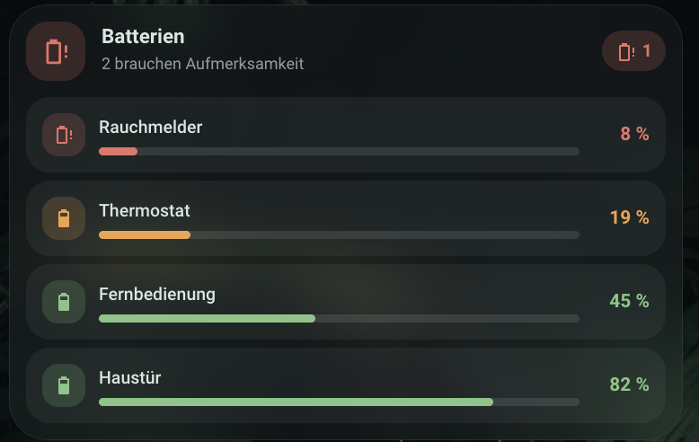

<details>
<summary>Konfiguration, Beispiele & Optionen</summary>

```yaml
type: custom:m3-battery-card
auto_discover: true
```

### Entitätsquelle

- **`auto_discover: true`** (Standard): findet automatisch alle Entities mit
  `device_class: battery`, optional gefiltert über `include_area` /
  `include_label` / `exclude_entities`. Einträge in `entities` wirken in
  diesem Modus als Name-/Icon-Override pro Entity (nicht als vollständiger
  Ersatz der automatischen Liste).
- **`auto_discover: false`**: nur die explizit in `entities` gelistete
  Auswahl.

`name_strip` entfernt konfigurierbare Suffixe aus dem angezeigten Namen
(Standard: „ Battery Level“, „ Batteriestand“, „ Battery“, „ Batterie“) — der
Entity-Name „Schlafzimmer Batteriestand“ wird so zu „Schlafzimmer“.

### Sortierung, Schwellwerte, Anzeige

Zeilen sind immer `unavailable` zuerst, danach aufsteigend nach Ladestand
sortiert — damit stehen die Geräte, die am ehesten Aufmerksamkeit brauchen,
oben. `thresholds` (kritisch/niedrig/mittel) bestimmen Balken- und
Textfarbe; `max_visible` + `show_healthy_toggle` blenden gesunde Geräte
hinter einem „N weitere anzeigen“-Button aus, ähnlich der Power List Card.

### Benachrichtigung bei schwachen Batterien

Die Kachel warnt nur, solange man sie ansieht — deshalb kann der Abschnitt
**Benachrichtigung** im Editor eine Home-Assistant-Automatisierung anlegen,
die unabhängig davon benachrichtigt. Ein oder mehrere Ziele auswählen (aus
den eigenen `notify.*`-Diensten), Schwellwert setzen (`notify_threshold`,
Standard 1 %), Rhythmus wählen, dann „Benachrichtigung einrichten“:

- **`daily`** / **`weekly`** — eine Sammelnachricht zur Zeit `notify_time`
  mit allen schwachen Batterien („5 Batterien schwach: …“), damit aus zwölf
  leeren Geräten nicht zwölf Pushes werden. `weekly` löst zusätzlich nur am
  Tag `notify_weekday` aus.
- **`on_change`** — meldet sofort, sobald eine Batterie den Schwellwert
  unterschreitet, eine Nachricht pro Gerät. Scharf wird es von selbst
  wieder, sobald die Batterie wieder darüber liegt.

Überwacht werden genau die Geräte, die die Kachel auflistet — die manuelle
`entities`-Liste oder die Auto-Discovery inklusive Bereichs-/Label-Filter.
Diese Auswahl wird beim Drücken des Buttons aufgelöst und in die
Automatisierung geschrieben; **nach dem Hinzufügen neuer Geräte den Button
erneut drücken**, damit sie mit abgedeckt sind. `notify_exclude_entities`
schaltet einzelne Geräte stumm, ohne sie aus der Kachel zu entfernen —
praktisch für Sensoren, die dauerhaft 1 % melden.

### Konfigurationsoptionen

| Option | Typ | Standard | Beschreibung |
|---|---|---|---|
| `auto_discover` | boolean | `true` | Automatische Erkennung aller Batterie-Sensoren |
| `entities` | Liste | – | Manuelle Auswahl bzw. Overrides bei `auto_discover: true` |
| `include_area` / `include_label` | Liste\<string\> | – | Filter für die Auto-Discovery |
| `exclude_entities` | Liste\<string\> | – | Von der Auto-Discovery ausgeschlossene Entities |
| `name_strip` | Liste\<string\> | siehe oben | Zu entfernende Namens-Suffixe |
| `thresholds` | Objekt (`critical`/`low`/`medium`) | `10`/`20`/`50` | Prozent-Schwellwerte für die Einfärbung |
| `max_visible` | number | – | Anzahl direkt sichtbarer Zeilen, Rest hinter „mehr anzeigen“ |
| `show_healthy_toggle` | boolean | `true` | Aufklappbereich für Geräte über dem `medium`-Schwellwert |
| `notify_service` | Liste\<string\> | – | Benachrichtigungsziele (ohne `notify.`-Präfix) |
| `notify_threshold` | number | `1` | Prozentwert, ab dem eine Batterie als schwach gilt |
| `notify_mode` | `daily` \| `weekly` \| `on_change` | `daily` | Sammelnachricht zur festen Zeit, wöchentlich, oder sofort beim Unterschreiten |
| `notify_time` | string | `18:00:00` | Uhrzeit der Sammelnachricht (nur `daily`/`weekly`) |
| `notify_weekday` | string | `mon` | Wochentag der Sammelnachricht (nur `weekly`) |
| `notify_exclude_entities` | Liste\<string\> | – | Geräte, die keine Benachrichtigung auslösen |
| `name` / `icon` | string | „Batterien“ / `mdi:battery` | Header |
| `critical_color` / `low_color` / `medium_color` / `ok_color` / `unavailable_color` | string | Theme-Standard | Stufenfarben |
| `text_color` / `secondary_text_color` | string | Theme-Standard | Name / Werte |
| `card_background` | string | Glas-/Solid-Hintergrund | Kartenhintergrund |
| `animation` | `auto` \| `on` \| `off` | `auto` | Auf-/Zuklapp-Animation; `auto`/`on` respektieren `prefers-reduced-motion` |
| `glass_background` | boolean | `true` | Milchiger Glashintergrund |
| `radius` / `corners` | number / object | `28` | Eckenradius, optional je Ecke |

</details>

## M3 Weather Card

Wetterkarte mit Header (Icon/Temperatur/Zustand/Chips), geglätteter
Temperaturkurve mit Verlaufsfüllung, Niederschlagsbalken je Stunde,
Sonnenauf-/-untergangsmarker in der Kurve und optionaler Tagesübersicht.

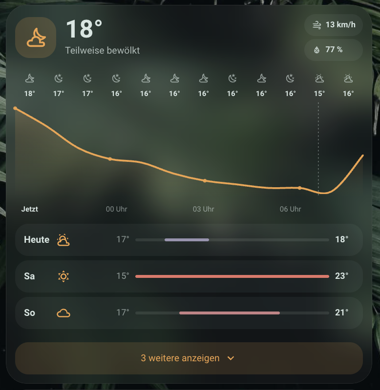

<details>
<summary>Konfiguration, Beispiele & Optionen</summary>

```yaml
type: custom:m3-weather-card
entity: weather.forecast_home
```

### Wetterdaten einrichten

Die Karte braucht irgendeine `weather.*`-Entity — sie erzeugt keine eigenen
Wetterdaten. Falls noch keine `weather`-Integration eingerichtet ist (der
Editor zeigt dann einen entsprechenden Hinweis), reicht für die meisten
Standorte die in Home Assistant eingebaute **Met.no**-Integration: kostenlos,
kein API-Key nötig, nutzt automatisch die Koordinaten der Home-Zone.

**Einstellungen → Geräte & Dienste → Integration hinzufügen → „Met.no“
suchen → Standort bestätigen.** Danach steht eine neue `weather.*`-Entity
zur Auswahl.

Andere Wetter-Integrationen (OpenWeatherMap, AccuWeather, Pirate Weather,
...) funktionieren genauso, benötigen aber meist einen kostenlosen API-Key
beim jeweiligen Anbieter.

Stündliche Vorhersage wird immer geladen; die Tagesübersicht nur, wenn
`days` > 0 gesetzt ist. Beide werden per `weather.get_forecasts`-Service
abgerufen und alle 15 Minuten aktualisiert. Wird die Wetter-Entity
vorübergehend `unavailable` (z.B. DNS-/Netzwerkfehler der Integration),
zeigt die Karte weiter den letzten bekannten Stand mit einem
"Letzter bekannter Stand · vor X Min"-Hinweis, statt leerzulaufen — erst
wenn noch nie Daten vorlagen, erscheint "Nicht verfügbar". Wie viele Tage
tatsächlich verfügbar sind, hängt von der Wetter-Integration ab (Met.no
liefert z.B. maximal 6 Tage); ab 4 Tagen wird die Tagesliste standardmäßig
eingeklappt und ist über einen Button aufklappbar.

### Konfigurationsoptionen

| Option | Typ | Standard | Beschreibung |
|---|---|---|---|
| `entity` | string | – (erforderlich) | `weather`-Entity |
| `name` | string | Freundlicher Name der Entity | Header-Titel |
| `hours` | number | `12` | Anzahl Stunden in der Kurve |
| `days` | number | `0` | Anzahl Tage in der Tagesübersicht (`0` = ausgeblendet) |
| `show_days_toggle` | boolean | `true` | Ab 4 Tagen einklappbar mit "N weitere anzeigen"-Button; `false` = immer alle konfigurierten Tage direkt anzeigen |
| `chips` | Liste (`apparent_temperature`\|`wind_speed`\|`humidity`\|`pressure`\|`uv_index`\|`visibility`) | gefühlte Temp., Wind, Luftfeuchtigkeit | Angezeigte Header-Chips |
| `show_sun` | boolean | `true` | Sonnenauf-/-untergangsmarker in der Kurve (aus `sun.sun`) |
| `show_current` | boolean | `true` | Die Kopfzeile: Icon, Temperatur, Zustand und Chips |
| `show_chart` | boolean | `true` | Die Temperaturkurve mit ihren Niederschlagsbalken |
| `show_hourly_icons` | boolean | `true` | Zustands-Icon je gezeigter Stunde |
| `show_hourly_temperatures` | boolean | `true` | Temperatur je gezeigter Stunde |
| `show_hour_labels` | boolean | `true` | Die Uhrzeit unter jeder Spalte. Ohne sie sagen die Temperaturen nicht, wann sie gelten |
| `show_temp_axis` | boolean | `false` | Marken für Min/Mitte/Max entlang der Kurve |
| `accent_color` | string | Solar-Gelb | Kurvenfarbe |
| `precipitation_color` | string | `#6ba7dc` | Farbe der Niederschlagsbalken |
| `gradient_color` | string | wie `accent_color` | Verlaufsfüllung unter der Kurve |
| `text_color` / `secondary_text_color` | string | Theme-Standard | Temperatur/Titel bzw. Chips/Nebenwerte |
| `card_background` | string | Glas-/Solid-Hintergrund | Kartenhintergrund |
| `animation` | `auto` \| `on` \| `off` | `auto` | Kurven-Einzeichenanimation; `auto`/`on` respektieren `prefers-reduced-motion` |
| `glass_background` | boolean | `true` | Milchiger Glashintergrund |
| `radius` / `corners` | number / object | `28` | Eckenradius, optional je Ecke |

Icons, Temperaturen und Uhrzeiten teilen sich einen Takt: Die Karte misst
ihre eigene Breite, entscheidet, wie viele Spalten hineinpassen, und zeichnet
dann jede 2., 3. oder 4. Stunde — nie eine gedrängte Reihe. Ein gleichmäßiger
Takt und eine Leiste, die links wie rechts bündig endet, gehen nur zusammen,
wenn dieser Schritt in der Reihe aufgeht; deshalb wird die Reihe so weit
gekürzt, bis er das tut. Wer in einer schmalen Karte zwölf Stunden anfordert,
bekommt elf gezeichnet — Kurve, Regenbalken und Sonnenmarker werden auf
dieselbe Länge gekürzt, damit nichts auseinanderläuft.

</details>

## M3 Presence Card

Anwesenheitsübersicht als Avatar-Raster für `person`- und
`device_tracker`-Entities mit Status-Ring (zuhause/abwesend/Zone/unbekannt),
Initialen-Avatar, relativer Zeitangabe („seit 5 Min.“) und optional
eingebetteter Karte (`hui-map-card`).

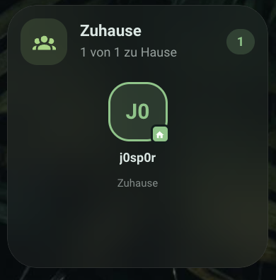

<details>
<summary>Konfiguration, Beispiele & Optionen</summary>

```yaml
type: custom:m3-presence-card
auto_discover: true
```

### Entitätsquelle

- **`auto_discover: true`** (Standard): findet automatisch alle
  `person`-Entities, optional gefiltert über `include_area` /
  `include_label` / `exclude_entities`.
- **`auto_discover: false`**: nur die explizit in `entities` gelistete
  Auswahl (`person.*` oder `device_tracker.*`).

### Interaktion

Ein Tap auf eine Person öffnet deren More-Info-Ansicht; langes Drücken (500ms)
löst optional `hold_action` aus (z.B. Navigation zu einer Karten-Ansicht).

`tap_action` ersetzt das More-Info beim Tap durch eine beliebige übliche
Home-Assistant-Aktion — `navigate`, `url`, `perform-action`, `toggle`,
`more-info` oder `none`. Wie `hold_action` gilt sie für die ganze Karte, und
Ziel ist die tatsächlich angetippte Person: `more-info`, `toggle` und ein
Dienstaufruf ohne eigenes Ziel landen alle auf deren `entity_id`.

```yaml
type: custom:m3-presence-card
tap_action:
  action: navigate
  navigation_path: /lovelace/personen
hold_action:
  action: more-info
```

Ohne `tap_action` öffnet ein Tap weiterhin die More-Info-Ansicht.

Ein Dienst, der kein `entity_id` verträgt, braucht ein leeres `target` als
Ansage — sonst wird die angetippte Person mitgegeben und der Aufruf schlägt
fehl:

```yaml
hold_action:
  action: perform-action
  perform_action: persistent_notification.create
  target: {}
  data:
    message: Jemand hat eine Kachel gedrückt
```


### Konfigurationsoptionen

| Option | Typ | Standard | Beschreibung |
|---|---|---|---|
| `auto_discover` | boolean | `true` | Automatische Erkennung aller `person`-Entities |
| `entities` | Liste\<string\> | – | Manuelle Auswahl bei `auto_discover: false` |
| `include_area` / `include_label` | Liste\<string\> | – | Filter für die Auto-Discovery |
| `exclude_entities` | Liste\<string\> | – | Von der Auto-Discovery ausgeschlossene Entities |
| `name` / `icon` | string | „Anwesenheit“ / `mdi:account-group` | Header |
| `show_distance` | boolean | `false` | Entfernung zur Home-Zone anzeigen (falls verfügbar) |
| `show_since` | boolean | `true` | Relative Zeit seit letzter Zustandsänderung |
| `show_map` | boolean | `false` | Eingebettete Karte unterhalb des Avatar-Rasters |
| `sort` | `home_first` \| `name` | `home_first` | Sortierung: zuhause zuerst oder alphabetisch |
| `home_color` / `not_home_color` / `zone_color` / `unknown_color` | string | Grün/Blau/Lila/Grau | Status-Ring-Farben |
| `zone_colors` | Objekt (Zonenname → Farbe) | – | Override je benannter Zone |
| `tap_action` | Aktionsobjekt | more-info | Aktion bei einem Tap auf einen Avatar, mit dieser Person als Ziel. Ohne Eintrag öffnet ein Tap deren More-Info-Ansicht |
| `hold_action` | Aktionsobjekt | – | Aktion bei langem Drücken (500ms) auf einen Avatar, mit dieser Person als Ziel |
| `text_color` / `secondary_text_color` | string | Theme-Standard | Namen bzw. Statuszeile |
| `card_background` | string | Glas-/Solid-Hintergrund | Kartenhintergrund |
| `animation` | `auto` \| `on` \| `off` | `auto` | Statuswechsel-Animation; `auto`/`on` respektieren `prefers-reduced-motion` |
| `glass_background` | boolean | `true` | Milchiger Glashintergrund |
| `radius` / `corners` | number / object | `28` | Eckenradius, optional je Ecke |

</details>

## M3 Media Card

Medienplayer-Karte mit kompakter Ansicht (aus/idle) und voller
Wiedergabe-Ansicht: Cover mit Farbextraktion für den Akzent, lokal
interpolierter Fortschritts-Wellen-Slider, Transportsteuerung
(feature-abhängig ein-/ausgeblendet), Lautstärke-Wellen-Slider,
Quellenauswahl und ein Browser für Bibliothek und Warteschlange des Players.

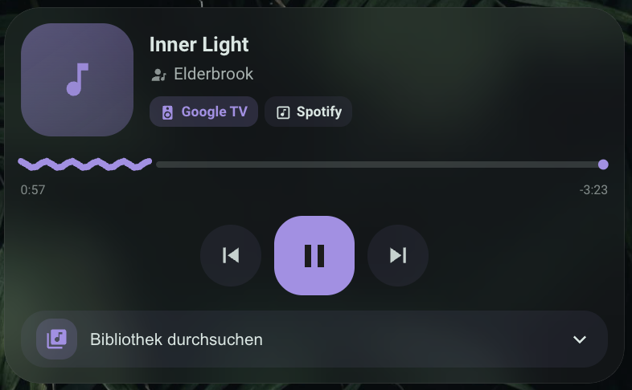

<details>
<summary>Konfiguration, Beispiele & Optionen</summary>

```yaml
type: custom:m3-media-card
entity: media_player.wohnzimmer
```

Die Wiedergabeposition wird clientseitig aus `media_position` +
`media_position_updated_at` hochgerechnet, damit der Fortschritt auch zwischen
den State-Updates des Players flüssig weiterläuft. Beim Pausieren ebbt die
Welle auf eine gerade Linie ab, der Balken trägt den Wiedergabezustand also
selbst; ein Stream ohne Dauer zeigt ein wanderndes Wellensegment und einen
**Live**-Chip statt einer Restzeit.

Transport-Buttons, Shuffle/Repeat, Spulen und die Bibliothek erscheinen nur,
wenn die Entity das jeweilige `supported_features` meldet. Das ist relevanter,
als es klingt: Ein Chromecast, der eine einzelne lokale Datei abspielt, meldet
weder `PREVIOUS_TRACK` noch `NEXT_TRACK` — diese Knöpfe fehlen dann zu Recht,
denn die Karte bietet keine Aktion an, die der Player ablehnen würde. Derselbe
Player über Spotify meldet sie, und dann sind sie da.

Player ganz ohne Metadaten (etwa ein Chromecast mit dem Default Media Receiver)
greifen auf den Dateipfad hinter `media_content_id` zurück: aus
`…/<Interpret>/<Album>/<Titel>.mp3` werden Interpret, Album und Titel. Echte
Metadaten haben immer Vorrang davor.

### Bibliothek und Warteschlange

Meldet der Player `BROWSE_MEDIA`, öffnet eine Zeile am Fuß der Karte den
Medienbrowser von Home Assistant: Breadcrumb-Navigation, je Zeile ein
Vorschaubild oder ein Icon nach `media_class`, Ordner zum Hineinnavigieren und
abspielbare Einträge, die per Tap starten. Liefert die Integration zusätzlich
eine Warteschlange, zeigt ein zweiter Reiter die kommenden Titel und die
eingeklappte Zeile liest sich als „Als Nächstes: …" statt „Bibliothek
durchsuchen". Integrationen ohne Warteschlange (darunter Cast und Spotify)
bekommen den Reiter gar nicht erst, statt ihn leer anzuzeigen.

Eine Ebene mit tausenden Einträgen wird bei 100 Zeilen gekappt, mit einem
Hinweis, tiefer zu navigieren — eine echte Bibliothek liefert hier 2147
Interpreten-Ordner auf einer Ebene, und alle zu rendern blockiert den Frame.

### Konfigurationsoptionen

| Option | Typ | Standard | Beschreibung |
|---|---|---|---|
| `entity` | string | – (erforderlich) | `media_player`-Entity |
| `name` | string | Freundlicher Name der Entity | Titel in der kompakten Ansicht |
| `show_source_select` | boolean | `false` | Quellenauswahl-Pills (falls von der Entity unterstützt) |
| `show_shuffle_repeat` | boolean | `false` | Shuffle-/Repeat-Buttons (falls unterstützt); Repeat läuft aus → alle → einer |
| `strip_track_number` | boolean | `true` | Führende Tracknummer aus dem Titel entfernen (`07 - Enjoy the Silence` → `Enjoy the Silence`). Auf ein bis zwei Ziffern begrenzt, damit `1979` und `365 Dreams` unangetastet bleiben |
| `time_display` | `remaining` \| `total` | `remaining` | Rechte Zeitangabe: Restzeit mit Minuszeichen oder Gesamtdauer |
| `meta_chips` | list | `[]` | Zusätzliche Chips neben Gerät und Quelle: `track`, `year`, `bitrate`. Jeder erscheint nur, wenn der Player das Attribut tatsächlich liefert — HA kennt kein Standardattribut für die Bitrate, die meisten Integrationen füllen diesen Chip also nie |
| `show_browser` | boolean | `true` | Bereich für Bibliothek/Warteschlange (erscheint ohnehin nur bei Playern mit `BROWSE_MEDIA`) |
| `default_tab` | `queue` \| `library` | `library` | Welcher Reiter zuerst offen ist, wenn es beide gibt |
| `browse_height` | number | `190` | Maximale Höhe der Liste in px |
| `use_artwork_color` | boolean | `true` | Akzentfarbe aus dem Cover extrahieren statt `accent_color` |
| `accent_color` | string | Lila (Media-Palette) | Fortschritts-/Lautstärkefarbe, falls `use_artwork_color: false` |
| `text_color` / `secondary_text_color` | string | Theme-Standard | Titel bzw. Interpret/Album |
| `card_background` | string | Glas-/Solid-Hintergrund | Kartenhintergrund |
| `animation` | `auto` \| `on` \| `off` | `auto` | Fortschritts-/Lautstärke-Animation; `auto`/`on` respektieren `prefers-reduced-motion` |
| `glass_background` | boolean | `true` | Milchiger Glashintergrund |
| `radius` / `corners` | number / object | `28` | Eckenradius, optional je Ecke |

</details>

## M3 Climate Overview Card

Eine kompakte Übersicht aller Temperatur-/Feuchte-Sensoren, gruppiert nach
Raum: eine Kachel pro Raum (Temperatur + Feuchte zusammengeführt), eine
waagerechte Vergleichsskala mit einem Punkt pro Raum, und ein Hinweis-Chip
im Header für den Raum, der am weitesten vom Komfortbereich abweicht.

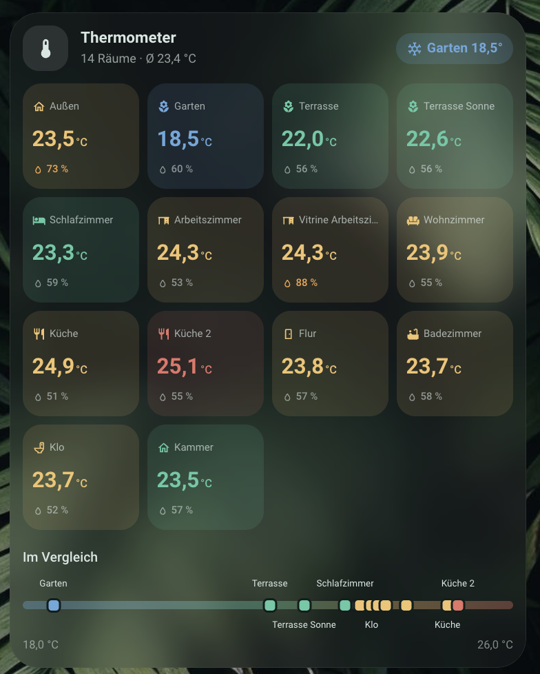

<details>
<summary>Konfiguration, Beispiele & Optionen</summary>

```yaml
type: custom:m3-climate-overview-card
auto_discover: true
```

### Entity-Quelle und Raumzuordnung

- **`auto_discover: true`** (Standard): findet alle `sensor`-Entities mit
  `device_class: temperature` oder `humidity` sowie jede `climate`-Entität —
  welche davon tatsächlich eine Kachel ergeben, entscheidet `mode`. Sensoren, die einem HA-
  **Bereich** zugeordnet sind, werden zu diesem Bereich gruppiert (Name/
  Icon aus der Bereichs-Registry); Sensoren ohne Bereich, die aber
  dasselbe **Gerät** teilen (z.B. ein Kombisensor für Temperatur+Feuchte),
  werden nach Gerät gruppiert; der Rest wird zu einer eigenen Kachel,
  benannt nach dem (bereinigten) Entity-Namen. Räume ohne
  Temperatursensor und ohne Thermostat werden übersprungen — Feuchte allein
  ergibt keinen Raum. Filterbar über `include_area` / `exclude_area` /
  `include_entities` / `exclude_entities` / `include_labels` /
  `exclude_labels` / `include_state` / `exclude_state`.
- **`mode`**: `temperature` (Standard) ist das bisherige Verhalten — nur
  eigene Sensoren, Räume ohne einen solchen entfallen. `thermostat` liest das
  Thermostat eines Raums, wenn er keinen eigenen Sensor hat (oder wenn das
  Thermostat ein Gerät der Stufe „group" ist, das mehrere echte vertritt),
  und fällt sonst auf den Sensor zurück. `thermostat_only` behält nur Räume,
  die überhaupt ein Thermostat haben, und liest immer aus ihm. Das so
  gefundene Thermostat ist zugleich das, was `tile_tap_action: thermostat`
  und der Standard-Tap des Popups öffnen — pro Raum über `climate_entity`
  unter `rooms` festlegbar, sonst automatisch als erste `climate`-Entität im
  Bereich des Raums.
- **`rooms`**: eine manuelle Liste (`name`, `icon`, `temperature_entity`,
  `humidity_entity`, `climate_entity`) statt Auto-Discovery — damit lässt
  sich die Übersicht von Hand aufbauen.

`name_strip` bereinigt Namen, die von einem Gerät statt einem Bereich
stammen (Standard entfernt die Suffixe "Temperature"/"Temperatur" sowie
die Präfixe "Thermometer N - "/"Thermostat ") — z.B. wird "Thermometer 6 -
Arbeitszimmer" zu "Arbeitszimmer". Da in den meisten echten Setups nur ein
Teil der Sensoren einem Bereich zugewiesen ist, entstehen dabei oft mehr
Kacheln als tatsächliche Räume (eine pro nicht zugeordnetem Gerät) —
entweder mit `exclude_entities` eingrenzen oder für ein sauberes Ergebnis
auf eine manuelle `rooms`-Liste umsteigen.

### Tap, Halten und das Popup

`tap_action` (Standard `more-info`) / `hold_action` (Standard `popup`) /
`double_tap_action` (Standard `none`) lösen `tile_tap_action` durch dasselbe
allgemeine Aktionssystem ab, das jede andere Karte benutzt, und ergänzen es um
die Aktionsart `popup`. `tile_tap_action: thermostat` funktioniert weiterhin
als der engere, ältere Schalter speziell für den Standard-Tap — eine
ausdrückliche `tap_action` sticht ihn.

`popup.mode` bestimmt, was die `popup`-Aktion öffnet: **`default-grid`**
(Standard) — dieselbe Karte noch einmal, eingegrenzt auf den Bereich des
angetippten Raums (bei einem von Hand konfigurierten Raum auf dessen
Entitäten); **`default-detail`** — HAs eigener More-Info-Dialog für die
angetippte Entität, ganz ohne eine Karte von uns; oder **`custom`** — eine
beliebige Lovelace-Karte aus `popup.card`, in der die Platzhalter
`[[area_id]]`, `[[device_id]]`, `[[entity_id]]`, `[[name]]`,
`[[temperature_entity]]` und `[[humidity_entity]]` gegen den angetippten Raum
aufgelöst werden, bevor die Karte gebaut wird. `popup.inherit_filters`
(Standard `true`) verengt den Filter der Karte um den des Popups, statt ihn
zu ersetzen.

### Farbstufen, Vergleichsskala, Hinweis-Chip

Die Temperatur jeder Kachel wird über `temp_thresholds` eingefärbt (vier
Grenzen → fünf Stufen: kalt/kühl/angenehm/warm/heiß); die Feuchte wechselt
außerhalb von `humidity_range` in die Warnfarbe. Die Vergleichsskala
(`show_scale`) trägt die Temperatur jedes Raums als Punkt auf demselben
Farbverlauf ein, mit alternierend ober-/unterhalb platzierten
Raumnamen (ab 9 Räumen nur noch Punkte mit Tooltip); bei weniger als 2
Räumen blendet sie sich aus. Der Hinweis-Chip (`show_outlier_chip`) hebt
den einen Raum hervor, der am weitesten außerhalb des Komfortbereichs
liegt — kältester bei Unterschreitung, wärmster bei Überschreitung — und
verschwindet, sobald alle Räume im Komfortbereich liegen.

`show_trend` zeigt einen kleinen Pfeil, wenn sich die Temperatur eines
Raums in der letzten Stunde um mehr als 0,5 K geändert hat (über die
History-API abgerufen, alle 15 Minuten aktualisiert). `show_mold_warning`
zeigt ein Warnsymbol auf Kacheln über 65 % Feuchte **und** unter 18 °C.

### Statt des Verlaufs das Thermostat öffnen

Ein Tap auf einen Raum öffnet den Dialog des Sensors — also seinen
Verlaufsgraphen. `tile_tap_action: thermostat` öffnet stattdessen das Thermostat
des Raums: das eigene `m3-climate-card-mini` der Suite, schwebend über der
Karte und dort direkt bedienbar.

```yaml
type: custom:m3-climate-overview-card
tile_tap_action: thermostat
```

Gesucht wird eine `climate`-Entität im selben Bereich wie der Raum. Räume
stammen meist aus einem Bereich, das trifft also weit öfter zu als nicht — ein
über das *Gerät* gruppierter Raum hat aber keinen Bereich, in dem gesucht
werden könnte. Dort benennt `climate_entity` es direkt:

```yaml
rooms:
  - name: Wohnzimmer
    temperature_entity: sensor.wohnzimmer_temperatur
    climate_entity: climate.wohnzimmer
```

Ein Raum ohne Thermostat verhält sich wie bisher und öffnet den Verlauf. Ein
Tap, der nichts öffnet, wäre schlimmer als einer, der das Falsche öffnet.

### Konfigurationsoptionen

| Option | Typ | Standard | Beschreibung |
|---|---|---|---|
| `auto_discover` | boolean | `true` | Automatische Erkennung von Temperatur-/Feuchte-Sensoren |
| `mode` | `temperature` \| `thermostat` \| `thermostat_only` | `temperature` | Worüber Auto-Discovery berichtet — siehe oben |
| `include_area` / `exclude_area` | list\<string\> | – | Bereichsfilter für Auto-Discovery |
| `include_entities` / `exclude_entities` | list\<string\> | – | Entitätsfilter für Auto-Discovery |
| `include_labels` / `exclude_labels` | list\<string\> | – | Labelfilter für Auto-Discovery |
| `include_state` / `exclude_state` | list\<string\> | – | Zustandsfilter (`unavailable`/`unknown` oder ein eigener Wert) |
| `rooms` | Liste (`name`, `icon`, `temperature_entity`, `humidity_entity`, `climate_entity`) | – | Manuelle Raumliste statt Auto-Discovery |
| `name_strip` | list\<string\> | siehe oben | Namens-Suffixe/-Präfixe, die aus automatisch erkannten Namen entfernt werden |
| `name` / `icon` | string | "Raumklima" / `mdi:thermometer` | Header |
| `show_header` | boolean | `true` | Kopfbereich der Karte |
| `tile_tap_action` | `history` \| `thermostat` | `history` | Engerer Altschalter für den Standard-Tap — eine ausdrückliche `tap_action` sticht ihn |
| `tap_action` / `hold_action` / `double_tap_action` | Aktionsobjekt | more-info / popup / none | Tap-/Halte-/Doppeltipp-Aktion; ergänzt die Aktionsart `popup` |
| `popup` | Objekt (`mode`, `title`, `inherit_filters`, `sort`, `show_header`, `card`, Filterfelder) | – | Popup der `popup`-Aktion — siehe oben |
| `sort` | `area` \| `temp_desc` \| `temp_asc` \| `name` | `area` | Kachel-Reihenfolge |
| `show_scale` | boolean | `true` | Vergleichsskala unter dem Kachelraster |
| `show_outlier_chip` | boolean | `true` | Header-Chip für den auffälligsten Raum |
| `show_trend` | boolean | `false` | Pfeil bei einer Änderung >0,5 K in der letzten Stunde |
| `show_mold_warning` | boolean | `false` | Warnsymbol über 65 % Feuchte und unter 18 °C |
| `temp_thresholds` | Objekt (`cold`/`cool`/`comfortable`/`warm`) | `19`/`20.5`/`23.5`/`25` | Grenzen zwischen den fünf Farbstufen |
| `humidity_range` | `[number, number]` | `[35, 65]` | Komfortbereich; außerhalb wird die Warnfarbe verwendet |
| `scale_min` / `scale_max` | number | automatisch aus den Messwerten | Fester Bereich der Vergleichsskala |
| `cold_color` / `cool_color` / `comfortable_color` / `warm_color` / `hot_color` | string | blau/türkis/grün/amber/rot | Temperatur-Farbstufen |
| `humidity_warn_color` | string | amber | Feuchtefarbe außerhalb von `humidity_range` |
| `accent_color` | string | Theme-Standard | Akzentfarbe des Header-Icons |
| `text_color` / `secondary_text_color` | string | Theme-Standard | Raumnamen/Werte bzw. Sekundärtext |
| `card_background` | string | Glas-/Solid-Hintergrund | Kartenhintergrund |
| `animation` | `auto` \| `on` \| `off` | `auto` | Animation der Vergleichsskala-Punkte; `auto`/`on` respektieren `prefers-reduced-motion` |
| `glass_background` | boolean | `true` | Milchiger Glashintergrund |
| `radius` / `corners` | number / object | `28` | Eckenradius, optional je Ecke |

</details>

## M3 Aquarium Card

Übersicht pro Aquarium: Wassertemperatur gegen einen Sollbereich, ein
festes Geräte-Raster (Taglicht, Nachtlicht, Pumpe, Heizer, CO2), ein
Tagesbogen-Beleuchtungsplan, optionale Kamera und Status-Chips für alles,
was Aufmerksamkeit braucht.

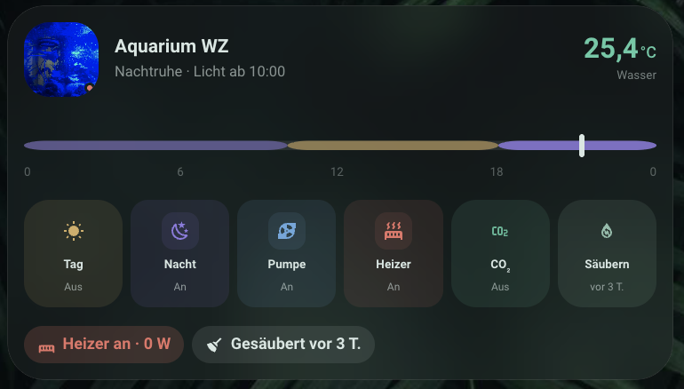

<details>
<summary>Konfiguration, Beispiele & Optionen</summary>

```yaml
type: custom:m3-aquarium-card
water_temperature_entity: sensor.aquarium_water_temperature
light_day:
  entity: switch.aquarium_light_day
pump:
  entity: switch.aquarium_pump
heater:
  entity: switch.aquarium_heater
```

### Geräte-Raster

Fünf feste Slots (`light_day`, `light_night`, `pump`, `heater`, `co2`),
jeweils `entity` + optional `name`/`icon`/`color` — `entity` weglassen
blendet die Kachel aus. `extra_devices` fügt beliebig viele weitere
Kacheln (gleiche Form) für alles Weitere hinzu, das einen Schalter
verdient (UV-Klärer, Dosierpumpe, ...). Tippen auf eine Kachel schaltet
`light`/`switch`-Entities über `homeassistant.toggle`; momentane Domains
(`button`, `input_button`, `scene`, `script`) lösen stattdessen ihren
jeweiligen "aktivieren"-Service aus, und `input_datetime`-Entities werden
mit dem aktuellen Zeitstempel versehen (genutzt vom Wartungs-Chip, siehe
unten). `heater_power_entity` (ein Leistungssensor) zeigt die aktuelle
Leistungsaufnahme unter der Heizer-Kachel und speist den Warn-Chip
"Heizer ohne Leistung".

### Tagesbogen-Beleuchtungsplan

`show_schedule` (Standard an) zeichnet einen 24h-Bogen unter dem
Geräte-Raster, phasenweise eingefärbt, mit Markierung der aktuellen Zeit
und einer Statuszeile ("Tagphase · noch 3 Std." / "Nachtruhe · Licht ab
08:00"). Zwei Wege, ihn zu füllen:

- **`schedule`**: eine manuelle Liste von `{ device: "day" | "night",
  start, end, color? }`-Einträgen (`start`/`end` als `"HH:MM"`) — die
  einfache, empfohlene Option für einen festen Tageszyklus.
- **`schedule_entity`**: ein `schedule`-Domain-Helfer — liest die
  heutigen `[{from, to}]`-Bereiche als eine einzige generische
  "an"-Phase (weniger granular als eine manuelle Liste, bleibt dafür
  automatisch mit einem bestehenden HA-Zeitplan-Helfer synchron).

Eine manuelle `schedule` hat Vorrang vor `schedule_entity`, wenn beide
gesetzt sind.

### Kamera

`camera_entity` + `camera_style` legt fest, wie die Karte die
Becken-Kamera zeigt: `none` (Standard), `thumbnail` (kleines
Eck-Vorschaubild, tippen zum Aufklappen), `banner`
(Header-Bild in voller Breite) oder `live` (bettet
`<ha-camera-stream>` für echtes Video ein — fällt automatisch auf ein
Standbild zurück, wenn die Kamera-Integration kein Streaming
unterstützt). `camera_refresh` (Sekunden, `0` = aus) steuert, wie oft
die Standbild-Varianten ein neues Bild holen; `camera_live_on_tap`
(Standard an) öffnet bei den Nicht-`live`-Stilen den Live-Stream-Dialog
beim Tippen.

### Chips, Wartung und Farben

Status-Chips erscheinen in fester Prioritätsreihenfolge und nur, wenn
relevant: Temperaturabweichung vom `target_range`, Heizer an aber ohne
Leistungsaufnahme (braucht `heater_power_entity`), fällige Wartung
(siehe unten), Wasserstand (aus einem `binary_sensor`, "on" = niedrig),
pH/TDS außerhalb des Bereichs und aktuelle Leistungsaufnahme. Bis zu
`AQUARIUM_CHIP_MAX` Chips werden direkt angezeigt, der Rest klappt in
einen "+N"-Überlauf-Chip.

`cleaning_entity` (ein `input_datetime`-Helfer) + `cleaning_interval`
(Tage) speisen den Wartungs-Chip: Tippen auf die "Aquarium
säubern"-Kachel stempelt den Helfer mit jetzt, und der Chip zählt ab
diesem Zeitstempel hoch ("Reinigung fällig", "vor 3 T.", ...) — kein
Umweg über Telegram/Benachrichtigungen nötig, nur ein normaler Helfer,
dessen Verlauf sich auch im Entity-Verlauf ansehen lässt.

### Reinigungs-Erinnerung

Der Chip ist nur sichtbar, solange das Dashboard offen ist — deshalb kann
der Abschnitt **Wartung → Erinnerung** im Editor eine echte
Home-Assistant-Automatisierung anlegen, die auch benachrichtigt, wenn
nichts geöffnet ist. Ein oder mehrere Benachrichtigungsziele auswählen
(die Liste wird aus den eigenen `notify.*`-Diensten aufgebaut), eine
tägliche Prüfzeit setzen, dann "Erinnerung einrichten" drücken. Die Karte:

- legt einen `input_number`-Intervall-Helfer an, falls
  `cleaning_interval_entity` noch nicht gesetzt ist (Startwert ist das
  aktuelle `cleaning_interval`), und schreibt ihn in die Kartenkonfiguration
  zurück;
- legt eine Automatisierung an (oder aktualisiert sie), die täglich zur
  gewählten Uhrzeit auslöst und jedes ausgewählte Ziel benachrichtigt, wenn
  seit `cleaning_entity` mehr Tage vergangen sind als der Intervall-Helfer
  erlaubt.

Die Automatisierungs-ID wird aus `cleaning_entity` abgeleitet — ein
erneuter Druck auf den Button aktualisiert also dieselbe Automatisierung,
statt Duplikate anzulegen. Es ist eine ganz normale Automatisierung,
sichtbar und bearbeitbar unter Einstellungen → Automatisierungen. Da Chip
und Automatisierung denselben `cleaning_interval_entity`-Helfer lesen,
ändert eine Anpassung dort beide gleichzeitig.

`accent_color` (Header-Icon) und die temperaturabhängigen
Kachelfarben haben beide eine zugehörige `_opacity`-Option
(`accent_opacity`, `tile_tint_opacity`, 0–100), die steuert, wie stark
diese Farbe ihren Hintergrund einfärbt — dieselben "Farbstärke"-Regler,
die jetzt bei jeder Karte neben der Farbauswahl erscheinen (siehe
Changelog).

### Konfigurationsoptionen

| Option | Typ | Standard | Beschreibung |
|---|---|---|---|
| `name` / `icon` | string | Entity-Name / `mdi:fishbowl-outline` | Header |
| `water_temperature_entity` | string | – | `sensor` mit `device_class: temperature` |
| `target_range` | `[number, number]` | `[24, 26]` | Sollbereich der Wassertemperatur |
| `light_day` / `light_night` / `pump` / `heater` / `co2` | Objekt (`entity`, `name`, `icon`, `color`) | – | Feste Geräte-Slots; `entity` weglassen blendet aus |
| `extra_devices` | Liste in gleicher Form | – | Weitere Geräte-Kacheln |
| `heater_power_entity` | string | – | Leistungssensor unter der Heizer-Kachel |
| `ph_entity` / `tds_entity` / `power_entity` | string | – | Optionale Wasserwerte-/Leistungssensoren für ihre Chips |
| `water_level_entity` | string | – | `binary_sensor`, "on" = niedriger Wasserstand |
| `cleaning_entity` | string | – | `input_datetime`-Helfer, beim Tippen gestempelt |
| `cleaning_interval` | number | `14` | Tage, bevor der Wartungs-Chip warnt |
| `cleaning_interval_entity` | string | – | `input_number`-Helfer; hat Vorrang vor `cleaning_interval` und wird mit der Erinnerungs-Automatisierung geteilt |
| `cleaning_notify_service` | list\<string\> | – | Benachrichtigungsziele der Erinnerung (ohne `notify.`-Präfix) |
| `cleaning_notify_time` | string | `18:00:00` | Tägliche Uhrzeit, zu der die Erinnerung prüft, ob die Reinigung fällig ist |
| `camera_entity` | string | – | `camera`-Entity |
| `camera_style` | `none` \| `thumbnail` \| `banner` \| `live` | `none` | Wie die Kamera angezeigt wird |
| `camera_refresh` | number | `10` | Standbild-Aktualisierungsintervall in Sekunden (`0` = aus) |
| `camera_live_on_tap` | boolean | `true` | Tippen öffnet den Live-Stream-Dialog |
| `schedule` | Liste von `{device, start, end, color?}` | – | Manuelle Beleuchtungsphasen |
| `schedule_entity` | string | – | `schedule`-Domain-Helfer als Fallback-Quelle |
| `show_schedule` | boolean | `true` | Tagesbogen-Zeitplan-Balken |
| `accent_color` / `accent_opacity` | string / number | Theme-Standard / `12` | Farbe + Farbstärke des Header-Icons |
| `tile_tint_opacity` | number | `12` | Farbstärke für Geräte-/Raum-Kachelhintergründe |
| `text_color` / `secondary_text_color` | string | Theme-Standard | Name/Wert bzw. Sekundärtext |
| `card_background` | string | Glas-/Solid-Hintergrund | Kartenhintergrund |
| `animation` | `auto` \| `on` \| `off` | `auto` | Zeitplan-Marker-/Kachel-Animationen |
| `glass_background` | boolean | `true` | Milchiger Glashintergrund |
| `radius` / `corners` | number / object | `20` | Eckenradius, optional je Ecke |

</details>

## M3 Updates Card

Übersicht aller verfügbaren Updates in einer Kachel: Status im Header, eigene
Boxen für Core/Betriebssystem/Supervisor mit Versionssprung und
Install-Button, Zeilen für Add-ons, HACS und Firmware, dazu ein
Aufklappbereich für alles, was bereits aktuell ist.

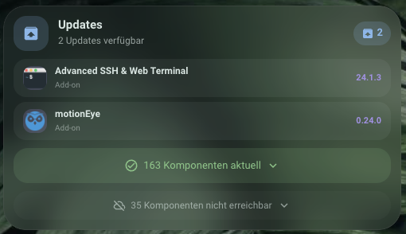

<sub>Screenshot mit simulierten Update-Daten, damit Kern-Boxen, MAJOR-Badge
und laufende Installation gleichzeitig sichtbar sind.</sub>

<details>
<summary>Konfiguration, Beispiele & Optionen</summary>

```yaml
type: custom:m3-updates-card
auto_discover: true
max_visible: 5
```

### Entitätsquelle und Gruppierung

- **`auto_discover: true`** (Standard): nimmt alle Entities der Domain
  `update` auf, `exclude_entities` blendet einzelne aus.
- **`auto_discover: false`**: nur die explizit in `entities` gelistete
  Auswahl.

Die Gruppierung läuft primär über die **Integration** aus der
Entity-Registry, nicht über den `entity_id`-Namen. Das ist wichtig, sobald
eine zweite HA-Instanz eingebunden ist: die spiegelt Entities mit fast
identischen Namen (`home_assistant_core_update_2`), und eine Namensregel
würde daraus zwei ununterscheidbare Core-Boxen machen. Die zweite Instanz
bekommt deshalb eine eigene Gruppe („Zweite Instanz"). `type_patterns`
überschreibt die Zuordnung pro `entity_id`-Fragment, falls die Automatik
etwas falsch einsortiert.

Entities, die Home Assistant beim Start nicht erreichen konnte
(`restored`/`unavailable`), zählen nicht als „aktuell" — sonst würde die
Kachel eine Abdeckung behaupten, die sie nicht hat. Sie stehen stattdessen
hinter einem eigenen Aufklapper unter den erreichbaren Komponenten, mit
Gruppe statt Version, damit auf einen Blick erkennbar ist, *warum* etwas
fehlt (z.B. „52 × Zweite Instanz" = die Verbindung dorthin liefert gerade
nichts).

`include_types` beschränkt die Anzeige auf bestimmte Gruppen (leer = alle),
`group_order` bestimmt die Reihenfolge und damit auch, welche Updates bei
gesetztem `max_visible` zuerst sichtbar bleiben. Im Editor lässt sich die
Reihenfolge mit Pfeiltasten je Gruppe umsortieren.

### Kern-Updates und Installation

Core, Betriebssystem und Supervisor bekommen eigene Boxen mit
`{installed} → {latest}` und einem **MAJOR**-Badge bei einem großen Sprung.
Die Erkennung behandelt beide Versionsschemata: bei
Home-Assistant-Kalenderversionen (`2026.8.1`) zählt ein Wechsel von Jahr oder
Monat, bei SemVer (`5.8.0`) die erste Zahl.

Der Install-Button ruft `update.install`. Mit `require_confirm: true`
(Standard) fragt er einmal nach („Update" → „Sicher?"), und entschärft sich
nach fünf Sekunden von selbst wieder — ein versehentlicher Tap soll auf einem
Wandtablet keinen Button hinterlassen, der beim nächsten Antippen Home
Assistant neu startet. Während der Installation zeigt der Button den
Fortschritt, die Box bekommt einen Balken am unteren Rand.

`no_install_types` listet Gruppen nur an, ohne Button (Standard: `firmware`,
weil ein fehlgeschlagenes Zigbee-Firmware-Flashen Hardware unbrauchbar machen
kann — das gehört bewusst auf die Geräteseite). Entities mit `auto_update`
bekommen ein Auto-Icon statt eines Buttons: Home Assistant installiert die
ohnehin selbst.

Die übrigen Zeilen öffnen beim Antippen den more-info-Dialog mit Changelog
und HA-eigenem Install-Button; `inline_install: true` blendet stattdessen
einen kleinen Button direkt in die Zeile ein.

### Backup-Chip, Übersprungene, Aufklappbereich

`backup_entity` (ein Zeitstempel-Sensor, z.B.
`sensor.backup_last_successful_automatic_backup`) zeigt im Banner das Alter
des letzten Backups — grün bis `backup_warn_days` (Standard 7), danach orange,
ohne verwertbaren Zeitstempel rot mit „Kein Backup".

Per `skip` übersprungene Updates stehen gedimmt am Ende der Liste und lassen
sich über einen eigenen Button wieder anzeigen (`update.clear_skipped`). Sie
zählen nicht als „aktuell" — sonst würde die Kachel mehr aktuelle Komponenten
behaupten, als es gibt.

`show_uptodate` (Standard an) fasst alles Aktuelle hinter einem Aufklapper
zusammen, aufgeklappt als kompakte Zeilen mit installierter Version.

### Benachrichtigung bei neuen Updates

Der Abschnitt **Benachrichtigung** im Editor legt eine
Home-Assistant-Automatisierung an:

- **`on_change`** (Standard) — meldet sofort, sobald ein Update auftaucht,
  eine Nachricht pro Komponente.
- **`daily`** / **`weekly`** — eine Sammelnachricht zur Zeit `notify_time`
  mit allen offenen Updates, damit aus einer Add-on-Welle nicht fünfzehn
  Pushes werden.

Überwacht wird dieselbe Auswahl, die die Kachel anzeigt;
`notify_exclude_entities` schaltet einzelne Entities stumm, ohne sie aus der
Kachel zu entfernen. Titel und Text lassen sich frei überschreiben,
Platzhalter: `{anzahl}`, `{liste}`, `{komponente}`, `{version}`, `{aktuell}`.

### Laufendes Update und Verbindungsverlust

Ein Core-Update startet Home Assistant neu, die Websocket-Verbindung bricht
also mitten in der Installation weg. Statt auf einem eingefrorenen Banner
stehen zu bleiben, zeigt die Kachel dann „Verbindung getrennt – {name} läuft"
mit dem Hinweis, dass Home Assistant gleich neu startet.

### Konfigurationsoptionen

| Option | Typ | Standard | Beschreibung |
|---|---|---|---|
| `auto_discover` | boolean | `true` | Alle `update.*`-Entities automatisch aufnehmen |
| `entities` | Liste\<string\> | – | Manuelle Auswahl bei `auto_discover: false` |
| `exclude_entities` | Liste\<string\> | – | Von der Anzeige ausgeschlossene Entities |
| `include_types` | Liste\<string\> | – | Nur diese Gruppen anzeigen (leer = alle) |
| `group_order` | Liste\<string\> | siehe oben | Reihenfolge der Gruppen und damit die Priorität |
| `type_patterns` | Objekt | – | `entity_id`-Fragment → Gruppe, überschreibt die Automatik |
| `no_install_types` | Liste\<string\> | `["firmware"]` | Gruppen ohne Install-Button |
| `max_visible` | number | `5` | Direkt sichtbare Zeilen, Rest hinter „mehr anzeigen“ (`0` = alle) |
| `require_confirm` | boolean | `true` | Install-Button fragt einmal nach |
| `inline_install` | boolean | `false` | Kleiner Install-Button direkt in der Zeile |
| `show_uptodate` | boolean | `true` | Aufklappbereich für bereits aktuelle Komponenten |
| `show_skipped` | boolean | `true` | Übersprungene Updates gedimmt am Ende anzeigen |
| `show_release_notes` | boolean | `true` | Tap auf die Versionszeile öffnet more-info |
| `backup_entity` | string | – | Zeitstempel-Sensor des letzten Backups |
| `backup_warn_days` | number | `7` | Ab diesem Alter wird der Backup-Chip orange |
| `notify_service` | Liste\<string\> | – | Benachrichtigungsziele (ohne `notify.`-Präfix) |
| `notify_mode` | `on_change` \| `daily` \| `weekly` | `on_change` | Sofort, oder Sammelnachricht zur festen Zeit |
| `notify_time` | string | `18:00:00` | Uhrzeit der Sammelnachricht (nur `daily`/`weekly`) |
| `notify_weekday` | string | `mon` | Wochentag der Sammelnachricht (nur `weekly`) |
| `notify_exclude_entities` | Liste\<string\> | – | Entities, die keine Benachrichtigung auslösen |
| `notify_title` / `notify_message` | string | – | Eigener Titel/Text, leer = Standardtext |
| `name` / `icon` | string | „Updates“ / `mdi:package-up` | Header |
| `ok_color` / `update_color` | string | `#81c784` / `#85b7eb` | Statusfarben |
| `addon_color` / `hacs_color` / `firmware_color` / `remote_color` | string | siehe oben | Typfarben der Zeilen |
| `accent_opacity` | number | `14` | Intensität der Banner-Tönung in Prozent |
| `text_color` / `secondary_text_color` | string | Theme-Standard | Name / Sekundärtext |
| `card_background` | string | Glas-/Solid-Hintergrund | Kartenhintergrund |
| `animation` | `auto` \| `on` \| `off` | `auto` | Aufklapp- und Fortschrittsanimationen |
| `glass_background` | boolean | `true` | Milchiger Glashintergrund |
| `radius` / `corners` | number / object | `28` | Eckenradius, optional je Ecke |

</details>

## M3 NAS Card / M3 System Card

Zwei Kacheln mit derselben Implementierung: Speicherbelegung pro Volume,
darunter CPU, RAM, Temperatur und Netzwerk als kompakte Statuskacheln,
optional der Zustand der Syncthing-Ordner. Die NAS Card liest die
**Glances**-Integration, die System Card die **System-Monitor**-Integration —
sonst sind sie identisch.

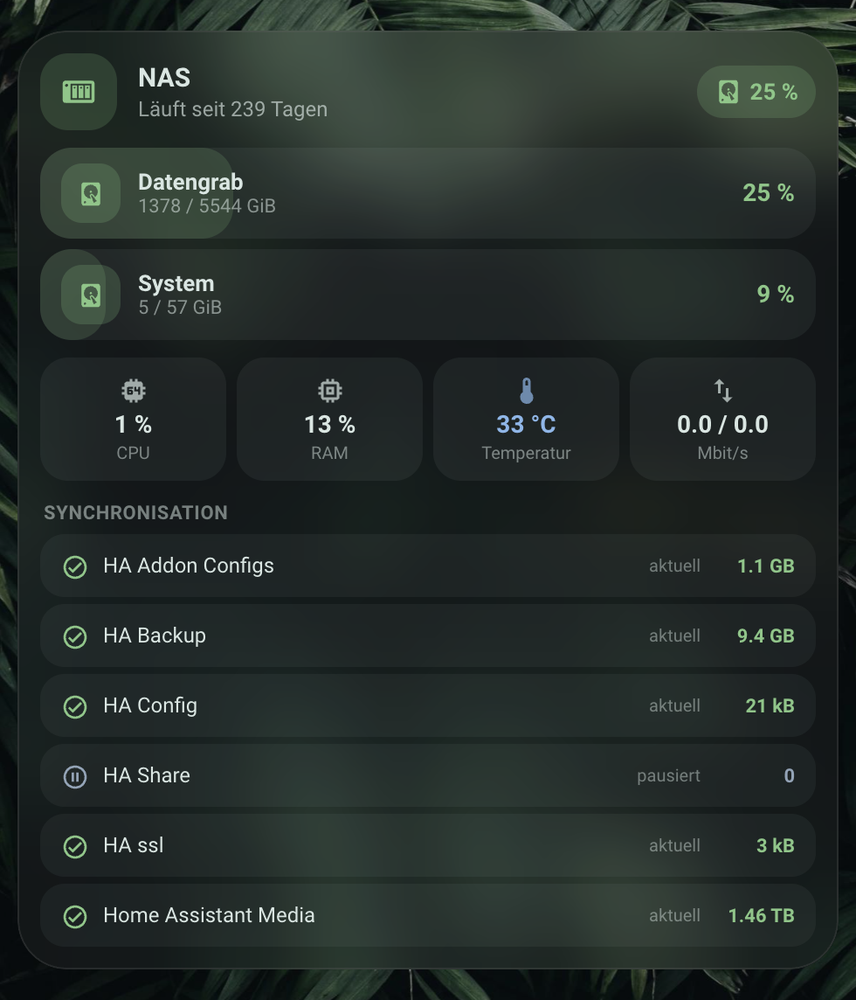

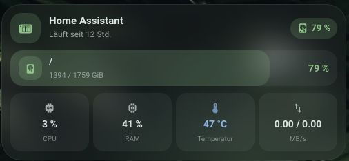

<sub>Oben die NAS Card mit zwei Volumes und den Syncthing-Ordnern, darunter
die System Card für die eigene Instanz. Die Laufwerksnamen stammen aus
`mount_names` — Glances meldet sonst Pfade wie
`/rootfs/srv/dev-disk-by-uuid-…`.</sub>

<details>
<summary>Konfiguration, Beispiele & Optionen</summary>

```yaml
type: custom:m3-nas-card
name: NAS

# oder, für die eigene HA-Instanz:
type: custom:m3-system-card
name: Home Assistant
```

### Datenquelle einrichten

Für die System Card genügt die mitgelieferte **System-Monitor**-Integration.

Für die NAS Card muss auf dem NAS **Glances** mit REST-API laufen; danach in
HA die Glances-Integration mit Host und Port `61208` hinzufügen. Im Container
ist ein Bind des Hosts nötig, sonst meldet Glances nur die Dateisysteme des
Containers statt der echten Volumes:

```yaml
services:
  glances:
    image: nicolargo/glances:latest-full
    network_mode: host
    pid: host
    restart: unless-stopped
    environment:
      - GLANCES_OPT=-w --disable-webui
    volumes:
      - /:/rootfs:ro
```

`--disable-webui` liefert nur die API, die HA braucht, ohne zusätzlich eine
unauthentifizierte Weboberfläche im Netz zu öffnen.

### Erkennung

Entitäten werden über den `translation_key` aus der Entity-Registry erkannt,
**nicht** über den Anzeigenamen — Home Assistant übersetzt den, eine
Namensregel würde nur in einer Sprache funktionieren. Das Label (Mount-Punkt,
Sensorname, Interface) stammt aus der `unique_id`.

Ist kein Prozent-Sensor aktiv — System Monitor liefert `disk_use_percent`
standardmäßig deaktiviert — rechnet die Karte die Belegung aus „belegt“ und
„frei“, statt das Volume wegzulassen.

Mount-Pfade werden für die Anzeige gekürzt (`/rootfs` entfällt,
UUID-Volumes werden zu „Volume a1b2c3d4“). `mount_names` überschreibt das
pro Pfad, `exclude_mounts` blendet einzelne aus.

### Temperatur

Glances meldet Platten- und SoC-Sensoren in einer Liste, und der SoC läuft
immer heißer. Die Karte bevorzugt deshalb Laufwerkssensoren, sobald welche
vorhanden sind — sonst stünde dort 49 °C, während die Platten bei 32 °C
liegen. `temperature_labels` legt die Auswahl bei Bedarf selbst fest.

### Synchronisation

Mit eingerichteter **Syncthing**-Integration listet die Karte jeden Ordner
mit Zustand und Größe; während einer Übertragung steht dort der Fortschritt
statt der Größe. Ohne die Integration bleibt der Abschnitt leer.

### Benachrichtigungen

Der Abschnitt **Benachrichtigung** legt eine Automatisierung mit bis zu drei
Auslösern an:

- **Sync-Fehler** — Ordner geht auf `error`, oder `errors` bzw. `pull_errors`
  steigt über 0. Letzteres ist wichtig: Syncthing sammelt Pull-Fehler,
  während der Ordner formal auf `idle` steht. **Pausierte Ordner lösen nichts
  aus** — das ist eine Einstellung, kein Fehler.
- **Platte voll** — Belegung über `notify_disk_threshold`.
- **Nicht erreichbar** — die Sensoren melden `unavailable`, standardmäßig
  aus, weil das bei jedem Neustart feuert.

Die Nachrichten nutzen die Namen, die auch die Kachel anzeigt. Die rohen
Entity-Namen wären unbrauchbar („Syncthing (http://…) ABCDEFG HA Share HA
Share“), deshalb wird die Zuordnung beim Einrichten in die Automatisierung
geschrieben.

### Konfigurationsoptionen

| Option | Typ | Standard | Beschreibung |
|---|---|---|---|
| `source` | `glances` \| `systemmonitor` | je nach Kacheltyp | Datenquelle |
| `config_entry_id` | string | – | Einschränkung auf eine Instanz, wenn mehrere existieren |
| `exclude_mounts` | Liste\<string\> | – | Auszublendende Mount-Punkte |
| `mount_names` | Objekt | – | Mount-Pfad → Anzeigename |
| `disks` | Liste | – | Explizite Reihenfolge und Benennung der Volumes |
| `disk_warn` / `disk_critical` | number | `80` / `90` | Prozent-Schwellwerte der Zeilenfarbe |
| `temp_warn` / `temp_critical` | number | `55` / `65` | Temperatur-Schwellwerte in °C |
| `temperature_labels` | Liste\<string\> | – | Zu berücksichtigende Temperatursensoren |
| `max_visible` | number | `4` | Direkt sichtbare Laufwerke, Rest hinter „mehr anzeigen“ |
| `show_cpu` / `show_memory` / `show_temperature` / `show_network` | boolean | `true` | Statuskacheln |
| `show_uptime` | boolean | `true` | Laufzeit im Untertitel |
| `show_sync` | boolean | `true` | Syncthing-Abschnitt |
| `sync_entities` | Liste\<string\> | – | Bestimmte Syncthing-Ordner statt aller |
| `notify_service` | Liste\<string\> | – | Benachrichtigungsziele (ohne `notify.`-Präfix) |
| `notify_sync_errors` | boolean | `true` | Bei Sync-Fehlern melden |
| `notify_disk_full` | boolean | `true` | Bei voller Platte melden |
| `notify_disk_threshold` | number | `90` | Schwellwert dafür |
| `notify_offline` | boolean | `false` | Melden, wenn die Quelle nichts mehr liefert |
| `notify_offline_minutes` | number | `10` | Wartezeit davor |
| `notify_title` / `notify_message` | string | – | Eigener Titel/Text, leer = Standardtext |
| `name` / `icon` | string | „NAS“ / `mdi:nas` | Header |
| `ok_color` / `warn_color` / `critical_color` / `offline_color` | string | siehe oben | Statusfarben |
| `accent_opacity` | number | `18` | Intensität der Kopfbereich-Tönung |
| `text_color` / `secondary_text_color` | string | Theme-Standard | Name / Sekundärtext |
| `card_background` | string | Glas-/Solid-Hintergrund | Kartenhintergrund |
| `animation` | `auto` \| `on` \| `off` | `auto` | Aufklapp-Animation |
| `glass_background` | boolean | `true` | Milchiger Glashintergrund |
| `radius` / `corners` | number / object | `28` | Eckenradius, optional je Ecke |

</details>

## M3 Supply Card

Verbrauchsmaterial — Waschmittel-Pods, Spülmaschinentabs, Filter, Tierfutter
— mit Restmenge, geschätzter Reichweite und Nachfüllen per Tap. Ein Vorrat
steht groß als Hero mit einem Punkt je verbleibender Einheit, der Rest folgt
als kompakte Zeilen; ein Tap darauf macht ihn zum Hero.

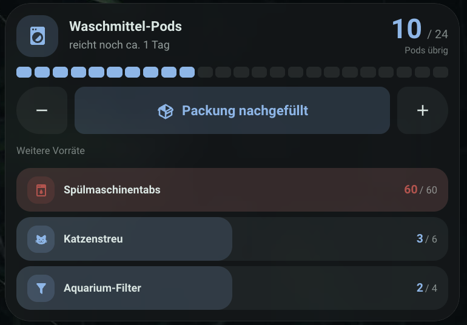

<details>
<summary>Konfiguration, Beispiele & Optionen</summary>

```yaml
type: custom:m3-supply-card
items:
  - entity: counter.waschmittel_pods
    name: Waschmittel-Pods
    icon: mdi:washing-machine
    unit: Pods
  - entity: counter.spulmaschinentabs
    name: Spülmaschinentabs
    icon: mdi:dishwasher
```

### Den Zähler anlegen

Jeder Vorrat braucht einen Helfer für die Restmenge: **Einstellungen → Geräte
& Dienste → Helfer → Helfer erstellen → Zähler**. Setze *Maximum* auf den
Inhalt einer Packung — Home Assistant speichert keinen höheren Wert, eine
60er-Packung Tabs braucht also Maximum 60. Genau deshalb wird `pack_size` in
der Karte auf dieses Maximum begrenzt.

Mehr braucht die Karte nicht: mit − herunterzählen und bei einer neuen
Packung auf *Packung nachgefüllt* tippen.

### Automatisch herunterzählen

Damit der Zähler dem Gerät folgt, legst du eine Automatisierung an, die ihn
nach jedem Durchlauf verringert:

```yaml
alias: Waschmittel-Pods herunterzählen
triggers:
  - trigger: state
    entity_id: sensor.waschmaschine_status
    to: "end"
actions:
  - action: counter.decrement
    target:
      entity_id: counter.waschmittel_pods
mode: single
```

Den Trigger ersetzt du durch das, was bei deiner Maschine das Ende markiert —
ein Status-Sensor, der auf `end`/`beenden` springt, eine Leistungsaufnahme
unter einem Schwellwert oder ein `binary_sensor`, der auf `off` geht.

### Reichweiten-Schätzung

Der Untertitel zeigt, wie lange ein Vorrat noch reicht — berechnet aus seiner
eigenen Historie: jede Verringerung zählt als Verbrauch, Nachfüllungen werden
ignoriert. Zwei Bedingungen müssen erfüllt sein, bevor eine Schätzung
erscheint: mindestens 3 Verringerungen und mindestens 2 Tage Beobachtung.
Sonst würden ein paar Taps beim Einrichten auf Hunderte pro Tag hochgerechnet.

Geteilt wird durch den Zeitraum, den die Historie **tatsächlich abdeckt**,
nicht durch `rate_window`. Der Recorder von Home Assistant bewahrt
standardmäßig 10 Tage auf, ein 30-Tage-Fenster liefert also meist ein Drittel
davon — durch das Fenster zu teilen würde die dreifache Reichweite
versprechen. Für mehr Daten `purge_keep_days` in der Recorder-Konfiguration
erhöhen.

Für einen Vorrat, der ein paar Mal im Jahr gewechselt wird — etwa ein
Aquarium-Filter — reicht die Historie nie aus. Dafür `usage_per_week` setzen,
dann rechnet die Karte direkt damit.

> Langzeitstatistik wird **nicht** verwendet: die gibt es nur für
> `sensor`-Entitäten mit `state_class`, und counter- oder
> input_number-Helfer tauchen dort nie auf.

### Benachrichtigungen

Die Karte legt auf Wunsch eine Home-Assistant-Automatisierung an, die dich an
zur Neige gehende Vorräte erinnert — täglich abends, wöchentlich oder sofort
beim Unterschreiten. Der Abend-Digest schickt eine Nachricht mit allen
Vorräten auf einmal statt einer Push je Artikel. Empfänger wählen,
entscheiden ob „leer", „kritisch" oder „knapp" meldenswert ist, Knopf
drücken — die Automatisierung erscheint unter *Einstellungen →
Automatisierungen*. Titel und Text akzeptieren `{anzahl}` und `{liste}`
(Digest) bzw. `{vorrat}` und `{rest}` (sofort).

Standardmäßig sind alle Vorräte der Karte erfasst. Mit `notify_items`
grenzt du das auf eine Auswahl ein — praktisch, wenn nur das Waschmittel
eine Push wert ist und die Ersatzfilter nicht.

### Einkaufsliste

Ist `todo_entity` gesetzt, zeigt ein kritischer Vorrat im Hero einen Chip
*Auf die Einkaufsliste*. `auto_add_to_list` erledigt das ungefragt als Teil
der Benachrichtigungs-Automatisierung — sie liest die Liste vorher aus und
überspringt, was schon draufsteht, damit eine tägliche Erinnerung keine
Dubletten anhäuft. Eine To-do-Liste brauchst du dafür zuerst:
**Einstellungen → Geräte & Dienste → Integration hinzufügen → Lokale
To-do-Liste**.

| Option | Typ | Standard | Beschreibung |
|---|---|---|---|
| `items` | Liste | – | Die Vorräte, siehe unten |
| `hero` | number \| string | geringste Reichweite | Index oder Entität für die große Darstellung |
| `layout` | `hero_and_list` \| `list_only` \| `hero_only` | `hero_and_list` | Layout |
| `refill_mode` | `set` \| `add` | `set` | Nachfüllen setzt auf, oder addiert, eine Packung |
| `list_tap_action` | `hero` \| `more-info` | `hero` | Verhalten beim Tap auf eine Zeile |
| `rate_window` | number | `30` | Tage Historie für die Verbrauchsrate |
| `usage_per_week` | number | – | Feste Rate, überspringt die Berechnung |
| `todo_entity` | string | – | To-do-Liste für die Einkaufseinträge |
| `notify_items` | Liste | alle | Benachrichtigung auf bestimmte Vorräte begrenzen |
| `auto_add_to_list` | boolean | `false` | Automatisch hinzufügen, wenn kritisch |
| `notify_*` | – | – | Siehe Benachrichtigungen oben |
| `ok_color` / `low_color` / `critical_color` / `unavailable_color` | string | siehe oben | Zustandsfarben |
| `accent_opacity` | number | `18` | Stärke der Tönung |
| `text_color` / `secondary_text_color` | string | Theme-Standard | Name / Sekundärtext |
| `card_background` | string | Glas/Solid-Hintergrund | Kartenhintergrund |
| `animation` | `auto` \| `on` \| `off` | `auto` | Animation beim Hero-Wechsel |
| `glass_background` | boolean | `true` | Milchglas-Hintergrund |
| `radius` / `corners` | number / object | `28` | Eckenradius, optional je Ecke |

Je Artikel:

| Option | Typ | Standard | Beschreibung |
|---|---|---|---|
| `entity` | string | – | `counter.*`- oder `input_number.*`-Helfer |
| `name` / `icon` / `color` | string | von der Entität | Name, Icon, Farbe bei ausreichendem Bestand |
| `pack_size` | number | Helfer-Maximum | Einheiten je Packung, begrenzt auf dieses Maximum |
| `unit` | string | – | Mehrzahlwort unter dem Wert, z.B. „Pods" |
| `low_threshold` | number | 25 % der Packung | Darunter: „knapp" |
| `critical_threshold` | number | 10 % der Packung, min. 1 | Darunter: „kritisch" |
| `shopping_item` | string | der Name | Text für die To-do-Liste |
| `usage_per_week` | number | – | Feste Rate für diesen Artikel |

</details>

## M3 Todo Card

Einkaufs- und Aufgabenlisten im Designsystem des Projekts, als Ersatz für die
eingebaute `todo-list`-Karte von Home Assistant. Eintragen in einer Zeile,
Abhaken per Tap, und Erledigtes verschwindet in einem Aufklappbereich.

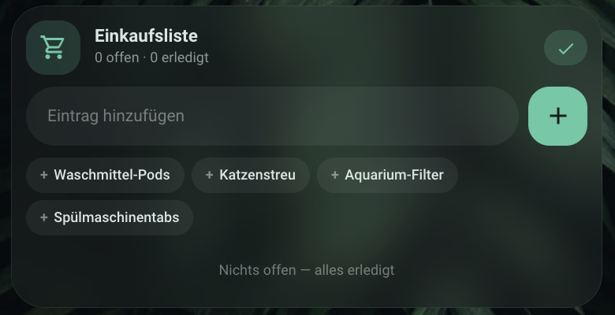

<details>
<summary>Konfiguration, Beispiele & Optionen</summary>

```yaml
type: custom:m3-todo-card
entity: todo.einkaufsliste
name: Einkaufsliste
quick_add_mode: supplies
```

Eine To-do-Liste brauchst du zuerst: **Einstellungen → Geräte & Dienste →
Integration hinzufügen → Lokale To-do-Liste**. Jede To-do-Integration
funktioniert — die Karte liest die `todo.*`-Entität, auf die du sie zeigen
lässt.

### Schnellwahl-Chips

Optionale Ein-Tap-Knöpfe über der Liste, gespeist aus einer von drei Quellen
über `quick_add_mode`:

| Modus | Chips zeigen |
|---|---|
| `none` (Standard) | nichts |
| `fixed` | die Einträge aus `quick_add` |
| `recent` | zuvor abgehakte Einträge |
| `supplies` | die Einkaufstexte der M3 Supply Cards dieses Dashboards |

`supplies` ist die Brücke zwischen beiden Karten: was du bei einem Vorrat als
`shopping_item` hinterlegt hast, wird hier zum Chip — sortiert, sodass der
knappste Vorrat vorn steht. Was schon auf der Liste steht, fällt raus; es
würde nur die Dublettenwarnung auslösen.

### Bearbeiten

Ein Tap auf eine Zeile hakt sie ab. **Langes Drücken** öffnet sie zum
Umbenennen oder Löschen. Mit `reorderable: true` bekommt jede Zeile einen
Ziehgriff; das Umsortieren läuft über die Reihenfolge von Home Assistant
selbst, sofern das Backend sie unterstützt.

`group_by_category: true` gruppiert Einträge der Form `Kategorie: Artikel`
unter einer kleinen Überschrift und lässt das nun überflüssige Präfix in der
Zeile weg — aus „Obst: Äpfel" wird „Äpfel" unter der Überschrift „Obst".

| Option | Typ | Standard | Beschreibung |
|---|---|---|---|
| `entity` | string | – | Die `todo.*`-Liste (Pflicht) |
| `name` / `icon` | string | von der Entität | Name und Icon im Header |
| `add_position` | `top` \| `bottom` | `top` | Wo neue Einträge landen |
| `prevent_duplicates` | boolean | `true` | Vorhandenen Eintrag hervorheben statt doppelt anlegen |
| `quick_add_mode` | `none` \| `fixed` \| `recent` \| `supplies` | `none` | Quelle der Chips |
| `quick_add` | Liste | – | Chip-Einträge für `fixed` |
| `max_quick_add` | number | `4` | Höchstzahl der Chips |
| `show_completed` | boolean | `true` | Aufklappbereich für Erledigtes |
| `show_clear_completed` | boolean | `true` | „Erledigte löschen" anbieten |
| `group_by_category` | boolean | `false` | Nach `Kategorie:`-Präfix gruppieren |
| `reorderable` | boolean | `false` | Ziehgriff zum Umsortieren |
| `accent_color` | string | `#5dcaa5` | Akzent für Icon, Chip und Häkchen |
| `accent_opacity` | number | `18` | Stärke der Tönung |
| `text_color` / `secondary_text_color` | string | Theme-Standard | Name / Sekundärtext |
| `card_background` | string | Glas/Solid-Hintergrund | Kartenhintergrund |
| `animation` | `auto` \| `on` \| `off` | `auto` | Morph-Animationen |
| `glass_background` | boolean | `true` | Milchglas-Hintergrund |
| `radius` / `corners` | number / object | `28` | Eckenradius, optional je Ecke |

</details>

## M3 Occupancy Card

Präsenz Raum für Raum. Jede Zeile ist ein Raum; er gilt als belegt, sobald
einer seiner Sensoren `on` ist. Die Auto-Erkennung gruppiert `binary_sensor`
mit `device_class: occupancy`/`motion`/`presence` nach Bereich (Fallback:
Gerät, dann einzelner Sensor). Eine optionale Zeitleiste zeigt, wann ein Raum
in den letzten Stunden belegt war.

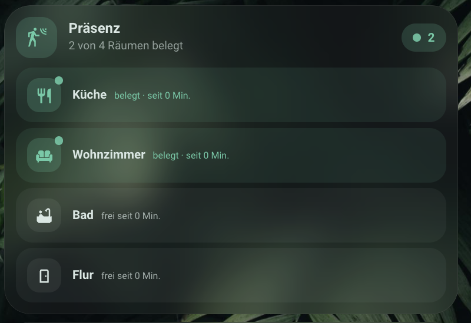

<details>
<summary>Konfiguration, Beispiele & Optionen</summary>

```yaml
type: custom:m3-occupancy-card
auto_discover: true
# oder manuelle Liste (auto_discover aus):
# sensors:
#   - entity: binary_sensor.wohnzimmer_presence
#     name: Wohnzimmer
```

### Konfigurationsoptionen

| Option | Typ | Standard | Beschreibung |
| --- | --- | --- | --- |
| `auto_discover` | boolean | `true` | Präsenz-/Bewegungssensoren automatisch finden |
| `include_area` | Liste | – | Nur diese Bereiche |
| `exclude_entities` | Liste | – | Diese Sensoren auslassen |
| `sensors` | Liste | – | Manuelle Räume: `{ entity, name, icon }` (schlägt Discovery) |
| `sort` | `occupied_first` \| `name` \| `last_active` | `occupied_first` | Reihenfolge |
| `show_timeline` | boolean | `true` | Aktivitäts-Zeitleiste unter den Zeilen |
| `timeline_hours` | number | `3` | Abgedeckte Stunden (1–24) |
| `max_visible` | number | – | Sichtbare Zeilen begrenzen, Rest aufklappbar |
| `notify_service` / `notify_enabled` | – | – | Optionale Push je Sensor bei Belegung (standardmäßig aus) |

</details>

## M3 Cover Card

Steuerung für `cover`-Entitäten, die sich dem Gerät anpasst: Sie liest
`supported_features` und rendert nur, was die Entität wirklich kann —
Auf/Stopp/Zu-Tasten, einen Positions-Slider mit Fenstervorschau und
Lamellen-Steuerung. Geräte ohne `cover`-Integration (z. B. ein FingerBot auf
zwei Schaltern) laufen über `entity_type: switch_pair`. Ein `group`-Modus
fasst mehrere Rollläden — oder Schalterpaare — mit Sammelsteuerung in einer
Karte zusammen.

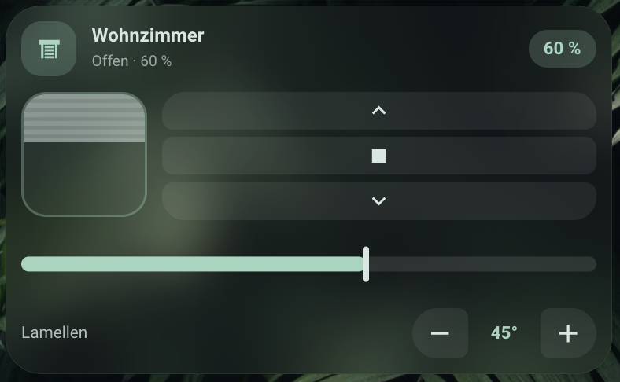

<details>
<summary>Konfiguration, Beispiele & Optionen</summary>

```yaml
# Einzeln
type: custom:m3-cover-card
entity: cover.wohnzimmer

# Schalterpaar (Auf/Ab-Relais, z. B. FingerBot)
# type: custom:m3-cover-card
# entity_type: switch_pair
# up_entity: switch.jalousie_hoch
# down_entity: switch.jalousie_runter

# Gruppe
# type: custom:m3-cover-card
# mode: group
# entities:
#   - cover.wohnzimmer
#   - { entity_type: switch_pair, up_entity: switch.kueche_hoch, down_entity: switch.kueche_runter, name: Küche }
```

### Konfigurationsoptionen

| Option | Typ | Standard | Beschreibung |
| --- | --- | --- | --- |
| `mode` | `single` \| `group` | `single` | Ein Cover im Detail oder eine Liste |
| `entity` | string | – | Das Cover (Einzelmodus) |
| `entity_type` | `cover` \| `switch_pair` | `cover` | Auf/Ab/Stopp-Schalter statt Cover |
| `up_entity` / `down_entity` / `stop_entity` | string | – | Schalter für `switch_pair` |
| `entities` | Liste | – | Gruppenzeilen: Cover-ID oder `switch_pair`-Objekt |
| `show_preview` | boolean | `true` | Fenstervorschau mit Füllstand |
| `slider_style` | `plain` \| `wavy` | `plain` | Stil des Positions-Sliders |
| `invert_position` | boolean | `false` | Für Integrationen mit umgekehrter Position |
| `tilt_step` | number | `15` | Lamellen-Schrittweite (°) |
| `travel_time` | number | `0` | Sekunden für positionslose Geräte (optimistisches Feedback) |
| `show_master` | boolean | `true` | Sammelsteuerung im Gruppenmodus |
| `row_tap_action` | `more-info` \| `toggle` | `more-info` | Tippen auf eine Gruppenzeile |

> **Keine Cover-Integration?** Ein Home-Assistant-Template-Cover bündelt zwei
> Schalter zu einer `cover`-Entität und schaltet damit Position/Vorschau frei.

</details>

## M3 Leak Card

Wassermelder-Übersicht mit zwei klar getrennten Zuständen: ruhig, wenn alles
trocken ist, unübersehbar im Alarm — inklusive direkter Absperrung. Erkennt
`binary_sensor` mit `device_class: moisture` automatisch, findet den
Batterie-Sensor jedes Melders und färbt die ganze Karte rot, sobald einer
Wasser meldet.

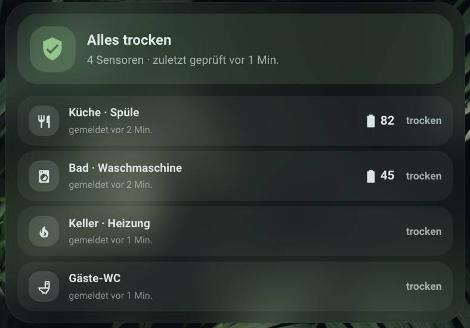

<details>
<summary>Konfiguration, Beispiele & Optionen</summary>

```yaml
type: custom:m3-leak-card
auto_discover: true
valve_entity: valve.hauptwasser      # optional: valve / switch / cover
# siren_entity: siren.alarm          # optional, für die Quittieren-Taste
```

`max_visible` hält die Liste kurz: Die ersten Sensoren stehen da, der Rest
liegt hinter einem „N weitere anzeigen". Im Alarmfall tritt die Begrenzung
zurück — welcher Sensor nass ist, muss ohne zweiten Tap sichtbar sein.

### Konfigurationsoptionen

| Option | Typ | Standard | Beschreibung |
| --- | --- | --- | --- |
| `auto_discover` | boolean | `true` | `device_class: moisture`-Sensoren finden |
| `include_area` / `exclude_entities` | Liste | – | Discovery eingrenzen |
| `sensors` | Liste | – | Manuelle Liste: `{ entity, name, icon, battery_entity }` |
| `valve_entity` | string | – | Absperrventil (valve/switch/cover) — nur dann erscheint die Absperr-Taste |
| `confirm_shutoff` | boolean | `false` | Vor dem Absperren nachfragen |
| `siren_entity` / `ack_entity` | string | – | Wird auf der Quittieren-Taste ausgeschaltet/gesetzt |
| `stale_hours` | number | `6` | Länger stiller Sensor gilt als „still" |
| `battery_warn` / `battery_critical` | number | `40` / `20` | Schwellen des Batterie-Chips |
| `test_interval_days` | number | `0` | „Test fällig"-Chip nach N Tagen (mit `last_test_entity`) |
| `max_visible` | number | – | Zeigt nur so viele Sensoren, der Rest hinter einem Umschalter |
| `collapse_ok` | boolean | `false` | Liste einklappen, solange alles trocken |
| `notify_service` / `notify_enabled` | – | – | Optionale Push bei Wasser (standardmäßig aus) |

> Die Karte ist die **Übersicht**, nicht der Alarm. Kombiniere sie mit einer
> Automation, die eine kritische Push sendet (`push: sound: critical` auf iOS,
> hochpriorisierter Kanal auf Android) — dann wirst du auch bei geschlossenem
> Dashboard benachrichtigt.

</details>

## M3 Waste Card

Abfuhrtermine: ein Hero mit der nächsten Abholung, eine Zwei-Wochen-Zeitleiste
und eine Zeile pro Tonne. Gib ihr Sensoren, deren Zustand die Tage bis zur
Abholung ist (z. B. Waste Collection Schedule mit
`value_template: '{{ value.daysTo }}'`). Zwei Modi: **info** (Tonnen werden
automatisch geleert — reine Information) und **reminder** (du stellst selbst
raus — eskaliert kurz vor dem Termin mit einem Rausgestellt-Knopf).

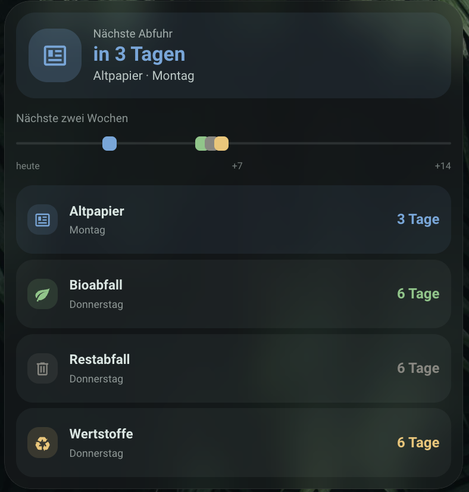

<details>
<summary>Konfiguration, Beispiele & Optionen</summary>

```yaml
type: custom:m3-waste-card
mode: info            # oder: reminder
entities:
  - sensor.altpapier
  - sensor.bio
  - { entity: sensor.wertstoff, name: Wertstoff, color: '#f0c46e' }
```

### Konfigurationsoptionen

| Option | Typ | Standard | Beschreibung |
| --- | --- | --- | --- |
| `mode` | `info` \| `reminder` | `info` | Nur Anzeige oder Eskalation + Quittieren |
| `entities` | Liste | – | Sensoren (Tage bis Abholung): ID oder `{ entity, name, icon, color }` |
| `calendar_entity` | string | – | Kalender mit einem Eintrag je Abholung, dessen Titel die Tonne benennt. Wird mit `entities` zusammengeführt. |
| `hero_primary` | `days` \| `weekday` | `days` | Hero zeigt „in 3 Tagen" oder „Montag" |
| `hero_icon` | `first` \| `multi` | `first` | Einzelnes oder überlappende Tonnen-Icons |
| `show_timeline` | boolean | `true` | Zwei-Wochen-Zeitleiste |
| `timeline_days` | number | `14` | Zeitleisten-Spanne (7–28) |
| `max_rows` | number | `0` | Zeilen begrenzen, Rest aufklappbar (0 = alle) |
| `reminder_offset` | number | `1` | Tage vor Abholung, ab denen erinnert wird (Reminder-Modus) |
| `reminder_time` | string | `18:00` | Am Vortag erst ab dieser Uhrzeit erinnern |
| `ack_entity` | string | – | `input_boolean`/`input_datetime` für „rausgestellt" |
| `notify_service` / `notify_enabled` | – | – | Optionale Rausstell-Erinnerung per Push (standardmäßig aus) |

</details>

## M3 Time Card

Eine kompakte Zeitauswahl für einen `input_datetime`-Helfer, mit optionalem
Übernehmen-Knopf und Preset-Chips. Drei Eingabe-Varianten (Stepper,
Scrollräder oder segmentierte Anzeige).

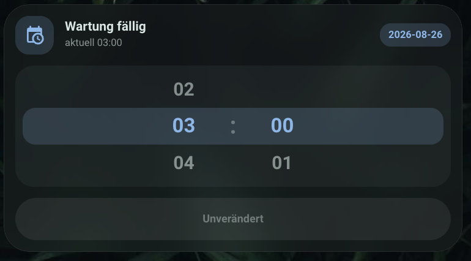

<details>
<summary>Konfiguration, Beispiele & Optionen</summary>

```yaml
type: custom:m3-time-card
entity: input_datetime.weckzeit
```

</details>

## M3 Clock Card

Eine Uhr in fünf Stilen, alle in derselben Designsprache. Sie liest **keine
Entität** — die Zeit kommt aus dem Browser, die Zeitzone aus Home Assistant —
und läuft damit auf jedem Dashboard ohne Einrichtung. Nur die optionalen Extras
weiter unten brauchen Entitäten.

Die Karte zeichnet nur neu, solange sie tatsächlich sichtbar ist: Eine Uhr auf
einem Wandtablet würde sonst wochenlang für einen leeren Raum animieren. Stile
ohne Bewegung zwischen den Sekunden schalten auf einen Timer um, der erst zur
vollen Minute aufwacht.

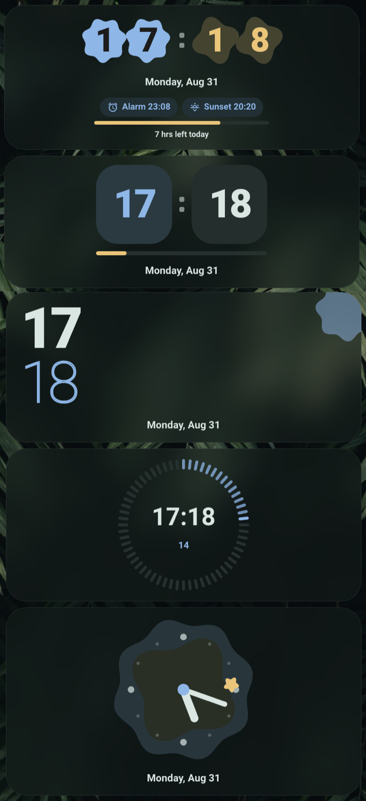

<details>
<summary>Konfiguration, Beispiele & Optionen</summary>

```yaml
type: custom:m3-clock-card
style: tiles          # tiles | shapes | lockscreen | scallop | ring
show_seconds: true
show_date: true
```

### Die fünf Stile

| Stil | Aussehen |
| --- | --- |
| `tiles` | Zwei große abgerundete Kacheln, die Stunden in der Akzentfarbe getönt. Standard. |
| `shapes` | Jede Ziffer in einer gelappten Form — Cookie für die Stunden, Kleeblatt für die Minuten. Die zwei Ziffern eines Paares überlappen, damit „14" als eine Zahl liest. |
| `lockscreen` | Eine Zeile massiv gefüllt, die andere als Kontur, dazu eine Deko-Form, die über die Ecke hinausragt. |
| `scallop` | Ein analoges Zifferblatt aus zwei gegenläufig rotierenden Lappenformen, mit einer kleinen Blüte als Sekundenzeiger. |
| `ring` | Sechzig Segmente um die Zeit. Mit `show_seconds: false` wird daraus die laufende Stunde, ein Segment je Minute. |

### Konfigurationsoptionen

| Option | Typ | Standard | Beschreibung |
| --- | --- | --- | --- |
| `style` | string | `tiles` | `tiles`, `shapes`, `lockscreen`, `scallop`, `ring` |
| `size` | number | `1.0` | Skaliert alle Maße des Stils, 0,7–1,5 |
| `time_zone` | string | HA-Zone | IANA-Zone, z. B. `Europe/Berlin`. Unbekannte Zone → Systemzeit |
| `time_format` | `auto` \| `12` \| `24` | `auto` | Folgt standardmäßig der HA-Spracheinstellung |
| `show_date` | boolean | `true` | Datumszeile unter der Uhr |
| `date_format` | `auto` \| `short` \| `long` | `auto` | |
| `show_seconds` | boolean | `true` | |
| `seconds_style` | `bar` \| `dots` \| `none` | `bar` | Nur `tiles`: Darstellung der Sekunden |
| `show_seconds_tile` | boolean | `false` | Nur `tiles`: dritte Kachel für die Sekunden |
| `colon_blink` | boolean | `true` | Nur `tiles` |
| `ring_animation` | `reset` \| `drain` | `reset` | Nur `ring`: wie der Ring beim Umlauf leert |
| `shape_hours` / `shape_minutes` | string | `cookie` / `clover` | `cookie`, `clover`, `flower`, `scallop`, `squircle` |
| `digit_overlap` | number | `-12` | Nur `shapes`: Überlappung der Ziffern eines Paares, −20…0 |
| `shape_motion` | boolean | `true` | Langsame Drehung der Lappenformen |
| `shape_speed` | `slow` \| `normal` \| `fast` | `normal` | |
| `show_decor` | boolean | `true` | Nur `lockscreen`: Deko-Form in der Ecke |
| `outline_target` | `minutes` \| `hours` \| `none` | `minutes` | Nur `lockscreen`: welche Zeile konturiert wird |
| `layout` | `stacked` \| `inline` | `stacked` | Nur `lockscreen` |
| `tick_style` | `dots` \| `lines` \| `none` | `dots` | Nur `scallop`: Stundenmarken |
| `tile_color_mode` | `accent_hours` \| `both_accent` \| `neutral` | `accent_hours` | Nur `tiles` |
| `alarm_entity` | string | – | Chip mit dem nächsten Wecker, nur innerhalb von 24 Stunden |
| `sun_entity` | string | – | Chip mit Sonnenauf- oder -untergang, z. B. `sun.sun` |
| `show_day_progress` | boolean | `false` | Balken mit Tagesfortschritt und Restzeit |
| `progress_range` | `day` \| `custom` | `day` | `custom` nutzt `progress_start` und `progress_end` |
| `progress_start` / `progress_end` | string | – | `HH:MM`, z. B. Arbeitszeit |
| `secondary_zones` | Liste | – | Einträge `{ label, time_zone }` als kompakte Zeile |
| `accent_color` / `secondary_color` | string | – | |

`animation: off` — oder die Systemeinstellung für reduzierte Bewegung — lässt
die Formen **stillstehen statt verschwinden**, wechselt Ziffern ohne Pop und
lässt den Sekundenzeiger springen statt gleiten.

</details>

## M3 Status Card

Zeigt einen Wert groß und mit Bedeutung: eine Zahl, einen Text oder einen
Ja/Nein-Zustand. Sie liest jede Entität — einen Template-Sensor, ein
`input_boolean`, ein Attribut von etwas anderem — und der eigentliche Punkt der
Karte ist die Zuordnung dazwischen: eine Regelliste macht aus `off` ein rotes
„Nein“ mit Kreuz oder aus einer Zahl unter 20 eine Warnfarbe, ganz ohne
Template-Sensor.

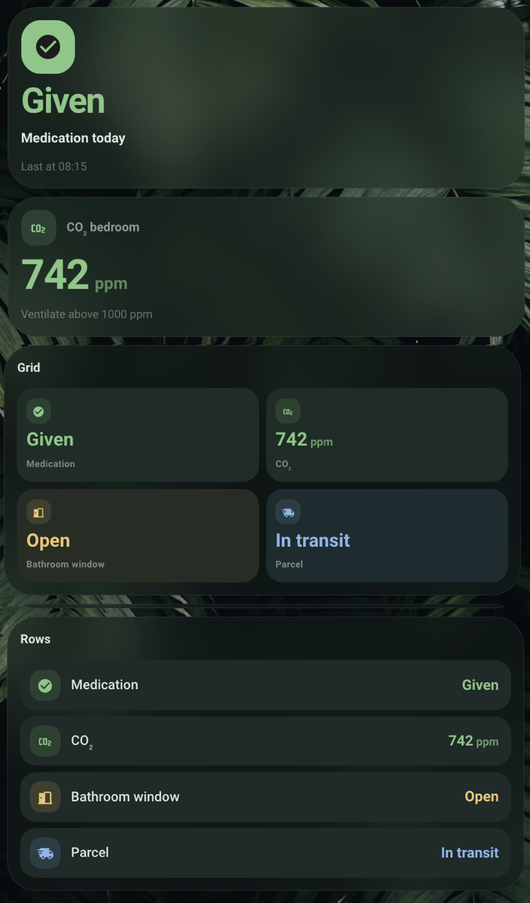

<details>
<summary>Konfiguration, Beispiele & Optionen</summary>

```yaml
type: custom:m3-status-card
items:
  - entity: input_boolean.medikament_gegeben
    name: Medikament
    preset: yes_no
    tap_action:
      action: toggle
hero_style: badge
```

### Layouts

Ein Wert bekommt die große „Hero“-Darstellung, mehrere ein Raster. `layout`
erzwingt eines von beiden, dazu kommt eine kompakte Zeilenliste.

| Layout | Was es ist |
| --- | --- |
| `auto` | Hero bei einem Wert, Raster ab zwei. Der Standard. |
| `hero` | Ein Wert in 26–40px, die Farbe des Werts färbt die ganze Karte |
| `grid` | Kacheln, `repeat(auto-fit, minmax(96px, 1fr))` oder feste `columns` |
| `row` | 48px-Zeilen: Icon, Name, Wert — für kompakte Aufzählungen |

`hero_style: badge` ersetzt das kleine Kopfzeilen-Icon durch ein 52px großes
Statussymbol in voller Farbe, das bei jedem Zustandswechsel kurz morpht.

### Zustands-Mapping

Jeder Wert kann eine `states`-Liste tragen. Die erste passende Regel gewinnt;
was sie nicht setzt, kommt weiterhin vom Wert selbst. Eine Regel prüft genau
eine Bedingung — `value`, `regex`, `above` oder `below`. Eine Regel ganz ohne
Bedingung ist bewusst ein Auffangfall, so endet eine Liste mit „und sonst“.

```yaml
items:
  - entity: sensor.batterie
    states:
      - below: 20
        icon: mdi:battery-alert
        color: "#e57368"
      - below: 50
        color: "#f0c46e"
      - color: "#81c784"     # Auffangfall
```

`preset` liefert eine fertige Regelliste in der Sprache des Dashboards. Die
eigenen `states` werden zuerst geprüft, eine Vorlage lässt sich also anpassen,
ohne sie zu ersetzen.

| Vorlage | Bildet ab |
| --- | --- |
| `yes_no` | `on`/`true` → Ja (grün, Haken), `off`/`false` → Nein (rot, Kreuz) |
| `on_off` | An / Aus, der Aus-Zustand in Grau |
| `ok_problem` | `off`/`ok` → OK, `on`/`problem` → Problem |
| `open_closed` | Offen (Bernstein) / Geschlossen (grün) |
| `traffic` | Unter 33 rot, unter 66 gelb, darüber grün — mehr ist besser |

### Trend

`trend: true` vergleicht den Wert mit derselben Entität vor 24 Stunden (über die
History-API, Langzeitstatistiken sind nicht nötig) und zeigt einen Chip mit der
Veränderung. `trend_inverted` gehört überall dorthin, wo Fallen die gute
Richtung ist — Verbrauch, Kosten —, sonst bekäme der bestmögliche Wert die
Alarmfarbe. Unter 1% Veränderung gilt als unverändert.

### Konfigurationsoptionen

| Option | Typ | Standard | Beschreibung |
| --- | --- | --- | --- |
| `items` | Liste | – | Ein Eintrag je Wert, siehe unten |
| `title` | string | – | Überschrift über Raster oder Zeilen |
| `layout` | `auto` \| `hero` \| `grid` \| `row` | `auto` | |
| `columns` | number | automatisch | Feste Spaltenzahl im Raster |
| `hero_style` | `inline` \| `badge` | `inline` | |
| `value_size` | number \| `auto` | `auto` | 40px bei Zahlen, 34px bei kurzem Text, 26px ab 12 Zeichen |
| `tap_action` | action | `more-info` | Vorgabe für alle Werte |
| `accent_color` / `accent_opacity` | | | Ersatzfarbe und Farbstärke |

Je Wert:

| Option | Typ | Beschreibung |
| --- | --- | --- |
| `entity` | string | |
| `name` / `icon` / `color` | string | |
| `attribute` | string | Zeigt dieses Attribut statt des Zustands |
| `unit` | string | Überschreibt die Einheit der Entität |
| `prefix` / `suffix` | string | |
| `decimals` | number | Standard ist die Genauigkeit, die der Zustand selbst mitbringt |
| `secondary` | string | Zeile unter dem Wert — Text oder eine Entität, deren Zustand angezeigt wird |
| `preset` | string | Siehe Vorlagen-Tabelle |
| `states` | Liste | Die Regelliste |
| `tap_action` | action | `toggle` schaltet die Anzeige sofort um, bevor HA bestätigt |
| `trend` / `trend_hours` / `trend_inverted` | | |

Eine nicht verfügbare Entität zeigt „—“ in neutralem Grau statt ihre Farbe zu
behalten: ein toter Sensor, der weiter grün leuchtet, liest sich als „alles in
Ordnung“ — also genau falsch herum.

</details>

## M3 Heading Card

Eine Abschnitts-Überschrift für den Raum *zwischen* den Karten. Sie zeichnet
bewusst keine eigene Karte — kein Rahmen, kein Glas, kein Schatten —, damit sie
als Beschriftung für das Folgende gelesen wird und nicht als weitere Kachel im
Raster. Sie ersetzt die eingebaute heading-Karte von Home Assistant, die ihren
Zweck erfüllt, aber nicht in der Designsprache dieser Suite.

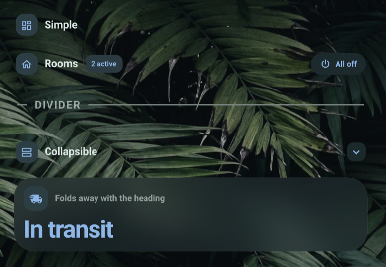

<details>
<summary>Konfiguration, Beispiele & Optionen</summary>

```yaml
type: custom:m3-heading-card
style: simple          # simple | status | divider | collapsible
title: Beleuchtung
icon: mdi:lightbulb
color: "#f0c46e"
```

### Die vier Varianten

| Variante | Was sie ist |
| --- | --- |
| `simple` | Squircle-Icon und Titel. Der Standard. |
| `status` | Zusätzlich ein Zähler-Chip und rechts ein Aktions-Button |
| `divider` | Ohne Icon und Titel: ein Strich, ein Label in Versalien, ein längerer Strich |
| `collapsible` | Zusätzlich ein Pfeil, der die Karten darunter einklappt |

### Status

Der Chip nimmt entweder festen Text, eine Entität, deren Zustand er zeigt, oder
`count_entities` — dann zählt er, wie viele davon an sind. Eine nicht
verfügbare Entität zählt in keine Richtung mit, denn sie als „aus“ zu melden
wäre eine Aussage, die die Karte nicht belegen kann.

```yaml
type: custom:m3-heading-card
style: status
title: Steckdosen
icon: mdi:power-plug
count_entities:
  - switch.schreibtisch
  - switch.tv
  - switch.lampe
action:
  name: Alle aus
  icon: mdi:power
  tap_action:
    action: call-service
    service: homeassistant.turn_off
    target:
      entity_id: [switch.schreibtisch, switch.tv, switch.lampe]
```

Der Button zieht nach einem Tap für eine halbe Sekunde seine Ecken zusammen und
hebt seine Tönung an. Er trägt keinen eigenen Zustand, das ist also die einzige
Rückmeldung, dass der Tap angekommen ist. Unter 260px entfällt die Beschriftung
und nur das Icon bleibt.

### Aufklappbar

Der Pfeil klappt alle Karten zwischen dieser Überschrift und der nächsten ein.
In die Dashboard-Konfiguration wird dabei nichts geschrieben — die Karten
werden im Browser ausgeblendet, Einklappen ist also ein Anzeigezustand und
keine Bearbeitung.

Drei andere Ansätze wurden geprüft und verworfen: die Lovelace-Konfiguration
bei jedem Tap umzuschreiben ist destruktiv und speichert einen reinen
UI-Zustand dauerhaft; jede Karte in eine `conditional` zu hüllen erfordert
Konfigurationsarbeit je Karte — also genau das, was diese Karte ersparen soll;
und eine Container-Karte, die ihre Kinder als Konfiguration bekommt, wäre ein
Stack und keine Überschrift und könnte im Sections-Grid nicht zwischen den
Karten stehen.

Der Preis für das Ausblenden der Geschwister ist eine Abhängigkeit vom DOM von
Home Assistant. Deshalb ist jeder Schritt eine Prüfung und keine Annahme, und
ein Layout, das die Karte nicht erkennt, fällt auf `simple` zurück — ein Pfeil,
der sichtbar nichts tut, ist schlimmer als gar keiner. Im Bearbeitungsmodus des
Dashboards wird ebenfalls nicht eingeklappt, dort ließen sich ausgeblendete
Karten sonst nicht mehr bearbeiten.

Der Zustand übersteht einen Reload: im `localStorage` je Browser, oder über
`collapse_state_entity` in einem `input_boolean` — dann gilt er geräteübergreifend
und eine Automatisierung kann einen Abschnitt einklappen.

```yaml
type: custom:m3-heading-card
style: collapsible
title: Medien
icon: mdi:speaker
default_collapsed: true
collapse_state_entity: input_boolean.medien_eingeklappt
```

### Konfigurationsoptionen

| Option | Typ | Standard | Beschreibung |
| --- | --- | --- | --- |
| `style` | string | `simple` | `simple`, `status`, `divider`, `collapsible` |
| `title` | string | – | Pflicht bei allen Varianten außer `divider` |
| `label` | string | – | Nur `divider`: der Text in Versalien zwischen den Strichen. Ohne ihn läuft der Strich durch |
| `icon` / `color` | string | | |
| `show_icon` | boolean | `true` | Ohne Icon rückt der Titel an den linken Rand |
| `title_size` | number | `15` | 12–22 |
| `tap_action` | action | `none` | Auf der ganzen Überschrift. Bei `collapsible` fest auf Einklappen |
| `badge` | string | – | Nur `status`: fester Text oder eine Entitäts-ID |
| `count_entities` | Liste | – | Nur `status`: der Chip zählt, wie viele an sind |
| `action` | Objekt | – | Nur `status`: `{ name, icon, tap_action }` |
| `default_collapsed` | boolean | `false` | Nur `collapsible` |
| `scroll_on_expand` | `false` | Holt die Karte nach dem Aufklappen ins Sichtfeld. Eine eingeklappte Karte am unteren Rand öffnet sich nach unten aus dem Bild heraus — ausgerechnet das, was man sehen wollte, sieht man dann nicht |
| `scroll_duration` | `240` | Wie lange dieses Scrollen dauert, in Millisekunden. `0` springt direkt. Das eingebaute weiche Scrollen des Browsers richtet sich nach der Entfernung und ist langsamer, als ein Tippen es erwarten lässt — deshalb steuert die Karte es selbst |
| `collapse_memory` | `device` | Wo der Zustand gemerkt wird. `device` behält ihn dauerhaft, eine offen gelassene Karte ist beim nächsten Mal wieder offen. `session` behält ihn nur, solange die App läuft: er folgt dir durchs Dashboard und ist beim nächsten Start weg, jeder Start zeigt also wieder die Übersicht. Wird ignoriert, wenn `collapse_state_entity` gesetzt ist — dann entscheidet der Helfer |
| `collapse_state_entity` | string | – | Nur `collapsible`: ein `input_boolean` mit dem Zustand |

</details>

## M3 Room Card

Eine Karte pro Raum. Man gibt ihr einen Bereich aus Home Assistant, den Rest
findet sie selbst: welche Gerätearten dort hängen, was jede davon gerade tut,
die Klimawerte und ob jemand im Raum ist.

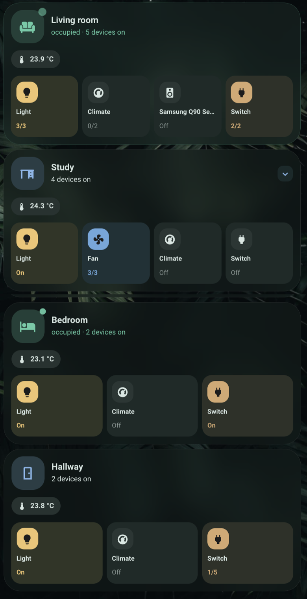
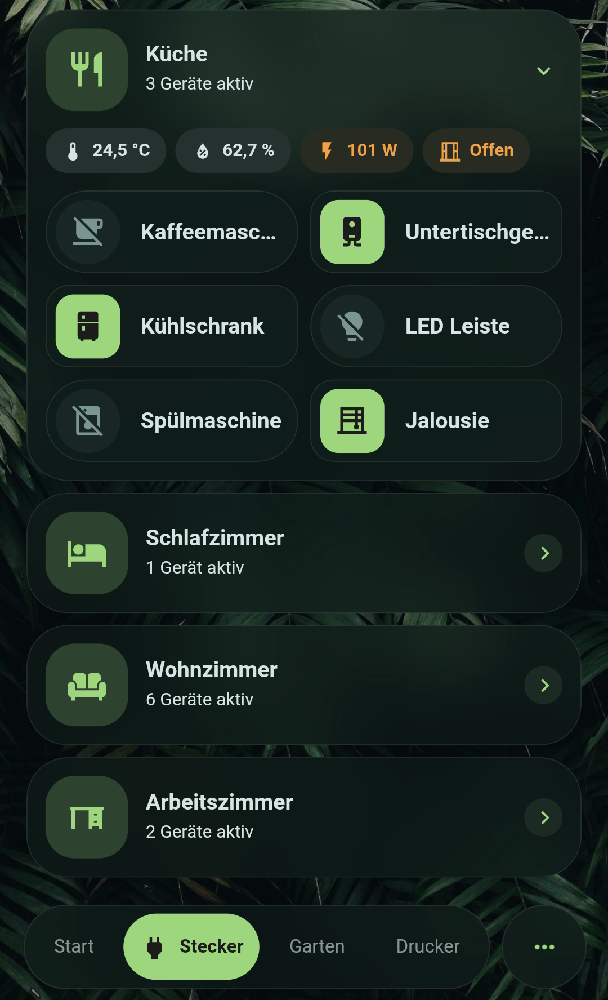

<details>
<summary>Konfiguration, Beispiele & Optionen</summary>

```yaml
type: custom:m3-room-card
area: wohnzimmer
```

Das ist die vollständige Minimalkonfiguration. Alles Weitere überschreibt nur,
was die Karte ohnehin schon gefunden hat.

### Was erkannt wird

Jede Entität, die dem Bereich zugeordnet ist — direkt oder über ihr Gerät —,
nach Domain gruppiert in neun eingebaute Kategorien: Licht, Ventilator,
Befeuchter, Klima, Medien, Rollo, Schalter, Sauger, Schloss. Dazu alles, was
unter `extra_domains` steht. Eine Kachel erscheint nur für eine Kategorie, die
im Raum tatsächlich eine Entität hat; das Raster wächst also mit dem Haus,
statt leere Platzhalter zu zeigen.

Drei Arten von Entitäten bleiben draußen, und die erste zählt mehr, als es
klingt: alles, was Home Assistant als Konfiguration oder Diagnose markiert.
Eine einzelne smarte Steckdose steuert eine Kindersicherung, eine
Status-LED und ein Einschaltverhalten bei — alle in der Domain `switch`. Auf
einer echten Installation gemessen: Im Wohnzimmer liegen 32 Schalter, von denen
2 das sind, was ein Mensch einen Schalter nennt. Ausgeblendete und deaktivierte
Entitäten bleiben ebenfalls draußen, denn da hat der Nutzer bereits gesagt,
dass er sie nicht sehen will.

### Die Badges

Der Text unter jeder Kachel ist der eigentliche Punkt der Karte. Bei mehreren
Geräten zählt er — `2/4`. Bei genau einem sagt er, was dieses Gerät tut:

| Kategorie | Badge |
| --- | --- |
| `fan` | Preset oder die Stufe, abgeleitet aus dem `percentage_step` des Lüfters |
| `humidifier` | Die Zielfeuchte |
| `climate` | Die Zieltemperatur, sonst der HVAC-Modus |
| `media_player` | Titel oder Quelle, auf 16 Zeichen gekürzt |
| `cover` | Offen, Geschlossen oder die Position in Prozent |
| `lock` | Verriegelt / Entriegelt |
| alles andere | An / Aus |

Eine nicht verfügbare Entität zählt als nicht an; eine Kategorie, in der
*jede* Entität nicht verfügbar ist, zeigt `—`, wird auf 40% gedimmt und lässt
sich nicht antippen.

### Präsenz

Ein `binary_sensor` im Bereich mit device_class `occupancy`, `motion` oder
`presence` wird von allein gefunden. Solange der Raum belegt ist, pulsiert ein
Punkt am Raum-Icon, die Karte bekommt 7% Präsenzfarbe, und der Untertitel
lautet „belegt · 3 Geräte aktiv“ statt nur der Zahl.

`presence_style: dot_only` behält den Punkt und lässt die Färbung weg, `none`
schaltet beides ab. Der Puls respektiert `animation: off` und die
Systemeinstellung für reduzierte Bewegung.

### Sensor-Chips

Temperatur, Luftfeuchte und Verbrauch, aus dem Bereich erkannt. Temperatur und
Feuchte kommen zuerst aus den Bereichseinstellungen von Home Assistant, wenn
sie dort gesetzt sind — eine bewusste Zuordnung schlägt jede Vermutung der
Karte —, sonst aus der passenden `device_class`. Der Verbrauchs-Chip erscheint
erst ab `power_threshold` (Standard 5 W): Ein Raum mit 0,4 W ist ein Raum ohne
Verbrauch, und ein Chip, der das sagt, kostet eine Zeile auf jeder Karte, in
der eine Steckdose hängt.

### Auswählen, was erscheint

Jede Kategorie hat außerdem ihren eigenen `badge`-Modus: `auto` zählt bei
mehreren Geräten und zeigt bei einem dessen Zustand, `count` und `state`
erzwingen jeweils eines davon, `none` lässt die Zeile ganz weg.

Ganze Kategorien lassen sich ausblenden oder umsortieren, und einzelne Geräte
lassen sich im Editor abwählen — jede Kategorie listet dort alle gefundenen
Geräte mit einem Schalter. Ein abgewähltes Gerät verschwindet aus der Kachel,
aus ihrer Zählung und aus allem, was die Kachel schaltet. Dorthin gehört zum
Beispiel die Status-LED einer Steckdose, wenn ihre Integration sie nicht als
Diagnose-Entität markiert.

Für die Sensor-Chips gilt dasselbe: `temperature_entity`, `humidity_entity` und
`power_entity` überschreiben das Erkannte, `extra_sensors` ergänzt Chips in der
angegebenen Reihenfolge.

### Interaktion

Steht ein einzelnes Gerät hinter einer Kachel, schaltet ein Tap es um. Bei
mehreren öffnet ein Tap eine Auswahl, die jedes Gerät mit seinem Zustand
auflistet — die vier Lampen eines Raums sind vier Entscheidungen, nicht eine —
dazu „Alles aus“ und „Alle an“ für die Fälle, in denen es doch nur eine ist.
Mit `category_tap: toggle` entfällt die Auswahl und alles schaltet sofort.

In jedem Fall werden nur Geräte geschaltet, die auch antworten, damit das
Ergebnis zu dem passt, was die Kachel angezeigt hat. Ein langer Druck öffnet
`detail_path`, sonst die Detailansicht der ersten Entität. Sauger und Schlösser
haben kein sinnvolles Umschalten, dort öffnet ein Tap die Detailansicht, statt
dass die Karte etwas rät, das man lieber selbst entscheidet.

### Die Kopfzeile antippen

Die Kopfzeile ist die Titelleiste der Karte und klappt sie standardmäßig
entweder ein (mit `collapsible: true`) oder tut gar nichts. `tap_action` legt
stattdessen eine gewöhnliche Home-Assistant-Aktion darauf — am nützlichsten
`navigate`, womit die Raumkarte auf einer Übersicht zum Weg in die eigene
Ansicht dieses Raums wird.

```yaml
type: custom:m3-room-card
area: wohnzimmer
tap_action:
  action: navigate
  navigation_path: /lovelace/wohnzimmer
```

`navigate` und `url` verhalten sich wie überall, und `none` lässt die
Kopfzeile bewusst untätig. `perform-action` funktioniert, sofern die Aktion ihr
`target` selbst benennt.

`more-info` und `toggle` funktionieren hier **nicht**, und das gehört deutlich
gesagt: Eine Raumkarte ist ein Bereich, keine Entität, hat also kein
mitzugebendes Ziel — und beide tun ohne eines wortlos nichts. Dafür ist
`categories[].tap_action` einer Kachel da, hinter der eine Entität steht.

Ein Tap kann nicht zugleich einklappen und eine Ansicht öffnen, deshalb
übernimmt `tap_action` die Kopfzeile vom Einklappen — und der Pfeil geht mit,
denn er verspricht ein Einklappen, das die Kopfzeile nicht mehr ausführt. Der
Rest von `collapsible` bleibt unberührt: der gespeicherte Zustand wird weiter
gelesen und angewendet, `collapse_state_entity` und eine Automatisierung können
die Karte also weiterhin einklappen, während ihre Kopfzeile navigiert.

Das gilt für die ganze Karte und ist etwas anderes als `categories[].tap_action`
für einen Tap auf eine einzelne Kategorie-Kachel im Inhalt, und als
`detail_path`, das bei langem Druck auf eine Kachel öffnet.

### Konfigurationsoptionen

| Option | Typ | Standard | Beschreibung |
| --- | --- | --- | --- |
| `area` | string | – | Die Bereichs-ID aus HA. Pflicht |
| `mode` | `auto` \| `manual` | `auto` | `auto` erkennt die Geräte des Bereichs und zeigt je Gerätetyp eine Kachel; `manual` zeichnet davon nichts und zeigt nur `cards` |
| `cards` | Liste | – | Lovelace-Karten im aufklappbaren Bereich — unter den Kacheln bei `auto`, allein bei `manual`. Schreibweise wie in einer Ansicht |
| `cards_columns` | number | `2` | Wie viele dieser Karten nebeneinander stehen |
| `name` / `icon` | string | aus dem Bereich | Das Icon wird sonst aus dem Raumnamen geraten |
| `tap_action` | Aktion | – | Was ein Tap auf die Kopfzeile tut. Ohne Eintrag klappt sie die Karte ein, sofern `collapsible` aktiv ist. Mit Eintrag übernimmt die Aktion die Kopfzeile und der Pfeil entfällt |
| `detail_path` | string | – | Öffnet sich bei langem Druck |
| `extra_domains` | Liste | – | Domains über die neun eingebauten hinaus |
| `category_order` | Liste | – | Domains in gewünschter Reihenfolge, der Rest folgt dahinter |
| `hidden_categories` | Liste | – | |
| `excluded_entities` | Liste | – | Einzelne Geräte, die draußen bleiben, egal in welcher Kategorie |
| `category_tap` | `list` \| `toggle` | `list` | Was ein Tap tut, wenn hinter der Kachel mehrere Geräte stehen |
| `categories` | Liste | – | Je Kategorie: `{ domain, name, icon, color, hidden, badge, tap_action }` |
| `show_sensors` | boolean | `true` | |
| `temperature_entity` / `humidity_entity` / `power_entity` | string | erkannt | |
| `power_threshold` | number | `5` | Watt |
| `extra_sensors` | Liste | – | Weitere Chips, in dieser Reihenfolge |
| `show_windows` | boolean | `true` | Chip für Fenster und Türen |
| `window_entities` | Liste | – | Überschreibt die Erkennung |
| `door_entities` | Liste | – | Kontakte, die getrennt von den Fenstern zählen — eine Tür, oder etwas, das gar kein Weg hinein ist, etwa der Positionskontakt einer Jalousie. Home Assistant nennt fast jeden Kontaktsensor `door`, was welcher ist, lässt sich also nicht erkennen |
| `presence_entity` | string | erkannt | |
| `presence_style` | `tint` \| `dot_only` \| `none` | `tint` | |
| `collapsible` | boolean | `false` | Klappt die Karte auf ihre Kopfzeile zusammen |
| `default_collapsed` | boolean | `false` | |
| `collapse_state_entity` | string | – | `input_boolean` mit dem eingeklappten Zustand |
| `strip_area_name` | boolean | `false` | Entfernt den Raumnamen aus dem Namen eines einzelnen Geräts. Aus, weil es eine Konvention voraussetzt |

Der Editor legt Kacheln über einen Entitätswähler an — als Button-, Licht-, Rollladen-, Medien- oder kompakte Klima-Karte — und jeder Eintrag klappt zum Editor genau dieser Karte auf, eine eingebettete Karte ist also so einstellbar wie überall sonst. Jede andere Lovelace-Karte lässt sich von Hand eintragen und bekommt ebenfalls ihren Editor.

</details>

## M3 Humidifier Card

Zielfeuchte, Modus, Lüfterstufe und die Zusatzfunktionen eines Geräts in einer
Karte. Die eingebaute humidifier-Karte von Home Assistant kann keine
Lüftergeschwindigkeit, deshalb steht üblicherweise eine zweite Karte daneben —
das hier ist die eine.

Sie setzt außerdem nicht voraus, dass `entity` eine `humidifier`-Entität ist.
Viele Entfeuchter erscheinen als Schalter plus `number` plus `sensor`, und die
funktionieren hier ebenso; siehe „Geräte, die keine humidifier-Entität sind".

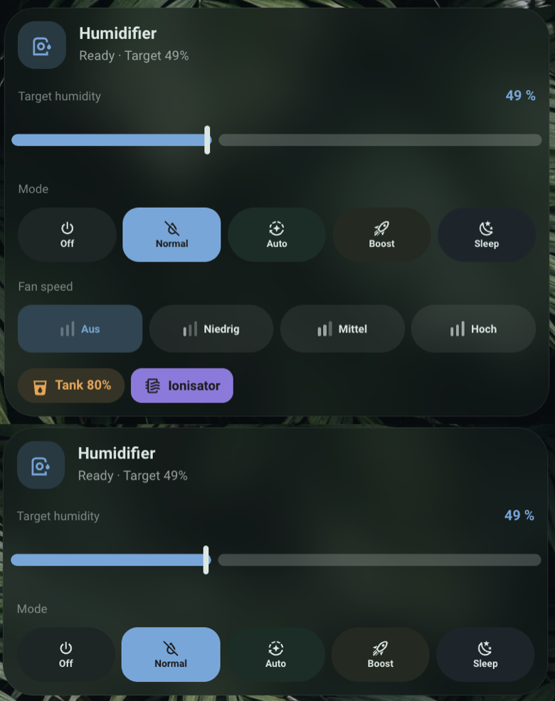

<sub>Dasselbe Gerät zweimal: alles, und darunter `layout: [slider, modes]`.</sub>

<details>
<summary>Konfiguration, Beispiele & Optionen</summary>

```yaml
type: custom:m3-humidifier-card
entity: humidifier.keller
```

Mehr braucht ein Gerät nicht, das sich ordentlich meldet: aktuelle und
Zielfeuchte, Modi und Bereich kommen alle von der Entität.

### Die vier Blöcke

| Block | Was er zeichnet |
| --- | --- |
| `slider` | Der Zielfeuchte-Regler, darüber Beschriftung und Wert. Seine Welle bewegt sich nur, solange das Gerät wirklich arbeitet; im Leerlauf flacht sie zum Balken ab — so wie im Bild oben |
| `modes` | Eine Pille je Modus, dazu eine Aus-Pille — Ausschalten ist kein Modus |
| `fan` | Eine Pille je Lüfterstufe, mit Balken-Icon, das mit der Stufe füllt |
| `chips` | Wassertank, schaltbare Zusatzfunktionen, reine Anzeigen |

`layout` bestimmt Reihenfolge **und** Sichtbarkeit. Was in der Liste fehlt, wird
nicht gezeichnet — ein Mechanismus statt einer Liste plus `show_*`-Schaltern,
die sich widersprechen können.

```yaml
type: custom:m3-humidifier-card
entity: humidifier.keller
layout: [slider, modes]     # keine Lüfterzeile, keine Chips
```

### Geräte, die keine humidifier-Entität sind

Ein Tuya- oder Zigbee-Entfeuchter ist oft ein `switch` fürs Ein und Aus, ein
`number` für das Ziel und ein `sensor` für den Messwert. Die Karte auf den
Schalter zeigen lassen und den Rest benennen:

```yaml
type: custom:m3-humidifier-card
entity: switch.keller_entfeuchter
device_kind: dehumidifier
current_entity: sensor.keller_luftfeuchte
target_entity: number.keller_ziel
mode_entity: select.keller_modus
fan_entity: select.keller_luefterstufe
tank_entity: sensor.keller_tank
controls:
  - entity: switch.keller_ionisator
    name: Ionisator
    icon: mdi:air-filter
    color: "#8f79e0"
sensors:
  - entity: sensor.keller_filter
    label: Filter ok
    icon: mdi:air-filter
```

`humidifier`, `switch`, `fan`, `select`, `input_select`, `number` und
`input_number` werden alle bedient; die Karte findet selbst heraus, welcher
Dienst zu welcher Domain gehört.

### Modi

Die Modi kommen aus `available_modes`, aus den Optionen von `mode_entity` oder
aus einer eigenen `modes`-Liste. Jeder Modus darf Name, Icon und Farbe tragen,
und ein unbekannter Modus bekommt trotzdem eine Farbe aus einer Palette statt
Grau.

```yaml
modes:
  - mode: sleep
    name: Nacht
    icon: mdi:weather-night
    color: "#8f79e0"
  - mode: turbo
    hidden: true
```

`mode_style` ist `icon_label`, `icon_only` oder `dropdown`; ab sechs Modi
schaltet die Karte selbst auf Auswahlliste, und eine schmale Karte lässt die
Beschriftungen weg.

### Lüfterstufe

Die Zeile liest, welche der drei Formen die Entität hat: `preset_modes` eines
Lüfters, dessen Prozentwerte (auf Aus / Niedrig / Mittel / Hoch abgebildet) oder
die Optionen eines `select`. `fan_steps` sticht alles:

```yaml
fan_steps:
  - { name: Aus }
  - { name: Leise, preset: sleep }
  - { name: Normal, percentage: 60 }
  - { name: Maximal, option: turbo }
```

### Optionen

| Option | Vorgabe | Wirkung |
| --- | --- | --- |
| `entity` | — | Pflicht. Das, was die Karte ein- und ausschaltet |
| `current_entity` | `current_humidity` der Entität | Woher der Messwert kommt |
| `target_entity` | `humidity` der Entität | Wo der Zielwert liegt |
| `action_entity` | `action` der Entität | Entfeuchtet / befeuchtet / bereit |
| `device_kind` | aus `device_class` | `humidifier` oder `dehumidifier` — Wortwahl und Icon |
| `min_humidity` / `max_humidity` | von der Entität, sonst 30 / 80 | Bereich des Reglers |
| `humidity_step` | `1` | Schrittweite beim Ziehen und für die Pfeiltasten |
| `mode_entity` | — | Ein `select`, das den Modus hält |
| `modes` | von der Entität | Eigene Liste mit Name, Icon, Farbe, `hidden` |
| `mode_style` | `icon_label` | `icon_label`, `icon_only`, `dropdown` |
| `fan_entity` | — | Ein `fan` oder `select`. Ohne Angabe entfällt die Zeile |
| `fan_steps` | abgeleitet | Eigene Stufen |
| `tank_entity` | — | Füllstandssensor oder `binary_sensor` |
| `tank_warn` / `tank_full` | `70` / `95` | Ab wann der Chip orange, dann rot wird |
| `tank_style` | `chip` | `chip` oder `bar` (ausgeblendet) |
| `controls` | — | Chips, die schalten: switch, button, select |
| `sensors` | — | Reine Anzeige-Chips |
| `layout` | alle vier | Welche Blöcke, in welcher Reihenfolge |

### Wenn Angaben fehlen

`action` ist im humidifier-Vertrag optional und wird von vielen Integrationen
weggelassen. Fehlt es, leitet die Karte Ent- oder Befeuchten aus der Richtung
zwischen Ist und Ziel ab, statt nichts zu zeigen. Ein Gerät ohne Modi bekommt
keine Modus-Zeile. Ein Tank, der nur ein `binary_sensor` ist, bekommt nur dann
einen Chip, wenn er voll ist — „nicht voll" ist keine Nachricht.

</details>

## M3 Calendar Card

Agenda und Monatsraster für beliebig viele Kalender, in der Designsprache dieser
Suite.

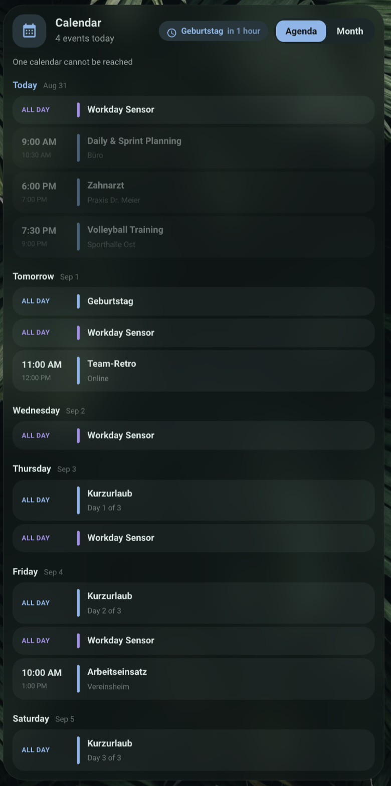

<details>
<summary>Konfiguration, Beispiele & Optionen</summary>

```yaml
type: custom:m3-calendar-card
entities:
  - calendar.familie
  - calendar.arbeit
```

Eine bloße Entity-ID wird neben der ausführlichen Form akzeptiert, weil man das
zuerst schreibt:

```yaml
entities:
  - entity: calendar.familie
    name: Familie
    color: "#85b7eb"
  - calendar.arbeit
```

Ohne Farbe bekommt jeder Kalender eine aus der Palette, der Reihe nach.

### Die zwei Ansichten

`view` ist `agenda` oder `month`; der Umschalter in der Kopfzeile wechselt,
`show_view_switch: false` legt die Ansicht fest.

Die **Agenda** gruppiert nach Tagen, mit „Heute" in der Akzentfarbe, dann
„Morgen", dann Wochentagsnamen. Jede Zeile trägt die Startzeit über der Endzeit,
einen Balken in der Farbe ihres Kalenders, den Titel und den Ort. Ein laufender
Termin ist getönt und trägt ein **Jetzt**-Abzeichen, ein beendeter verblasst.
`max_events` begrenzt die Liste und ergänzt eine Zeile „+n weitere".

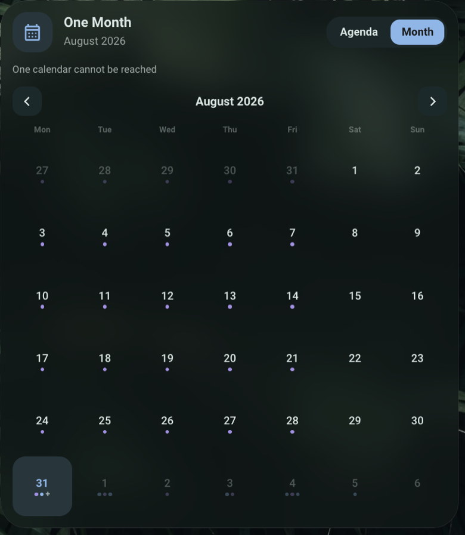

Das **Monatsraster** zeichnet bis zu drei Punkte je Tag in den Kalenderfarben,
wobei der dritte zum „+" wird, wenn es mehr sind. Heute ist getönt, ein
angetippter Tag füllt sich mit der Akzentfarbe und listet seine Termine unter
dem Raster. Die Woche beginnt, wo `hass.locale.first_weekday` es sagt.

### Woher die Termine kommen

Aus `calendar.get_events`, nicht aus den Attributen der Entität — die tragen nur
den nächsten Termin und taugen für eine Liste nicht. Ergebnisse werden fünf
Minuten zwischengespeichert, von allen Karten gemeinsam genutzt und neu gelesen,
sobald eine Kalender-Entität ihren Zustand ändert.

Ein Kalender, der nicht erreichbar ist, wird in einer Zeile unter der Kopfzeile
benannt statt stillschweigend weggelassen: vier von fünf Kalendern zu zeigen,
ohne es zu sagen, wäre schlimmer.

### Mehrtägige und ganztägige Termine

Ein mehrtägiger Termin erscheint an **jedem** Tag, den er berührt, mit „Tag 2
von 3" dort, wo sonst der Ort steht — ein Dienstag, der nichts zeigt, während
eine dreitägige Reise läuft, wäre falsch. Im Monatsraster setzt er an jedem
seiner Tage einen Punkt.

Ein ganztägiger Termin zeigt **GANZTÄGIG** in der Farbe seines Kalenders statt
einer Uhrzeit. Er trägt nie das *Jetzt*-Abzeichen: „läuft gerade" braucht eine
Uhrzeit, und unter einer Überschrift, die schon „Heute" sagt, wäre das Abzeichen
ohne Aussage.

### Optionen

| Option | Vorgabe | Wirkung |
| --- | --- | --- |
| `entities` | — | Pflicht. Entity-IDs oder `{entity, name, color}` |
| `view` | `agenda` | `agenda` oder `month` |
| `show_view_switch` | `true` | Der Agenda/Monat-Umschalter in der Kopfzeile |
| `days_ahead` | `7` | Zeitraum der Agenda, 1–30 |
| `max_events` | `0` | 0 zeigt alles im Zeitraum |
| `hide_past_today` | `false` | Vergangene Termine von heute ausblenden statt blass |
| `show_adjacent_days` | `true` | Tage der Nachbarmonate im Raster zeichnen |
| `show_next_chip` | `false` | Chip in der Kopfzeile mit dem nächsten Termin |
| `tap_action` | `detail` | `detail`, `more-info`, `navigate`, `none` |
| `navigation_path` | `/calendar` | Ziel von `navigate` und des Knopfs im Detailfenster |

</details>

## M3 Nav Card

Eine Navigationsleiste fürs Dashboard: eine Reihe Einträge, von denen der zur
aktuellen Seite gehörende leuchtet. Fünf Varianten derselben Leiste, von einer
schlichten Kopfzeile bis zu einem Sheet, das man über die Ansicht zieht — dazu
Badges, Templates und Untermenüs je Eintrag. Der Funktionsumfang der Navbar
Card aus der Community, gezeichnet in der Formensprache dieser Sammlung statt
in ihrer.

Über die Kartenauswahl hinzugefügt, kommt sie bereits ausgefüllt: die ersten
drei Ansichten des Dashboards werden Einträge, die nächsten fünf wandern hinter
den runden Knopf — die Anordnung, in der eine Leiste mit mehr Seiten als Platz
ohnehin endet. Das ist ein Vorschlag und nicht mehr: Die Einträge sind ab
diesem Moment gewöhnliche Konfiguration zum Bearbeiten, Umsortieren oder
Löschen, und die Leiste liest das Dashboard von sich aus nie wieder.
„Ansichten übernehmen" im Editor wiederholt das Einlesen jederzeit.

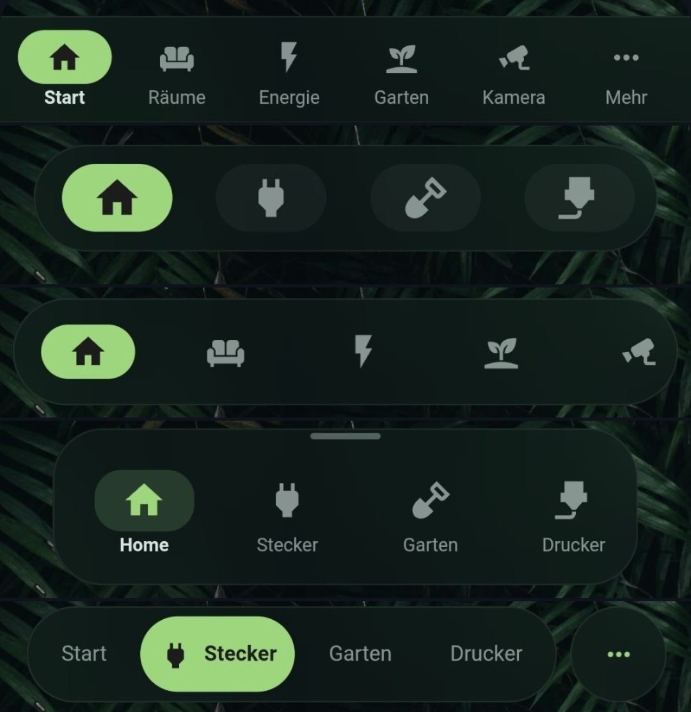
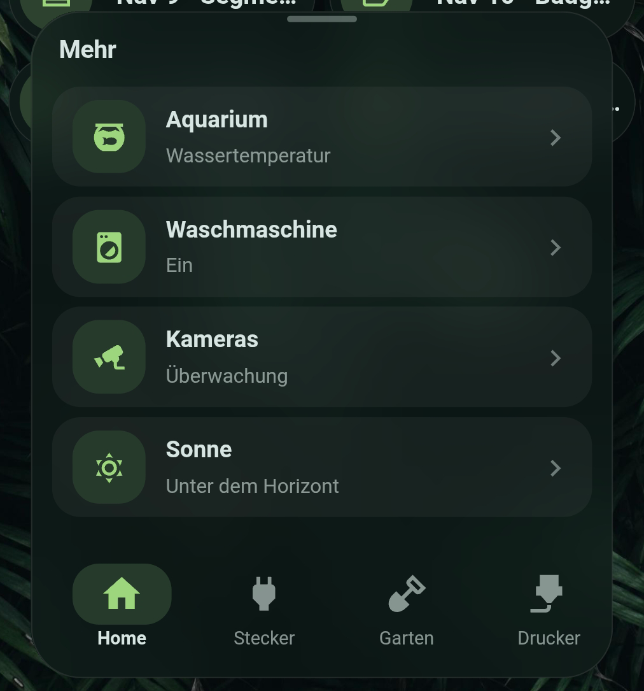
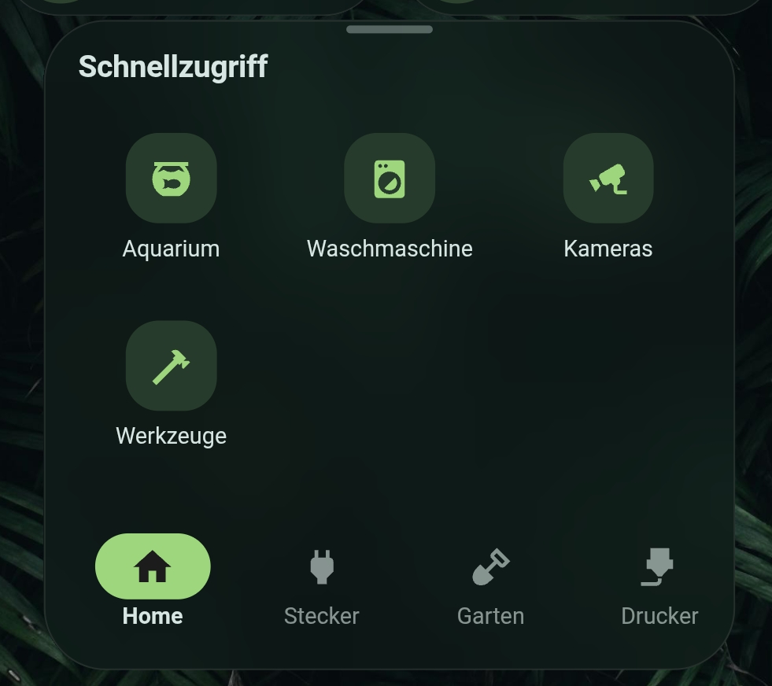

<details>
<summary>Konfiguration, Beispiele & Optionen</summary>

```yaml
type: custom:m3-nav-card
style: footer          # header | footer | segmented | floating | sheet
items:
  - name: Home
    icon: mdi:home
    path: /lovelace/0
  - name: Energie
    icon: mdi:flash
    path: /lovelace/energie
  - name: Garten
    icon: mdi:sprout
    path: /lovelace/garten
```

### Die fünf Varianten

| Variante | Was sie ist | Wann sie die richtige ist |
| --- | --- | --- |
| `header` | Oben angedockt, volle Breite | Ein Desktop-Dashboard, wo die Leiste zum Titel gehört und nicht zum Daumen |
| `footer` | Unten angedockt, volle Breite | Die Vorgabe fürs Handy: dort, wo der Daumen ohnehin ist |
| `segmented` | Eine Pille im Kartenfluss | Ein Umschalter für einen Abschnitt, nicht fürs Dashboard — die einzige Variante, die mitscrollt |
| `floating` | Eine abgesetzte runde Leiste über dem Inhalt | Dieselbe Aufgabe wie `footer`, nur mit sichtbarem Inhalt darunter |
| `sheet` | `floating` plus aufziehbare Schublade | Wenn die Leiste auch etwas halten soll: Kurzbefehle, eine Szene, eine Karte |

`header`, `footer`, `floating` und `sheet` positionieren sich gegen den
Bildschirm; ihr Platz im Raster fällt zusammen, sie kosten also keine Zeile der
Ansicht. `segmented` ist eine ganz normale Karte und steht, wo sie steht.

Im Bearbeiten-Modus — und in der Vorschau des Karten-Wählers — wird jede
Variante stattdessen im Kartenfluss gezeichnet. Eine angedockte Leiste hat
keinen anklickbaren Platz mehr; ohne das ließe sich die Karte zwar anlegen,
aber nie wieder öffnen.

Standardmäßig nimmt eine angedockte Leiste die volle Inhaltsbreite ein. Am
Handy ist das richtig, am Desktop meistens deutlich zu viel — die Einträge
stehen dann weit auseinander. `max_width` begrenzt sie und setzt sie mittig:
eine Zahl in px, jede CSS-Länge, oder `fit` für genau so breit wie die Einträge
es brauchen.

```yaml
type: custom:m3-nav-card
style: footer
max_width: fit        # oder 600, oder "40rem"
items: [...]
```

### Die Reiter von Home Assistant

Die Karte fasst sie nicht an und kann es auch nicht: Eine Karte lebt in ihrem
eigenen Kasten, und Home Assistant bietet keinen unterstützten Weg, aus ihm
heraus die Kopfzeile auszublenden. Auf einem Dashboard, das seine Reiterleiste
noch zeigt, hat man also zwei Navigationen gleichzeitig. Zwei Wege heraus, die
sich kombinieren lassen:

**`subview: true` bei den Ansichten, zu denen die Leiste führt.** In Home
Assistant eingebaut, ohne Zusatzsoftware. Eine Unteransicht taucht in der
Reiterleiste gar nicht auf und wird nur über Navigation erreicht — genau das,
was diese Leiste tut. Ansichten, die man nie als Reiter wollte, sind dann keine.

**Die Kopfzeile mit [kiosk-mode](https://github.com/NemesisRE/kiosk-mode)
ausblenden.** Ganz oben in der Rohkonfiguration eines Dashboards, und es lohnt
sich, das auf die Breite zu begrenzen, die es braucht:

```yaml
kiosk_mode:
  mobile_settings:
    hide_header: true
```

Das passt zur Aufteilung Desktop/Handy von oben: Das Handy verliert die
Kopfzeile von Home Assistant und behält nur diese Leiste, der Desktop behält
seine Reiter. Wer die Kopfzeile überall ausblendet, verliert auch den Stift, der
den Editor öffnet — kiosk-mode beschreibt, wie man wieder hineinkommt, und
`?disable_km` an der URL ist die kurze Antwort.

Dass man eine zweite Erweiterung braucht, damit die erste richtig aussieht, ist
keine gute Antwort, und eine spätere Fassung sollte das selbst können: Die Karte
findet die Kopfzeile von ihrem Platz aus, und sie nur auszublenden, solange eine
Leiste auf der Ansicht liegt, träfe es genauer als jede Einstellung pro
Dashboard. In dieser Version steckt es nicht, weil der Zugriff auf HAs eigenes
DOM nicht unterstützt ist und nach dessen Zeitplan bricht — und weil eine
Kopfzeile, die nicht zurückkommt, den Editor mitnimmt. Bis dahin sind die beiden
Wege oben die ehrliche Antwort.

### Desktop und Handy

Die übliche Paarung ist Kopfzeile am großen Bildschirm, Fußzeile oder Sheet am
Handy — zwei Layouts einer Karte, nicht zwei Karten:

```yaml
type: custom:m3-nav-card
desktop:
  style: header
mobile:
  style: sheet
breakpoint: 768
items: [...]
```

Umgeschaltet wird anhand der **eigenen** Breite der Karte, nicht der des
Fensters. Eine Karte in einer schmalen Spalte auf einem breiten Bildschirm ist
schmal — genau das würde eine Media Query falsch beantworten. Beide Blöcke
können die Leiste auf ihrer Breite auch ganz ausblenden (`hidden: true`) und
`show_labels` überschreiben.

### Templates

`name`, `icon`, `color`, `hidden`, `disabled` und der Badge nehmen Jinja2 —
und abonnieren es: Home Assistant schiebt den neuen Wert, sobald sich etwas
ändert, das im Template vorkommt. Kein Pollen, kein Neurendern auf Verdacht:

```yaml
items:
  - name: "{{ states('sensor.gartenmodus') | title }}"
    icon: >-
      {{ 'mdi:water' if is_state('switch.bewaesserung', 'on') else 'mdi:sprout' }}
    path: /lovelace/garten
    hidden: "{{ not is_state('person.ich', 'home') }}"
```

Nur Felder, in denen wirklich `{{` oder `{%` steht, öffnen ein Abo, und zwei
Einträge mit identischem Template teilen sich eines. Alle werden geschlossen,
sobald die Karte die Seite verlässt.

### Badges

```yaml
items:
  - name: Meldungen
    icon: mdi:bell
    path: /lovelace/meldungen
    badge:
      count_entities: [binary_sensor.leck_kueche, binary_sensor.leck_bad]
    badge_style: count       # dot | count | text
```

Ein Badge nimmt ein `template`, eine `entity`, deren Zustand er zeigt, oder
`count_entities` — dann zählt er, wie viele davon an sind. In jedem Fall
blenden `0`, `off`, `unavailable`, `unknown` und ein leerer Wert ihn aus: eine
Leiste voller grauer Nullen wirkt kaputt, nicht ruhig. `show_if` hängt ihn an
ein zweites Template.

### Untermenüs

Ein Eintrag mit `submenu` öffnet ein schwebendes Menü, statt zu navigieren. Es
wächst aus dem Knopf heraus, der es geöffnet hat, und schließt bei Auswahl,
Klick daneben oder Escape.

```yaml
submenu_trigger: tap     # tap | hold
items:
  - name: Mehr
    icon: mdi:dots-horizontal
    submenu:
      - name: Drucker
        icon: mdi:printer-3d
        path: /lovelace/drucker
      - name: Netzwerk
        icon: mdi:lan
        path: /lovelace/netzwerk
```

Mit `submenu_trigger: hold` navigiert ein Tipp wie gewohnt und das Menü kommt
beim langen Drücken — herum, wie es sein sollte, wenn der Eintrag selbst ein
echtes Ziel ist und das Menü nur die Abkürzung zu seinen Nachbarn.

### Das Sheet

```yaml
type: custom:m3-nav-card
style: sheet
sheet_title: Schnellzugriff
sheet_action:
  icon: mdi:plus
  tap_action:
    action: navigate
    navigation_path: /lovelace/edit
sheet_default: collapsed   # collapsed | expanded | remember
sheet_max_height: 60       # vh, oder jede CSS-Länge als Text
snap_points: [0, 0.5, 1]   # optionale Zwischenstufe
sheet_cards:
  - type: custom:m3-button-card
    entity: light.wohnzimmer
items: [...]
```

Die Schublade nimmt zweierlei auf. `sheet_items` sind Kurzbefehl-Kacheln — genau
die Einträge, die sonst hinter einem „Mehr"-Untermenü verschwinden, hier aber
auf einen Blick sichtbar statt erst nach dem Öffnen eines Menüs. Sie lassen
sich auf zwei Arten zeichnen: `grid` bringt die meisten Ziele auf den
wenigsten Platz, Symbol mit Beschriftung darunter; `list` gibt jedem eine volle
Zeile mit Symbol, Namen, zweiter Zeile und Pfeil. Die zweite Zeile
(`secondary`) nimmt freien Text, ein Template oder eine Entity-ID, deren
Zustand sie zeigt — und genau das macht eine Zeile ihren Mehrplatz wert. Der Editor hat
einen Knopf, der ein bestehendes Untermenü direkt übernimmt. Darunter nimmt
`sheet_cards` beliebige Lovelace-Karten auf, jede M3-Karte eingeschlossen:

```yaml
sheet_title: Mehr
sheet_items:
  - name: Kameras
    icon: mdi:cctv
    path: /lovelace/kamera
  - name: Neustart
    icon: mdi:power
    tap_action:
      action: call-service
      service: homeassistant.restart
      confirmation:
        text: Home Assistant wirklich neu starten?
sheet_cards:
  - type: custom:m3-button-card
    entity: light.wohnzimmer
```

Vorsicht bei den Blöcken je Breite: der Wurzel-`style` gilt nur dort, wo kein
Block ihn überschreibt. Eine Karte auf `sheet` mit `mobile: { style: floating }`
hat eine volle Schublade und am Handy — dem Gerät, für das sie gedacht war —
keinen Griff. Es bricht nichts, die Schublade ist dort schlicht nicht
erreichbar. Der Editor weist jetzt darauf hin.

Eine Schublade ohne Inhalt — keine Kacheln, keine Karten, kein Titel — hat
nichts aufzuziehen. Die Karte zeichnet dann eine schlichte schwebende Leiste
statt eines Griffs, der ein leeres Fach öffnet, und der Editor sagt es, statt
es einen beim Ziehen herausfinden zu lassen.

Eine Aktion mit `confirmation` fragt vorher nach — gut zu wissen, bevor man
„Home Assistant neu starten" einen Tipp weit weg legt. Gezogen wird am Griff oder
mit einem Wisch von der Leiste nach oben; ein Tipp auf den Griff öffnet sie
ebenfalls. Beim Loslassen geht sie zum nächstgelegenen Rastpunkt — außer es
war ein Schwung, dann geht sie in die geworfene Richtung, egal wo sie gerade
stand.

Der interessante Fall ist das Ziehen **im** Inhalt: der scrollt ganz normal,
und das Sheet übernimmt die Geste nur dann, wenn der Inhalt schon ganz oben
steht und der Finger nach unten geht. Genau so verhält sich jedes native
Bottom Sheet — und deshalb bleibt das Scrollen des Browsers samt seiner
Trägheit, die keine JavaScript-Nachbildung trifft, überall sonst unangetastet.

`sheet_default: remember` merkt sich den Zustand je Browser, oder in einem
`input_boolean` über `sheet_state_entity` — dann synchron über Geräte hinweg,
und eine Automatisierung kann die Schublade öffnen. Unter 600px Fensterhöhe
(Handy im Querformat) sinkt die Höhenbegrenzung auf 50vh, sonst bliebe von der
Seite, für die die Schublade da ist, nichts übrig.

Zwei Grenzen sind wichtig. Im Bearbeiten-Modus wird das Sheet im Kartenfluss
und aufgeklappt gezeichnet, weil eine am Bildschirm angedockte Schublade genau
die Karte verdeckt, die der Editor gerade zeigen will. Und nur das erste Sheet
einer Ansicht dockt an: ein zweites läge über dem ersten, ohne dass man sähe,
welcher Griff zu welchem gehört — es wird deshalb inline gezeichnet.

### Sichtbarkeit

`hidden` nimmt ein Jinja2-Template und lässt die ganze Leiste weg, solange es
wahr ist. Für Sichtbarkeit nach Nutzer, Gerät oder Bildschirmgröße gibt es die
eingebaute Sichtbarkeits-Funktion von Home Assistant im Karten-Editor — die
kann das längst für jede Karte, und eine zweite Umsetzung in dieser hier würde
ihr nur in die Quere kommen.

### Umstieg von der Navbar Card

| Navbar Card | Hier |
| --- | --- |
| `routes` | `items` |
| `routes[].url` | `items[].path` |
| `routes[].label` | `items[].name` |
| `routes[].icon` / `icon_selected` | `items[].icon` (ein Template kann umschalten) |
| `routes[].badge.template` | `items[].badge.template` |
| `routes[].badge.color` | `items[].badge.color` |
| `routes[].submenu` | `items[].submenu` |
| `routes[].hidden` | `items[].hidden` |
| `routes[].tap_action` / `hold_action` | gleiche Namen |
| `desktop.position: top/bottom` | `desktop.style: header/footer` |
| `desktop.show_labels` | `desktop.show_labels`, oder `label_visibility` |
| `desktop.min_width` | `breakpoint` (Breite der Karte, nicht des Fensters) |
| `mobile.show_labels` | `mobile.show_labels` |
| `styles` (freies CSS) | `styles` (eine Eigenschaft/Wert-Zuordnung) |
| `template` für eine ganze Routenliste | — kein Gegenstück; Einträge werden konfiguriert und einzeln getemplatet |
| `haptic` | `haptics` |

`preload_views` wird angenommen und gespeichert, tut aber derzeit nichts: Home
Assistant bietet einer Karte keinen Weg, eine andere Ansicht vorzuwärmen, und
der einzige Behelf — unsichtbar hin- und zurücknavigieren — würde flackern und
einen falschen Verlaufseintrag hinterlassen. Die Option bleibt, damit eine
spätere Version sie ohne Konfigurationsbruch umsetzen kann.

### Optionen

| Option | Vorgabe | Wirkung |
| --- | --- | --- |
| `items` | — | Die Einträge. Je: `name`, `icon`, `path`, `match`, `color`, `badge`, `badge_style`, `hidden`, `disabled`, `submenu`, `tap_action`, `hold_action`, `double_tap_action` |
| `style` | `footer` | `header`, `footer`, `segmented`, `floating`, `sheet` |
| `position` | je Variante | `top` oder `bottom`, für die abgesetzten Varianten |
| `desktop` / `mobile` | — | Überschreibungen je Breite: `style`, `position`, `show_labels`, `hidden` |
| `breakpoint` | `768` | Kartenbreite, unter der `mobile` gilt |
| `label_visibility` | `always` | `always`, `active_only`, `never` |
| `icon_visibility` | `always` | `always`, `active_only`, `never` — dieselben drei Möglichkeiten wie bei den Beschriftungen, unabhängig davon |
| `item_background` | `false` | Eine zarte Fläche unter jedem Eintrag, nicht nur unter dem aktuellen |
| `active_style` | `tint` | `tint` (zarte Tönung in der Farbe des Eintrags) oder `solid` (voll gefüllt, dunkle Schrift darauf) |
| `action_button` | — | `{icon, tap_action, color}` — ein runder Knopf neben der Leiste, außerhalb ihrer Fläche |
| `max_width` | — | Breitenbegrenzung, mittig. Zahl = px, Text = CSS-Länge, `fit` = so breit wie die Einträge |
| `size` | `1` | Skaliert jedes Maß, 0,7–1,5 |
| `page_transition_ms` | `180` | Dauer dieser Überblendung. Die Browser-Voreinstellung von 250 ms wirkt träge für einen Wechsel, den man selbst ausgelöst hat |
| `marker_motion` | `none` | `none` oder `slide` — ob eine einzelne Fläche zwischen den Einträgen wandert statt zweier, die ein- und ausblenden |
| `page_transition` | `none` | `none`, `fade` oder `up` — `up` ist Materials Fade-Through: erst geht die alte Seite, dann steigt die neue leicht herein |
| `pill_size` | `1` | Skaliert allein die Markierung um den aktiven Eintrag, ohne Icon oder Text anzufassen |
| `label_size` | `11`, neben dem Icon `14` | Textgröße in px. Der Standard hängt an `label_position`: unter dem Icon ist der Text eine Bildunterschrift, daneben der Name des Eintrags |
| `label_position` | `below` | Wo der Text eines Eintrags relativ zum Icon sitzt: `below`, `above`, `right`, `left`. Bei den waagerechten umschließt die aktive Pille Icon und Text gemeinsam |
| `edge_distance` | `8` (angedockt `6`) | Abstand in px zwischen Leiste und dem Bildschirmrand, an dem sie klebt. Kommt **zusätzlich** zur Safe Area des Geräts, nicht statt ihr — die Leiste kann also nicht auf der Gestenleiste landen |
| `container_style` | `glass` | `glass`, `solid`, `transparent` |
| `container_opacity` | `100` | Deckkraft der Leiste in Prozent |
| `blur` | `20` | Weichzeichnen des Hintergrunds in px |
| `radius` | Kapsel | Eckenradius der Leiste. Ohne Angabe sind die Enden vollrund, egal wie hoch die Leiste ist — so machen es die Vorbilder; eine Zahl legt ihn stattdessen fest. Vorsicht bei Werten knapp unter der halben Leistenhöhe (unskaliert 31 px): das wirkt wie eine gestauchte Kapsel, nicht wie ein abgerundetes Rechteck |
| `submenu_trigger` | `tap` | `tap` oder `hold` |
| `haptics` | `true` | Haptik-Event von Home Assistant beim Tippen auslösen |
| `auto_hide_on_scroll` | `false` | Beim Runterscrollen ausblenden, beim Hochscrollen zurück |
| `hidden` | — | Jinja2-Boolean; blendet die ganze Karte aus |
| `styles` | — | Freies CSS für die Leiste. Für Fortgeschrittene |
| `sheet_items` | — | Kacheln in der Schublade: `name`, `icon`, `path`, `color`, `tap_action` |
| `sheet_item_style` | `grid` | `grid` (Symbole mit Beschriftung darunter) oder `list` (volle Zeilen) |
| `sheet_columns` | automatisch | Nur im Raster: Kacheln pro Zeile; leer füllt so viele, wie die Breite hergibt |
| `sheet_cards` | — | Karten in der Schublade, unter den Kacheln |
| `sheet_title` | — | Titelzeile über dem Inhalt der Schublade |
| `sheet_action` | — | `{icon, tap_action}`-Knopf rechts in dieser Zeile |
| `sheet_max_height` | `60` | vh als Zahl, oder jede CSS-Länge als Text |
| `sheet_default` | `collapsed` | `collapsed`, `expanded`, `remember` |
| `sheet_state_entity` | — | Ein `input_boolean` mit dem Offen-Zustand |
| `snap_points` | `[0, 1]` | Anteile, bei denen die Schublade einrastet |
| `collapse_on_navigate` | `true` | Schublade beim Seitenwechsel schließen |

Eine offene Schublade schließt außerdem bei einem Tipp irgendwo außerhalb. Die
Fläche, die diesen Tipp fängt, ist unsichtbar und verbraucht ihn — hinter der
Schublade reagiert also nichts darauf, dass sie weggetippt wurde.
| `preload_views` | `false` | Reserviert; tut derzeit nichts |

</details>

## M3 Lights Overview Card

Eine Raum-für-Raum-Lichtübersicht, nach demselben Muster wie Climate Overview
oben (die beiden sind dafür gedacht, gestapelt auf einem Dashboard zu
sitzen): eine Kachel pro Raum mit An/Aus-Status und Anzahl, oder eine flache
Liste aller Lichter. Ein Tap schaltet die Lichter des Raums; Hold öffnet ein
Popup.

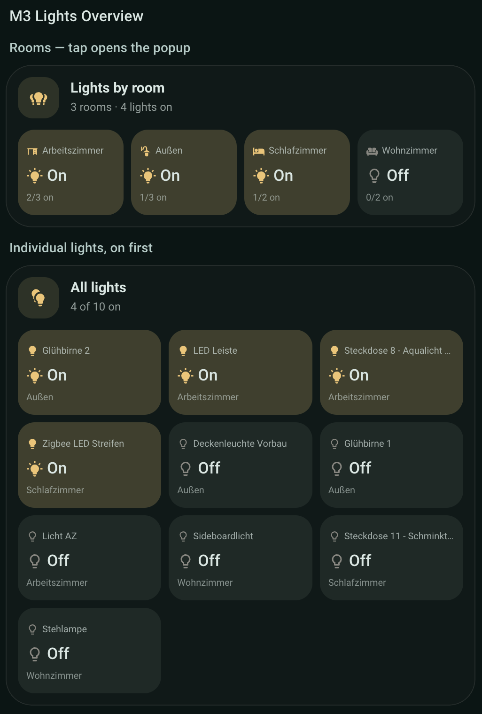
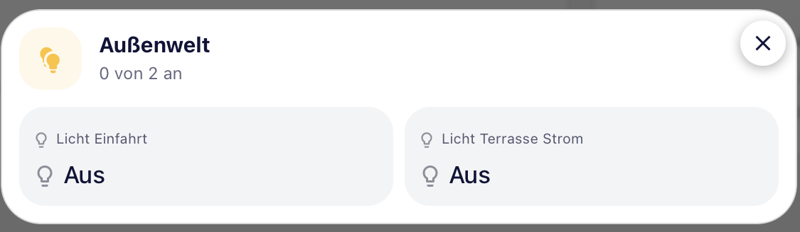

<details>
<summary>Konfiguration, Beispiele & Optionen</summary>

```yaml
type: custom:m3-lights-overview-card
auto_discover: true
```

### Entity-Quelle und Raumzuordnung

- **`auto_discover: true`** (Standard): findet alle `light`-Entities, die
  einem HA-**Bereich** zugeordnet sind, und gruppiert sie zu dessen Kachel.
  Anders als bei Climate Overview wird ein Licht ohne Bereich verworfen statt
  zu einer eigenen Kachel zu werden — eine Raum-für-Raum-Übersicht hat für
  ein nicht zuordenbares Licht nichts Sinnvolles zu zeigen. Filterbar über
  `include_area` / `exclude_entities` / `include_labels` / `exclude_labels` /
  `include_state` / `exclude_state`.
- **`rooms`**: eine manuelle Liste (`name`, `icon`, `entities`,
  `toggle_entities`) statt Auto-Discovery.
- **`view`**: `rooms` (Standard, eine Kachel pro Raum) oder `entities` (eine
  Kachel pro Licht, mit dem Raumnamen als Unterzeile).
- **`group_handling`**: wenn eine `light.group` und ihre Mitglieder sonst
  beide als eigene Lichter im selben Raum zählen würden, eine Seite fallen
  lassen — `prefer_groups` zählt nur die Gruppe, `prefer_members` nur die
  Mitglieder. Standard `all` zählt beide.

### Was gezeigt wird vs. was ein Tap schaltet

Status und Anzahl einer Kachel spiegeln jedes Licht wider, das der
Anzeigefilter oben durchlässt. Was ein **Tap** tatsächlich schaltet, kann
enger sein: `toggle_filter` (dieselbe Syntax wie der Anzeigefilter) setzen,
um nur eine Teilmenge zu schalten, oder `exclude_toggle_entities` als
Kurzform für "zeigen, aber nicht schalten" bei bestimmten Entities — nützlich
für ein zeitgesteuertes Licht oder eine Szenen-Leuchte, die sichtbar sein
soll, aber nicht Teil des raumweiten Umschaltens. `toggle_inherit_filters:
false` lässt `toggle_filter` eigenständig stehen, statt den Anzeigefilter
einzugrenzen. Bei einem manuellen Raum ist `toggle_entities` standardmäßig
gleich `entities`.

### Tap, Hold und das Popup

Dasselbe Action-System wie bei Climate Overview: `tap_action` (Standard
`toggle`) / `hold_action` (Standard `popup`, oder `more-info` in der
`entities`-Ansicht) / `double_tap_action`, wobei `popup.mode` bestimmt, was
Hold öffnet — **`default-grid`** (dieselbe Karte noch einmal, eingegrenzt auf
den angetippten Raum), **`default-detail`** (HA's More-Info-Dialog) oder
**`custom`** (eine beliebige Lovelace-Karte aus `popup.card`, mit
`[[area_id]]`, `[[entity_id]]`, `[[name]]` aufgelöst gegen den angetippten
Raum).

### Konfigurationsoptionen

| Option | Typ | Standard | Beschreibung |
|---|---|---|---|
| `auto_discover` | boolean | `true` | Automatische Erkennung von Lichtern nach Bereich |
| `include_domains` | Liste | `["light"]` | Welche Domänen die Erkennung durchsucht. Eine Lampe an einer Funksteckdose ist ein `switch`, und nichts in Home Assistant sagt, welche Schalter Licht sind — `switch` ergänzen und mit den Include/Exclude-Filtern eingrenzen, oder die Entitäten stattdessen je Raum unter `rooms` aufzählen |
| `include_area` / `exclude_area` | list\<string\> | – | Filter für Auto-Discovery |
| `include_entities` / `exclude_entities` | list\<string\> | – | Entity-Filter für Auto-Discovery |
| `include_labels` / `exclude_labels` | list\<string\> | – | Label-Filter für Auto-Discovery |
| `include_state` / `exclude_state` | list\<string\> | – | Status-Filter (`on`/`off`/`unavailable`/`unknown`, oder ein eigener Wert) |
| `group_handling` | `all` \| `prefer_groups` \| `prefer_members` | `all` | Wie eine `light.group` und ihre Mitglieder gezählt werden |
| `rooms` | Liste (`name`, `icon`, `entities`, `toggle_entities`) | – | Manuelle Raumliste statt Auto-Discovery |
| `name` / `icon` | string | "Lights" / `mdi:lightbulb-group` | Header |
| `view` | `rooms` \| `entities` | `rooms` | Kachel pro Raum, oder eine flache Liste pro Licht |
| `sort` | `name` \| `area` \| `on_first` | `name` | Kachel-Reihenfolge |
| `show_header` | boolean | `true` | Kartenheader |
| `show_count` | boolean | `true` | "N/gesamt an" auf einer Mehrlicht-Kachel |
| `show_area` | boolean | `true` | Raumname als Unterzeile in der `entities`-Ansicht |
| `hide_empty_rooms` | boolean | `false` | Räume ohne passende Lichter verwerfen |
| `toggle_filter` | Objekt (dieselben Felder wie der Anzeigefilter) | – | Engerer Filter dafür, was ein Tap tatsächlich schaltet |
| `exclude_toggle_entities` | list\<string\> | – | Kurzform: zeigen, aber nie schalten |
| `toggle_inherit_filters` | boolean | `true` | Ob `toggle_filter` den Anzeigefilter eingrenzt oder eigenständig steht |
| `toggle_group_handling` | `all` \| `prefer_groups` \| `prefer_members` | `group_handling` | `group_handling`, angewendet auf die Schaltmenge |
| `tap_action` / `hold_action` / `double_tap_action` | Action-Config | toggle / popup / none | Tap-/Hold-/Doppeltap-Actions; ergänzt eine `popup`-Action |
| `popup` | Objekt (`mode`, `title`, `view`, `sort`, `show_area`, `show_header`, `card`, Filterfelder) | – | Popup der `popup`-Action — siehe oben |
| `on_color` / `off_color` | string | Theme-Standard | Kachelfarbe nach Status |
| `accent_color` / `accent_opacity` | string / number | Theme-Standard / `12` | Akzentfarbe des Header-Icons |
| `tile_tint_opacity` | number | – | Stärke der Kachel-Hintergrundtönung |
| `text_color` / `secondary_text_color` | string | Theme-Standard | Raumnamen/Werte bzw. Sekundärtext |
| `card_background` | string | Glas-/Solid-Hintergrund | Kartenhintergrund |
| `animation` | `auto` \| `on` \| `off` | `auto` | Respektiert `prefers-reduced-motion` |
| `glass_background` | boolean | `true` | Milchiger Glashintergrund |
| `radius` / `corners` | number / object | `28` | Eckenradius, optional je Ecke |

</details>

## M3 Chip Buttons Card

Eine horizontale Reihe antippbarer Pillen-Chips — einer pro Entity — mit
Tap-/Hold-/Doppeltipp-Aktionen. Das ist die M3-Antwort auf Bubble Cards
„sub-buttons only"-Karte: gleiche Grundidee (eine Reihe Icon-Chips), aber
flachere Konfiguration — ein Formular pro Chip statt mehrerer verschachtelter
Panels, und explizite Auf/Ab-Buttons zum Umsortieren statt eines Dropdown-Menüs.

Ein Chip kann auch nicht-interaktiv sein (`interactive: false`) — dann wird er
zu einer reinen Anzeige (z.B. ein Temperatur- oder Feuchte-Chip), das M3-
Äquivalent zu Bubble Cards separater zweiter Zeile, ohne ein zweites
Positionierungssystem konfigurieren zu müssen.

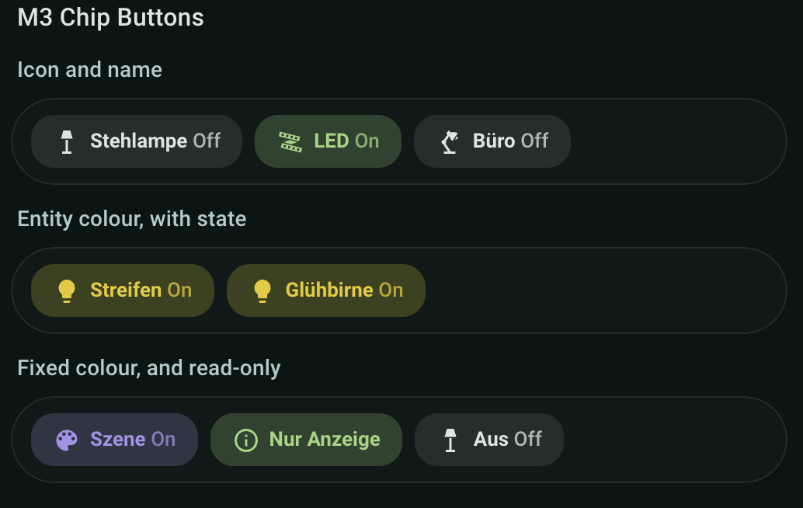

<details>
<summary>Konfiguration, Beispiele & Optionen</summary>

```yaml
type: custom:m3-chip-buttons-card
wrap: false
justify: start
buttons:
  - entity: input_select.home_mode
    name: Daheim
    icon: mdi:home
    tap_action:
      action: more-info
  - entity: lock.haustuer
    name: Abgeschlossen
    color: blue
    tap_action:
      action: toggle
    hold_action:
      action: more-info
  - icon: mdi:magnify
    name: Suche
    interactive: false
    tap_action:
      action: none
  - entity: sensor.wohnzimmer_temperatur
    interactive: false
    show_state: true
glass_background: true
radius: 28
```

### Konfigurationsoptionen

| Option | Typ | Standard | Beschreibung |
|---|---|---|---|
| `buttons` | Liste | `[]` | Die Chips, in Anzeigereihenfolge. Jeder Eintrag unterstützt die folgenden Felder |
| `buttons[].entity` | string | – (optional) | Beliebige Entity. Kann für einen reinen Aktions-/Anzeige-Chip leer gelassen werden |
| `buttons[].name` | string | `friendly_name` der Entity | Angezeigter Name |
| `buttons[].icon` | string | Entity-Icon, sonst ein generisches Icon | Icon |
| `buttons[].color` | string | `primary` | HA-Farbname oder beliebige CSS-Farbe für den Chip im **aktiven** Zustand |
| `buttons[].inactive_color` | string | – (Standard-Theme-Grau) | Farbe für den Chip im **inaktiven** Zustand |
| `buttons[].show_state` | boolean | `true` | Entity-Zustand neben dem Namen anzeigen |
| `buttons[].static_color` | boolean | `false` | Chip immer als „aktiv" darstellen, unabhängig vom tatsächlichen Entity-Zustand (z.B. für einen Status-Chip, der immer hervorstechen soll) |
| `buttons[].interactive` | boolean | `true` | `false` macht aus dem Chip eine reine Anzeige — keine Tap-/Hold-Handler, nicht per Tastatur fokussierbar |
| `buttons[].tap_action` | Action | `more-info` | Tap-Aktion, gleicher Aktions-Picker wie bei jeder anderen Karte |
| `buttons[].hold_action` | Action | `none` | Aktion bei langem Drücken |
| `buttons[].double_tap_action` | Action | `none` | Aktion bei Doppeltipp |
| `wrap` | boolean | `false` | Chips auf mehrere Zeilen umbrechen statt horizontal zu scrollen |
| `justify` | `start` \| `center` \| `end` \| `space-between` | `start` | Horizontale Ausrichtung der Chip-Reihe |
| `radius` | number (px) | `28` | Eckenradius der Karte |
| `corners` | object | – | Optionaler Override je Ecke, wie bei jeder anderen Karte |
| `glass_background` | boolean | `true` | Milchiger Glashintergrund |
| `card_background` | string | – | Hintergrundfarbe überschreiben |
| `animation` | `auto` \| `on` \| `off` | `auto` | Press-Animation; `auto` respektiert `prefers-reduced-motion` |

</details>

## M3 Group Card

Fasst andere Karten — M3 oder nicht — in einem gemeinsamen Rahmen zusammen,
sodass ein Stapel mehrerer kleiner Karten (z.B. zwei oder drei Chip-Button-
Reihen) wie eine einzige Karte wirkt statt wie ein Haufen separat umrandeter
Kästen. Die Gruppe zeichnet selbst den äußeren Rahmen/Hintergrund; jede
verschachtelte Karte, die den Rahmen-Stil dieser Suite teilt, verliert
automatisch ihren eigenen Rahmen, Hintergrund und ihr Padding, sobald sie in
einer Gruppe steckt — ganz ohne Konfiguration an der verschachtelten Karte
selbst. `gap` allein steuert den Abstand zwischen den Reihen, `gap: 0` lässt
sie sich berühren.

Karten werden über dieselben visuellen Picker hinzugefügt, bearbeitet und
sortiert, die auch Home Assistants eigener `vertical-stack`-Editor nutzt —
inklusive Suche, Favoriten und Einfügen aus der Zwischenablage beim
Hinzufügen einer Karte.

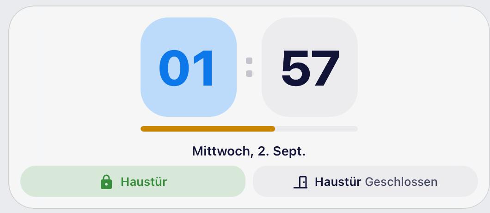

<details>
<summary>Konfiguration, Beispiele & Optionen</summary>

```yaml
type: custom:m3-group-card
gap: 4
cards:
  - type: custom:m3-chip-buttons-card
    buttons:
      - entity: lock.haustuer
        name: Haustür
      - entity: binary_sensor.haustuer
        name: Haustür
  - type: custom:m3-chip-buttons-card
    buttons:
      - entity: lock.hintertuer
        name: Hintertür
      - entity: binary_sensor.hintertuer
        name: Hintertür
```

### Konfigurationsoptionen

| Option | Typ | Standard | Beschreibung |
|---|---|---|---|
| `cards` | Liste | `[]` | Die verschachtelten Karten, in Anzeigereihenfolge. Beliebige Lovelace-Karte — M3 oder nicht |
| `gap` | number (px) | `8` | Abstand zwischen den Reihen. `0` lässt sie sich berühren |
| `radius` | number (px) | `16` | Eckenradius der Karte |
| `corners` | object | – | Optionaler Override je Ecke, wie bei jeder anderen Karte |
| `glass_background` | boolean | `true` | Milchiger Glashintergrund |
| `card_background` | string | – | Hintergrundfarbe überschreiben |

</details>

## Entwicklung

```bash
npm install
npm run dev     # Watch-Build nach dist/m3-cards.js
npm run build    # Produktions-Build
npm run lint     # Typecheck
```

Zum lokalen Testen `dist/m3-cards.js` nach `config/www/` kopieren und als
Lovelace-Ressource (`/local/m3-cards.js`, Typ „JavaScript-Modul“) einbinden.

## Dank

**M3 Lights Overview**, **M3 Chip Buttons** und **M3 Group Card** stammen von
Fabian Wendel ([UHaFnir](https://github.com/UHaFnir/m3-cards)), der dieses
Projekt geforkt hat — ebenso die getrennten Schalter für Kopfbereich und
Diagramm der Wetterkarte und deren einstellbare Stundenleiste. Zwei
Performance-Fehler in Code, der hier schon lag, hat er ebenfalls gefunden: Jede
selbsterkennende Karte holte die gesamte Entitäts-Registry erneut, statt die
Kopie zu lesen, die das Frontend ohnehin hält, und das Öffnen des
Karten-Auswahldialogs löste neunmal eine Rundum-Erkennung aus.

Die Abschnitte zu diesen drei Karten oben sind weitgehend sein Text, leicht
angepasst.

## Lizenz

MIT
