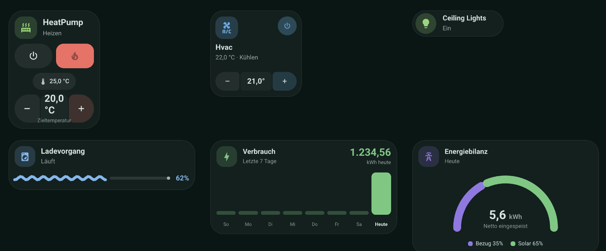
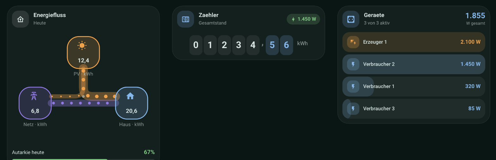
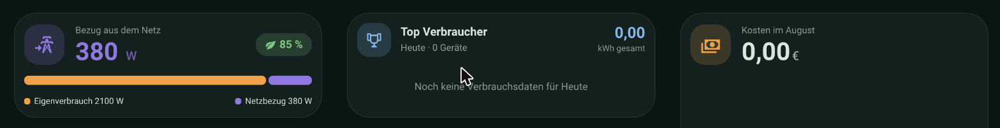
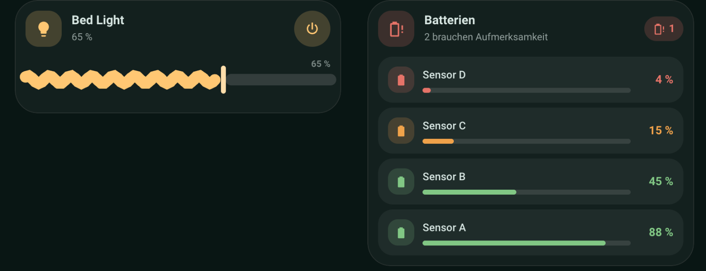
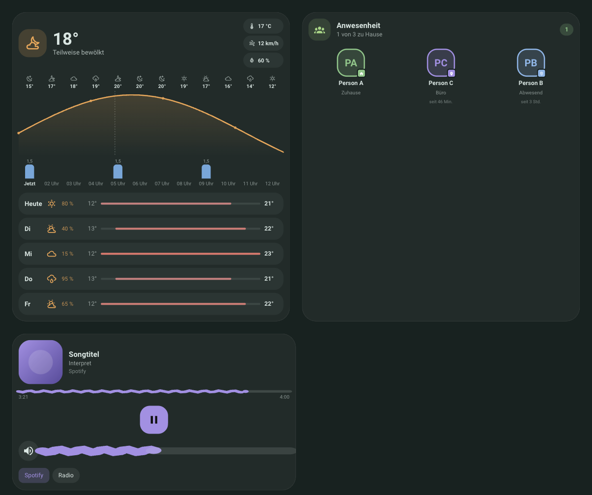

# M3 Cards

> **⚠️ Beta:** Dieses Projekt ist neu und befindet sich in aktiver
> Entwicklung. Konfigurationsoptionen können sich zwischen Versionen noch
> ändern — bitte Issues melden, wenn dir etwas auffällt.

Material-3-inspirierte, native Lovelace-Karten für Home Assistant — gebaut mit
TypeScript + [Lit](https://lit.dev), **ohne** Abhängigkeit zu `button-card`,
`card-mod`, `mod-card` oder `stack-in-card`. Ein einziges Bundle
(`m3-cards.js`) registriert siebzehn Karten:

- **M3 Climate Card** (`custom:m3-climate-card`) — für `climate`-Entities
  (Klimaanlagen und Heizungsthermostate)
- **M3 Climate Card Mini** (`custom:m3-climate-card-mini`) — kompakte Variante
  der Klimakarte für schmale Screens (zwei Kacheln passen z.B. auf ein Handy
  nebeneinander)
- **M3 Button Card** (`custom:m3-button-card`) — generische Button-/Entity-Karte
  für beliebige Domains (Buttons, Schalter, Lichter, Szenen, Türen, ...)
- **M3 Progress Card** (`custom:m3-progress-card`) — Fortschrittskarte für
  Haushaltsgeräte (Waschmaschine, Trockner, Spülmaschine, ...) mit
  Material-3-Expressive-Wellenindikator
- **M3 Energy Card** (`custom:m3-energy-card`) — Balkendiagramm für
  Energiewerte pro Tag/Stunde/Monat (Solarerzeugung, Verbrauch, ...) mit
  prominentem aktuellem Wert, Monats-Hochrechnung + Vergleichs-Chips, oder als
  Solar-Tagesverlauf mit Prognose-Overlay (`mode: solar`)
- **M3 Gauge Card** (`custom:m3-gauge-card`) — Halbkreis-Gauge für das
  Verhältnis zweier Größen (z.B. Netzbezug vs. Einspeisung), gespeist aus dem
  Energie-Dashboard oder zwei frei wählbaren Sensoren
- **M3 Energy Flow Card** (`custom:m3-energy-flow-card`) — Knoten-Diagramm der
  heutigen Energieflüsse zwischen PV, Netz und Haus, gespeist aus dem
  Energie-Dashboard
- **M3 Counter Card** (`custom:m3-counter-card`) — Zählerstand als
  Ziffernanzeige mit Roll-Animation bei Wertänderung (z.B. Stromzähler),
  optionalem Leistungs-Chip im Header und Tages-Ticker
- **M3 Power List Card** (`custom:m3-power-list-card`) — sortierte Liste von
  Leistungssensoren (z.B. Steckdosen) mit Schwellwert-Filter, Anteilsbalken
  und Aufklappbereich für inaktive Geräte; optional `auto_discover` zieht
  automatisch alle Sensoren mit `device_class: power`
- **M3 Power Summary Card** (`custom:m3-power-summary-card`) — Netzbilanz,
  Verbrauch, Erzeugung und Autarkie als Schnellübersicht in einer Karte
- **M3 Top Consumers Card** (`custom:m3-top-consumers-card`) — Ranking der
  größten Einzelverbraucher aus der Geräte-Sektion des Energie-Dashboards,
  optional nach Kosten statt kWh
- **M3 Cost Card** (`custom:m3-cost-card`) — Kostenauswertung mit Prognose,
  Vergleichs-Chip und Tagesbalken, drei Preisquellen (Energie-Dashboard,
  `input_number`-Helfer mit Stepper, oder fester Preis)
- **M3 Light Card** (`custom:m3-light-card`) — Lichtsteuerung mit
  Wellen-Slider für die Helligkeit (Ziehen und Tippen, auch auf Touch ohne
  Scroll-Konflikt)
- **M3 Battery Card** (`custom:m3-battery-card`) — Batteriestand-Übersicht
  über alle `device_class: battery`-Sensoren, mit Schwellwert-Einfärbung,
  Sortierung und optionalem Auto-Discovery
- **M3 Weather Card** (`custom:m3-weather-card`) — Wetterkarte mit
  geglätteter Temperaturkurve, Niederschlagsbalken, Sonnenauf-/-untergang und
  Tagesübersicht, gespeist aus einer `weather`-Entity
- **M3 Presence Card** (`custom:m3-presence-card`) — Anwesenheitsübersicht als
  Avatar-Raster für `person`-/`device_tracker`-Entities mit Status-Ring,
  Zonenfarben und optionaler eingebetteter Karte
- **M3 Media Card** (`custom:m3-media-card`) — Medienplayer-Steuerung mit
  Cover-Farbextraktion, Fortschritts- und Lautstärke-Wellen-Slider sowie
  Quellenauswahl


*Screenshots aller siebzehn Karten mit Demo-Daten:*







<sub>Karten- und Sensornamen in den Screenshots sind generische Demo-Daten
(HA-Demo-Integration + Platzhalter-Helfer), keine echten Geräte.</sub>

🇬🇧 [English README](README.en.md)

## Features

- Milchige Glas-Karte (frei abschaltbar für solide Themes), gemeinsame Design-Sprache
- Modus-Pills mit Shape-Morph-Animation (rund → abgerundetes Rechteck)
- Temperatur-Stepper mit Schrittweite/Grenzen aus der Entity
- Optionale externe Temperatur-/Feuchte-Sensoren, Fenster- und Batterie-Chip
- Preset-Unterstützung (Tap zum Durchschalten, wahlweise als eigene Zeile oder
  als Button in der Modus-Zeile)
- Konfigurierbare Kartenhöhe + volle Höhen-Anpassung an `horizontal-stack`/Grid-Layouts
  für exakt gleich hohe Kacheln nebeneinander
- Vollständiger, grafischer Editor (kein YAML nötig) — Vorbild: nativer Tile-Card-Editor,
  einheitliches Erscheinungsbild-Panel (Eckenradius-Presets, Ecken einzeln) auf allen Karten
- `unavailable`-Handling ohne Crash: Werte als „–“, Controls gedimmt
- Deutsch/Englisch lokalisiert (folgt `hass.locale.language`)
- Barrierefreiheit: alle interaktiven Elemente per Tastatur erreichbar
  (Tab/Enter/Leertaste) mit sichtbarem Fokusring und `aria-label`
- Respektiert `prefers-reduced-motion` durchgängig, zusätzlich pro Karte über
  `animation: auto | on | off` erzwingbar
- Alte Configs (z.B. `animations: true/false`) werden beim Laden automatisch
  auf das aktuelle Schema migriert — kein manuelles Nachpflegen nötig

## Installation

### HACS (empfohlen)

1. HACS → Frontend → Menü (⋮) → *Benutzerdefinierte Repositories*
2. Repository-URL eintragen, Kategorie **Lovelace** wählen
3. „M3 Cards“ installieren und Home Assistant neu laden

### Manuell

1. Lade die aktuelle `m3-cards.js` aus den [Releases](../../releases) herunter
2. Kopiere sie nach `config/www/m3-cards.js`
3. Füge die Ressource in Home Assistant hinzu:
   *Einstellungen → Dashboards → Ressourcen → Ressource hinzufügen*
   - URL: `/local/m3-cards.js`
   - Typ: JavaScript-Modul

## M3 Climate Card

Karte über den Dashboard-Editor hinzufügen (Suche nach „M3 Climate Card“) oder
per YAML:

```yaml
type: custom:m3-climate-card
entity: climate.wohnzimmer
name: Wohnzimmer
show_presets: true
preset_style: chip # chip | pill
show_sensors: true
temperature_chip_placement: info_row # info_row | header
temperature_sensor: sensor.wohnzimmer_temperatur
humidity_sensor: sensor.wohnzimmer_luftfeuchte
window_sensor: binary_sensor.wohnzimmer_fenster
battery_sensor: sensor.thermostat_batterie
battery_threshold: 20
glass_background: true
hidden_modes: []
height: 380
mode_colors:
  heat: "#e57368"
  cool: "#6ba7dc"
```

### Konfigurationsoptionen

| Option | Typ | Standard | Beschreibung |
|---|---|---|---|
| `entity` | string | **Pflicht** | `climate.*`-Entity |
| `name` | string | `friendly_name` der Entity | Angezeigter Name |
| `icon` | string | `mdi:radiator` (nur Heizen) / `mdi:air-conditioner` | Header-Icon |
| `show_presets` | boolean | `true` | Preset-Auswahl anzeigen (falls Entity `preset_modes` unterstützt) |
| `preset_style` | `chip` \| `pill` | `chip` | Preset als eigene breite Zeile (`chip`) oder als zusätzlicher Button in der Modus-Zeile (`pill`) |
| `show_sensors` | boolean | `true` | Sensor-Chips (Temperatur/Feuchte) anzeigen |
| `temperature_chip_placement` | `info_row` \| `header` | `info_row` | Ist-Temperatur in der Sensor-Zeile oder als Chip oben rechts im Header |
| `temperature_sensor` | string | – | Externer Temperatursensor, überschreibt `current_temperature` |
| `humidity_sensor` | string | – | Externer Feuchtesensor, überschreibt `current_humidity` |
| `window_sensor` | string | – | `binary_sensor`, zeigt „Offen“-Chip bei `state: "on"` |
| `battery_sensor` | string | – | Sensor für Batteriestand |
| `battery_threshold` | number | `20` | Schwellwert (%), ab dem der Batterie-Chip erscheint |
| `hidden_modes` | string[] | `[]` | HVAC-Modi, die trotz Entity-Unterstützung nicht als Pill angezeigt werden |
| `glass_background` | boolean | `true` | Milchiger Glashintergrund (aus für solide Themes) |
| `animations` | boolean | `true` | Shape-Morph/Press-Animationen; `false` deaktiviert alle Übergänge |
| `unavailable_style` | `dimmed` \| `normal` \| `hidden` | `dimmed` | Anzeige, wenn die Entity im Zustand `unavailable`/`unknown` ist: `dimmed` (ausgegraut, nicht antippbar, wie bisher), `normal` (normale Darstellung, Modus-Pills/Stepper bleiben antippbar) oder `hidden` (Karte wird komplett ausgeblendet) |
| `height` | number (px) | – (automatisch) | Feste Mindesthöhe der Karte. Siehe [Gleich hohe Kacheln](#gleich-hohe-kacheln) |
| `radius` | number (px) | `32` | Eckenradius der Karte (Editor bietet Eckig/Leicht rund/Rund/Benutzerdefiniert) |
| `corners` | object | – | Optionaler Override je Ecke: `top_left`, `top_right`, `bottom_right`, `bottom_left` (px) — für asymmetrische Material-3-Expressive-Formen, überschreibt `radius` nur für die angegebenen Ecken |
| `mode_colors` | object | siehe unten | Farb-Override je HVAC-Modus. Editor zeigt Textfeld + Farb-Swatch; akzeptiert Hex/CSS **oder** HA-Farbnamen wie bei `color` der Button-Karte |
| `icon_active_color` | string | `var(--primary-color)` | Header-Icon-Farbe, wenn aktiv (nicht „Aus“) |
| `icon_inactive_color` | string | `var(--primary-color)` | Header-Icon-Farbe im Zustand „Aus“ |
| `plus_active_color` | string | Farbe des aktuellen Modus | Plus-Button-Farbe, wenn aktiv |
| `plus_inactive_color` | string | `mode_colors.off` | Plus-Button-Farbe im Zustand „Aus“ |
| `minus_active_color` | string | `var(--primary-text-color)` | Minus-Button-Farbe, wenn aktiv |
| `minus_inactive_color` | string | `var(--primary-text-color)` | Minus-Button-Farbe im Zustand „Aus“ |

Ohne eigene Angabe bleibt das Icon wie bisher immer in der Theme-Akzentfarbe
(`--primary-color`); Minus bleibt neutral. `icon_active_color` /
`icon_inactive_color` / `plus_active_color` / `plus_inactive_color` /
`minus_active_color` / `minus_inactive_color` erlauben eine komplett
unabhängige Farbe je Element und Zustand („Aus“ vs. aktiv).

#### Standard-Modusfarben

| Modus | Farbe |
|---|---|
| `off` | `#9e9e9e` |
| `heat` | `#e57368` |
| `cool` | `#6ba7dc` |
| `dry` | `#5dcaa5` |
| `auto` | `#5dcaa5` |
| `fan_only` | `#b8c4c9` |
| `heat_cool` | `#e5a768` |

### Gleich hohe Kacheln

Das native HA-Masonry-Dashboard gleicht die Höhe nebeneinanderliegender Karten
**nicht** automatisch an — jede Spalte wird unabhängig nach ihrem eigenen Inhalt
hoch. Zwei Optionen:

1. **`horizontal-stack` verwenden** (empfohlen, kein manueller Wert nötig): Karten
   in einem `horizontal-stack` werden von Home Assistant per Flexbox automatisch
   auf die Höhe der höchsten Karte gestreckt — die M3-Karten füllen diese Höhe
   vollständig aus (inkl. Stepper, der unten andockt):
   ```yaml
   type: horizontal-stack
   cards:
     - type: custom:m3-climate-card
       entity: climate.klimaanlage
     - type: custom:m3-climate-card
       entity: climate.wohnzimmer
   ```
2. **`height` manuell setzen**: falls kein `horizontal-stack` genutzt wird, kann
   pro Karte ein fester Pixelwert (`height: 380`) angegeben werden.

## M3 Climate Card Mini

Kompakte Companion-Karte zur großen Klimakarte: Icon-Kachel + Ein/Aus-Button
oben, Name + „Ist-Temperatur · Modus“ darunter, Minus/Zieltemperatur/Plus-Stepper
unten. Kein Preset-, Sensor- oder Modus-Zeilen-Support — dafür passen zwei
Kacheln bequem nebeneinander auf ein Handydisplay.

```yaml
type: custom:m3-climate-card-mini
entity: climate.schlafzimmer
name: Schlafzimmer
glass_background: true
mode_colors:
  heat: "#e57368"
  cool: "#6ba7dc"
```

### Konfigurationsoptionen

| Option | Typ | Standard | Beschreibung |
|---|---|---|---|
| `entity` | string | **Pflicht** | `climate.*`-Entity |
| `name` | string | `friendly_name` der Entity | Angezeigter Name |
| `icon` | string | `mdi:radiator` (nur Heizen) / `mdi:air-conditioner` | Icon in der Icon-Kachel |
| `glass_background` | boolean | `true` | Milchiger Glashintergrund (aus für solide Themes) |
| `animations` | boolean | `true` | Übergänge für Icon-Kachel/Ein-Aus-Button/Stepper; `false` deaktiviert sie |
| `unavailable_style` | `dimmed` \| `normal` \| `hidden` | `dimmed` | Anzeige, wenn die Entity im Zustand `unavailable`/`unknown` ist |
| `radius` | number (px) | `28` | Eckenradius der Karte (Editor bietet Eckig/Leicht rund/Rund/Benutzerdefiniert) |
| `corners` | object | – | Optionaler Override je Ecke: `top_left`, `top_right`, `bottom_right`, `bottom_left` (px) |
| `mode_colors` | object | siehe [Standard-Modusfarben](#standard-modusfarben) | Farb-Override je HVAC-Modus |
| `icon_active_color` | string | Farbe des aktuellen Modus | Icon-Farbe, wenn die Heizung/Klimaanlage aktiv (nicht „Aus“) ist |
| `icon_inactive_color` | string | `mode_colors.off` | Icon-Farbe im Zustand „Aus“ |
| `power_active_color` | string | Farbe des aktuellen Modus | Ein-Aus-Button-Farbe, wenn aktiv |
| `power_inactive_color` | string | `mode_colors.off` | Ein-Aus-Button-Farbe im Zustand „Aus“ |
| `plus_active_color` | string | Farbe des aktuellen Modus | Plus-Button-Farbe, wenn aktiv |
| `plus_inactive_color` | string | `mode_colors.off` | Plus-Button-Farbe im Zustand „Aus“ |
| `minus_active_color` | string | `var(--primary-text-color)` | Minus-Button-Farbe, wenn aktiv |
| `minus_inactive_color` | string | `var(--primary-text-color)` | Minus-Button-Farbe im Zustand „Aus“ |

Icon-, Ein-Aus-Button- und Plus-Farbe folgen standardmäßig den `mode_colors`
(inkl. „Aus“) und lassen sich damit schon allein über `mode_colors.off`
anpassen; Minus bleibt standardmäßig neutral. `icon_active_color` /
`icon_inactive_color` / `power_active_color` / `power_inactive_color` /
`plus_active_color` / `plus_inactive_color` / `minus_active_color` /
`minus_inactive_color` erlauben zusätzlich eine komplett unabhängige Farbe je
Element und Zustand.

Der Ein/Aus-Button ruft `homeassistant.toggle` auf die Entity auf. Ein Tap auf
die Icon-Kachel, den Namen/Status oder die Zieltemperatur-Anzeige öffnet den
More-Info-Dialog.

## M3 Button Card

Generische Karte für Entities außerhalb von `climate` (Buttons, Schalter,
Lichter, Szenen, Türsensoren, ...) im selben Design.

```yaml
type: custom:m3-button-card
entity: button.hausflur_tur_offnen
name: Haustür öffnen
icon: mdi:door
color: dark-grey
state_colors:
  open: red
  locked: green
show_state: false
show_icon_background: true
show_slider: false
vertical: false
radius: 28
glass_background: true
tap_action:
  action: toggle
hold_action:
  action: more-info
```

### Konfigurationsoptionen

| Option | Typ | Standard | Beschreibung |
|---|---|---|---|
| `entity` | string | – (optional) | Beliebige Entity — auch `automation.*`, `script.*`, `scene.*`. Kann leer gelassen werden für einen reinen Aktions-Button ohne Entity-Zustand (siehe unten) |
| `name` | string | `friendly_name` der Entity | Angezeigter Name |
| `icon` | string | Entity-Icon, sonst HA-Standardicon für die Domain/`device_class` | Icon. Ohne Angabe wird — wie bei der nativen Tile-Karte — automatisch das von HA berechnete Standardicon verwendet (z.B. Thermometer für `device_class: temperature`), nicht nur das explizit auf der Entity gesetzte Icon |
| `color` | string | `primary` (übernimmt die Theme-Akzentfarbe von HA) | HA-Farbname (`red`, `dark-grey`, `deep-orange`, ...) **oder** beliebige CSS-Farbe (`#hex`, `rgb(...)`) für Icon/Hintergrund im **ein-/aktiven** Zustand |
| `inactive_color` | string | – (Standard-Theme-Grau) | Farbe für Icon/Hintergrund im **aus-/inaktiven** Zustand, gleiches Format wie `color`. Wird auch verwendet, wenn `static_color: true` gesetzt ist |
| `invert_colors` | boolean | `false` | Vertauscht `color` und `inactive_color` (bzw. deren Standardwerte), ohne dass eigene Farben angegeben werden müssen — z.B. um schnell "hell im Aus-Zustand, Akzentfarbe im An-Zustand" in "Akzentfarbe im Aus-Zustand, hell im An-Zustand" umzudrehen |
| `state_colors` | object | – | Farb-Override je Entity-Zustand (z.B. `open`, `locked`), überschreibt `color` nur für diesen Zustand. Editor bietet die gängigsten Zustände als Felder an; per YAML ist jeder beliebige Zustandsname möglich |
| `static_color` | boolean | `false` | Icon/Hintergrund immer in der Farbe von `inactive_color` (bzw. Standard-Grau) anzeigen, unabhängig vom Entity-Zustand — z.B. für Geräte, die dauerhaft an sind und optisch nicht "aktiv" hervorgehoben werden sollen. Mit `inactive_color` frei wählbar |
| `unavailable_style` | `dimmed` \| `normal` \| `hidden` | `dimmed` | Anzeige, wenn die Entity im Zustand `unavailable` ist: `dimmed` (ausgegraut, nicht antippbar, wie bisher), `normal` (normale Darstellung, weiterhin antippbar — z.B. damit `hold_action: more-info` zur Diagnose nutzbar bleibt) oder `hidden` (Karte wird komplett ausgeblendet) |
| `show_state` | boolean | `true` | Statuszeile unter dem Namen anzeigen |
| `state_content` | `state` \| `last_changed` \| `last_updated` | `state` | Inhalt der Statuszeile: der Entity-Zustand selbst, oder eine relative Zeitangabe seit der letzten Zustandsänderung bzw. dem letzten Update (z.B. „vor 3 Stunden“) |
| `show_icon_background` | boolean | `true` | Farbiger Kreis hinter dem Icon |
| `icon_size` | number (px) | – (automatisch, skaliert mit Kartenhöhe) | Feste Icon-Größe unabhängig von der Kartenhöhe, damit unterschiedlich hohe Buttons (z.B. `rows: 1` vs. `rows: 2`) optisch gleich große Icons haben |
| `align_icons` | boolean | `false` | Icons unabhängig von der Kartenhöhe am gleichen Abstand vom linken Rand ausrichten — nützlich in Kombination mit `icon_size`, damit übereinander liegende Karten unterschiedlicher Höhe optisch exakt fluchten. Die vertikale Zentrierung bleibt unverändert |
| `show_slider` | boolean | `false` | Schieberegler unter dem Icon/Text anzeigen — nur wirksam bei `light` (Helligkeit), `cover` (Position), `fan` (Stufe), `input_number`/`number` (Wert) |
| `vertical` | boolean | `false` | Icon über statt neben dem Text |
| `radius` | number (px) | `28` | Eckenradius der Karte. Im Editor als Voreinstellung („Eckig“ 8px / „Leicht rund“ 16px / „Rund“ 28px) oder frei wählbar |
| `corners` | object | – | Optionaler Override je Ecke: `top_left`, `top_right`, `bottom_right`, `bottom_left` (px) — für asymmetrische Material-3-Expressive-Formen wie z.B. ein Button mit nur einer runden Seite |
| `glass_background` | boolean | `true` | Milchiger Glashintergrund |
| `animations` | boolean | `true` | Press-Animation (leichtes Einsinken beim Antippen); `false` deaktiviert alle Übergänge |
| `tap_action` | Action | domänenabhängig | Ohne Angabe automatisch sinnvoll gewählt: `automation.trigger`/`script.turn_on`/`scene.turn_on`/`button.press` für die jeweilige Domain, `toggle` für Licht/Schalter/etc., sonst `more-info` |
| `hold_action` | Action | `more-info` | Aktion bei langem Drücken (auf der ganzen Kachel) — wie bei der nativen Tile-Karte |
| `double_tap_action` | Action | `none` | Aktion bei Doppeltipp (auf der ganzen Kachel) |
| `icon_tap_action` | Action | `more-info` | Eigene Tap-Aktion nur für das Icon/den Icon-Kreis, unabhängig von `tap_action` — wie bei der nativen Tile-Karte |
| `icon_hold_action` | Action | `none` | Aktion bei langem Drücken auf das Icon |
| `icon_double_tap_action` | Action | `none` | Aktion bei Doppeltipp auf das Icon |

Aktive Zustände (`on`, `open`, `home`, `playing`, ...) färben Icon und
Icon-Hintergrund in der konfigurierten `color` (oder dem passenden
`state_colors`-Override); Entities ohne dauerhaften Zustand (`button`,
`script`, `scene`) sind immer eingefärbt.

Automatisierungen/Skripte/Szenen auslösen funktioniert wie jede andere
Entity — `entity: automation.guten_morgen` reicht bereits, ein Tap löst die
Automatisierung dank des domänenabhängigen Standard-`tap_action` direkt aus
(kein manuelles `call-service` nötig, es sei denn du willst etwas anderes).

#### Reiner Aktions-Button (ohne Entity)

`entity` kann komplett weggelassen werden, wenn die Karte nur eine Aktion
auslösen soll (z.B. ein Skript/eine Automatisierung starten) und kein
Entity-Zustand angezeigt werden muss. Ohne `entity` wird kein Status-Text
angezeigt und das Icon ist immer eingefärbt (wie bei `button`/`script`):

```yaml
type: custom:m3-button-card
name: Katze füttern
icon: mdi:cat
color: dark-grey
tap_action:
  action: perform-action
  perform_action: script.futterung_10g
  target: {}
```

## M3 Progress Card

Fortschrittskarte für Haushaltsgeräte mit Status/Prozent/Restzeit-Sensoren
(Waschmaschine, Trockner, Spülmaschine, 3D-Drucker, ...). Der Fortschrittsbalken
ist ein Material-3-Expressive-„Wavy“-Indikator: ein wellenförmiger, animierter
aktiver Teil, eine Lücke, ein flacher Track und ein Endpunkt-Dot.

```yaml
type: custom:m3-progress-card
entity: sensor.waschmaschine_vorgangsstatus
percentage_entity: sensor.waschmaschine_fortschritt_prozent
remaining_entity: sensor.waschmaschine_verbleibende_minuten
name: Waschmaschine
icon: mdi:washing-machine
glass_background: true
```

### Status-Logik

Der Status-Sensor wird (Groß-/Kleinschreibung ignorierend) einer von vier
Kategorien zugeordnet, jeweils mit eigenem Statustext:

| Kategorie | Standard-Statuswerte | Standard-Statustext | Balken |
|---|---|---|---|
| Läuft | `wash`, `waschen`, `spin`, `schleudern`, `rinse`, `spülen` | „{remaining} Min. verbleibend“ | animierte Welle |
| Vorbereitung | `beladungserkennung` | „Erkenne Beladung…“ | animierte Welle (auch ohne Prozentwert: „Indeterminate“-Segment pendelt über den Track) |
| Fertig | `end`, `beenden` | „Fertig! Wäsche ist sauber.“ | Balken auf 100 %, Welle läuft zu einer geraden Linie aus |
| Bereit (alle anderen Werte) | – | „Bereit“ | ausgeblendet, Karte kollabiert auf Header-Höhe |

Die Statuswerte-Listen sind über `running_states` / `preparing_states` /
`done_states` frei konfigurierbar; `{remaining}` im Statustext wird durch den
Wert von `remaining_entity` ersetzt (fehlt der Sensor, entfällt nur die
Minutenangabe, kein Crash). `percentage_entity`/`remaining_entity` sind
optional — ohne `percentage_entity` läuft der Balken im „Vorbereitung“-Zustand
als Indeterminate-Animation.

### Konfigurationsoptionen

| Option | Typ | Standard | Beschreibung |
|---|---|---|---|
| `entity` | string | **Pflicht** | Status-Sensor |
| `percentage_entity` | string | – | Sensor mit Fortschritt in Prozent (0–100) |
| `remaining_entity` | string | – | Sensor mit Restzeit in Minuten |
| `name` | string | `friendly_name` der Entity | Angezeigter Name |
| `icon` | string | `mdi:washing-machine` | Icon in der Icon-Kachel |
| `status_text_running` / `_preparing` / `_done` / `_ready` | string | siehe Tabelle oben | Statustext je Kategorie; `{remaining}` als Platzhalter in `status_text_running` |
| `running_states` / `preparing_states` / `done_states` | string[] | siehe Tabelle oben | Statuswerte je Kategorie (Groß-/Kleinschreibung egal) |
| `animation` | `auto` \| `on` \| `off` | `auto` | `auto`/`on` respektieren `prefers-reduced-motion` des Systems (dann statische Linie); `off` deaktiviert die Animation immer |
| `wave_style` | `wavy` \| `flat` | `wavy` | Nur bei `animation: off` — eingefrorene Welle oder gerade Linie; zeigt in beiden Fällen weiterhin Füllstand/Lücke/Dot |
| `hide_when_ready` | boolean | `false` | Ganze Karte ausblenden im Zustand „Bereit“ (statt nur den Balken) |
| `glass_background` | boolean | `true` | Milchiger Glashintergrund (aus für solide Themes) |
| `radius` | number (px) | `28` | Eckenradius der Karte |
| `corners` | object | – | Optionaler Override je Ecke: `top_left`, `top_right`, `bottom_right`, `bottom_left` (px) |

#### Farben

Alle Farben sind optional; nicht gesetzte Felder folgen dem Theme. Intern als
CSS Custom Properties (`--m3p-accent`, `--m3p-track`, `--m3p-dot`, …) auf der
Karte hinterlegt — damit lassen sie sich bei Bedarf zusätzlich per `card-mod`
oder Theme überschreiben.

| Option | Standard | Beschreibung |
|---|---|---|
| `accent_color` | `#85b7eb` | Welle, Prozentzahl, Icon |
| `track_color` | 12 % `--primary-text-color` | Flacher Track |
| `dot_color` | 70 % `--primary-text-color` | Endpunkt-Dot |
| `icon_color` | Akzentfarbe | Icon-Farbe |
| `icon_background` | 18 % Icon-Farbe | Icon-Kachel-Hintergrund |
| `text_color` | `--primary-text-color` | Name |
| `secondary_text_color` | `--primary-text-color` | Statuszeile |
| `card_background` | wie Glas-/Solid-Hintergrund | Kartenhintergrund |
| `state_colors.running` / `.preparing` / `.done` | – | Überschreibt `accent_color` nur für diese Kategorie (z.B. Grün bei „Fertig“) |

```yaml
type: custom:m3-progress-card
entity: sensor.waschmaschine_vorgangsstatus
percentage_entity: sensor.waschmaschine_fortschritt_prozent
remaining_entity: sensor.waschmaschine_verbleibende_minuten
state_colors:
  done: green
```

## M3 Energy Card

Balkendiagramm für Energiewerte (Solarerzeugung, Verbrauch, ...). Über `mode`
gibt es zwei grundsätzlich verschiedene Darstellungen:

- **`mode: consumption`** (Standard) — Balken pro Tag oder pro Stunde für
  eine einzelne Entity, siehe `period` unten.
- **`mode: solar`** — Tagesverlauf der Solarerzeugung inkl. Prognose, siehe
  eigener Abschnitt weiter unten.

`mode: consumption` ist nicht auf Strom beschränkt — Einheit und Icon werden
von der Entity übernommen (Icon automatisch anhand `device_class`: `gas` →
Flamme, `water` → Wassertropfen, sonst Blitz, außer explizit über `icon`
gesetzt), daher eignet sich der Modus genauso für Gas- oder Wasserzähler.

### `mode: consumption` — Zeiträume über `period`

- **`period: day`** (Standard) — die letzten N Tage als Balken plus den
  heutigen Wert prominent im Header, live aus dem aktuellen Entity-State.
- **`period: hour`** — die letzten N Stunden des heutigen Tages plus die
  laufende Stunde, mit Wertezeile über den Balken.
- **`period: month`** — die letzten N Monate (rollierend, inkl. laufendem
  Monat) mit Hochrechnung, Durchschnittslinie und Vergleichs-Chips, siehe
  eigener Abschnitt weiter unten.

```yaml
type: custom:m3-energy-card
entity: sensor.solarenergie_gesamterzeugnis_daily
name: Solarerzeugung
icon: mdi:solar-power
accent_color: "#66bb6a"
period: day
days: 7
```

```yaml
type: custom:m3-energy-card
entity: sensor.shelly_3em_gesamtverbrauch_hourly
name: Verbrauch pro Stunde
icon: mdi:lightning-bolt
period: hour
hours: 6
```


### Datenbeschaffung

Die vergangenen Tage/Stunden/Monate werden primär über HA-Langzeitstatistiken
(`recorder/statistics_during_period`, konfigurierbar über `statistic_type`)
geladen:

- `state` (Standard bei `period: day`/`hour`) — der letzte Rohwert des
  Zeitraums, passend für Zähler-Sensoren, die periodisch zurückgesetzt werden
  (z.B. `*_daily`/`*_hourly`-Sensoren wie bei Shelly). Entspricht dem, was
  ein `mini-graph-card` mit `aggregate_func: max` anzeigen würde.
- `change` — die Differenz innerhalb des Zeitraums, passend für einen nie
  zurückgesetzten Gesamtzähler. **Default bei `period: month`**: selbst ein
  täglich zurücksetzender Zähler braucht hier `change`, weil sein `state` bei
  Monats-Granularität nur den Wert des letzten Tages im Monat liefert (ein
  paar kWh), nicht die Monatssumme — `change` akkumuliert dagegen korrekt
  über alle Tages-Resets hinweg.

Hat die Entity keine Langzeitstatistik, greift bei `period: day`/`hour`
automatisch ein History-API-Fallback (Werte per Maximum pro Tag/Stunde
verdichtet). Bei `period: month` gibt es keinen Fallback (eine monatsweise
History-Abfrage wäre unpraktikabel groß) — stattdessen zeigt die Karte eine
klare Meldung. Ob eine Entity Langzeitstatistiken hat, lässt sich unter
**Entwicklerwerkzeuge → Statistik** prüfen — der Editor zeigt bei
`period: day`/`hour` zusätzlich einen Hinweis, falls nicht. Der laufende Tag/
die laufende Stunde/der laufende Monat wird stets live (bzw. bei `change`
über eine Kurzzeit-Statistik-Summe seit Periodenbeginn) berechnet, nicht aus
der Langzeitstatistik, da diese Periode noch nicht abgeschlossen ist. Die
Daten werden im Tages-Modus alle 15 Minuten, im Stunden-Modus alle 5 Minuten
und im Monats-Modus stündlich aktualisiert.

### Interaktion

Tap auf einen Balken zeigt kurz eine Wert-Bubble mit dem Wert (morpht dabei
leicht: Eckenradius 9→6px, Aufhellung); Tap auf den Header öffnet die
More-Info-Ansicht der Entity. Beim ersten Rendern wachsen die Balken gestaffelt
(30ms pro Balken) auf ihre Zielhöhe ein — respektiert die `animation`-Option
und `prefers-reduced-motion`. Im Stunden-Modus wird bei mehr als 12 Balken
(z.B. `hours: 24`) die Wertezeile automatisch ausgeblendet und nur noch jedes
zweite Stunden-Label angezeigt, damit es nicht zu eng wird.

### `period: month` — Hochrechnung, Vergleich, Durchschnitt

```yaml
type: custom:m3-energy-card
entity: sensor.shelly_3em_gesamtverbrauch_daily
name: Verbrauch pro Monat
icon: mdi:calendar-month
period: month
months: 12
```

- **Hochrechnung**: der laufende Monat wird als gefüllter Ist-Balken plus
  gestricheltem Umriss dargestellt — der Umriss zeigt, wo der Monat bei
  gleichbleibendem Tagesdurchschnitt landen würde (`Ist-Wert ÷ verstrichene
  Tage × Tage im Monat`). Abschaltbar über `show_projection: false`.
- **Durchschnittslinie**: gestrichelte waagerechte Linie auf Höhe des
  Mittelwerts der abgeschlossenen Monate. Abschaltbar über
  `show_average: false`.
- **Vergleichs-Chips** unter dem Header (abschaltbar über
  `show_comparison: false`):
  - Chip 1 vergleicht die Hochrechnung (bzw. den Ist-Wert, wenn
    `show_projection: false`) mit dem Vormonat in Prozent — grün, wenn
    weniger verbraucht wurde, rot bei mehr. Bei Erzeugungs-Werten (z.B.
    `mode: solar` oder eigene Zähler) diese Logik mit `higher_is_better: true`
    umdrehen, damit „mehr“ grün ist.
  - Chip 2 zeigt den Durchschnitt der abgeschlossenen Monate (`Ø X kWh`).
- Bei `months > 12` wird nur noch jeder zweite Monat beschriftet, damit die
  Achse nicht zu eng wird (gleiche Schwelle wie im Stunden-Modus).

### `mode: solar` — Tagesverlauf mit Prognose

Zeigt den heutigen Tagesverlauf der Solarerzeugung als Balken plus, falls
verfügbar, eine Prognose-Überlagerung (gestrichelter Umriss):

```yaml
type: custom:m3-energy-card
mode: solar
source: energy
name: Solarerzeugung
glass_background: true
```

- **`source: energy`** (Standard) — summiert automatisch alle Solar-Quellen
  aus dem HA-Energie-Dashboard (**Einstellungen → Dashboards → Energie**),
  ohne dass eine Entity manuell angegeben werden muss.
- **`source: entity`** — nutzt stattdessen eine einzelne, frei gewählte
  `entity`.
- **Prognose**: wird automatisch über `energy/solar_forecast` geladen, wenn
  im Energie-Dashboard eine Prognose-Integration (Forecast.Solar, Solcast, …)
  konfiguriert ist. Alternativ liefert `forecast_entity` eine eigene
  Prognose-Entity (erwartet ein `wh_hours`-Attribut, Zeitstempel → Wh — das
  Format von Forecast.Solar/Solcast-Sensoren). Ist keine Prognose verfügbar,
  funktioniert die Karte normal, nur ohne Umriss-Balken und ohne
  „von X kWh erwartet“ im Header.
- **Balken**: vergangene/laufende Stunden gefüllt (laufende Stunde volle
  Akzentfarbe, vergangene als 30 %-Tint); künftige Stunden nur als
  gestrichelter Umriss (reine Prognose); ist die laufende Stunde noch unter
  der Prognose, wird die Differenz als gestrichelter Umriss auf den gefüllten
  Balken gestapelt.
- **Zeitraum**: automatisch auf die erste bis letzte Stunde mit Erzeugung
  oder Prognose > 0 getrimmt (nicht 0–24 Uhr, sonst nur leere Balken morgens/
  nachts); `full_day: true` erzwingt den vollen 0–24-Uhr-Bereich.
- **Statistik-Typ**: Solar-Sensoren aus dem Energie-Dashboard sind fast immer
  Lifetime-Zähler (nie zurückgesetzt), daher ist der Default hier `change`
  statt `state` (siehe Datenbeschaffung oben).
- **Vergleichs-/Durchschnitts-Chips** (wie bei `period: month`, siehe unten):
  ein Chip zeigt den heutigen (Erzeugung + Prognose) Stand in % über/unter
  gestern, ein zweiter den Durchschnitt der letzten 7 Tage. Steuerbar über
  `show_comparison`/`show_average` (Standard beide an).

### Konfigurationsoptionen

| Option | Typ | Standard | Beschreibung |
|---|---|---|---|
| `mode` | `consumption` \| `solar` | `consumption` | Balken pro Tag/Stunde oder Solar-Tagesverlauf mit Prognose |
| `entity` | string | **Pflicht** außer bei `mode: solar` + `source: energy` | Energie-Sensor |
| `statistic_type` | `state` \| `change` | `state` (`change` bei `mode: solar` oder `period: month`) | Statistik-Typ für die Balkenwerte |
| `period` | `day` \| `hour` \| `month` | `day` | Balken pro Tag, Stunde oder Monat — nur bei `mode: consumption` |
| `days` | number | `7` | Anzahl vergangener Tage (3–14), nur bei `period: day` |
| `hours` | number | `6` | Anzahl vergangener Stunden (3–24), nur bei `period: hour` |
| `months` | number | `12` | Anzahl Monate inkl. laufendem Monat (3–24), nur bei `period: month` |
| `source` | `entity` \| `energy` | `entity` | Nur bei `mode: solar`: einzelne Entity oder alle Solar-Quellen des Energie-Dashboards |
| `forecast_entity` | string | — | Nur bei `mode: solar`: eigene Prognose-Entity (optional, Fallback wenn kein Energie-Dashboard-Forecast konfiguriert ist) |
| `full_day` | boolean | `false` | Nur bei `mode: solar`: immer 0–24 Uhr anzeigen statt zu trimmen |
| `show_values` | boolean | `false` | Wertezeile über den Balken auch im Tages-Modus anzeigen (im Stunden-Modus ist sie standardmäßig an; bei `mode: solar`/`period: month` nicht verfügbar) |
| `show_legend` | boolean | `true` | Nur bei `mode: solar`: Legende „Erzeugt“/„Prognose“ unter den Balken (nur sichtbar, wenn Prognose vorhanden ist) |
| `show_projection` | boolean | `true` | Nur bei `period: month`: Hochrechnung für den laufenden Monat als gestrichelten Umriss anzeigen |
| `show_average` | boolean | `true` | Nur bei `period: month`: gestrichelte Durchschnittslinie anzeigen |
| `show_comparison` | boolean | `true` | Nur bei `period: month`: Vergleichs-Chips (Vormonat, Durchschnitt) unter dem Header anzeigen |
| `higher_is_better` | boolean | `false` | Nur bei `period: month`: Farblogik des Vergleichs-Chips umdrehen (für Erzeugungs- statt Verbrauchswerte) |
| `comparison_better_color` | string | `#81c784` | Nur bei `period: month`: Farbe des Vergleichs-Chips bei „besser“ |
| `comparison_worse_color` | string | `#e57368` | Nur bei `period: month`: Farbe des Vergleichs-Chips bei „schlechter“ |
| `name` | string | `friendly_name` der Entity | Angezeigter Name |
| `icon` | string | `mdi:solar-power` (`mdi:solar-power-variant` bei `mode: solar`) | Icon in der Icon-Kachel |
| `subtitle` | string | „Letzte {days} Tage“ / „Heute · letzte {hours} Stunden“ / „Pro Monat · {months} Monate“ / „Heute · Tagesverlauf“ | Untertitel-Override |
| `accent_color` | string | `#81c784` | Akzentfarbe (aktueller Balken, aktueller Wert, Icon, Umriss-Prognose/-Hochrechnung) |
| `bar_tint_color` | string | 28 % Akzentfarbe (30 % bei `mode: solar`) | Farbe der vergangenen Balken |
| `text_color` / `secondary_text_color` | string | Theme-Standard | Name / Achsen-Labels |
| `card_background` | string | Glas-/Solid-Hintergrund | Kartenhintergrund |
| `animation` | `auto` \| `on` \| `off` | `auto` | Betrifft Tap-Morph + Einwachs-Effekt; `auto`/`on` respektieren `prefers-reduced-motion` |
| `glass_background` | boolean | `true` | Milchiger Glashintergrund |
| `radius` / `corners` | number / object | `28` | Eckenradius, optional je Ecke |

## M3 Gauge Card

Ersetzt eine `energy-grid-neutrality-gauge`-Kachel: zeigt das Verhältnis
zweier Größen (z.B. Netzbezug vs. Einspeisung) als Halbkreis-Bogen mit
Nettowert in der Mitte. Zwei Segmente mit einer kleinen Lücke am
Übergangspunkt — die Lücke selbst ist der „Zeiger“, keine separate Nadel.

```yaml
type: custom:m3-gauge-card
name: Netzbilanz
```


### Datenquellen

- **`source: energy`** (Standard, keine weitere Konfiguration nötig, wenn das
  HA-Energie-Dashboard eingerichtet ist): liest die konfigurierten
  Netzbezug-/Einspeisung-Statistik-IDs aus `energy/get_prefs` (mehrere
  Zähler/Tarife werden automatisch summiert) und lädt deren Tageswerte.
- **`source: entities`**: zwei frei wählbare Sensoren (`value_a_entity` =
  Bezug, `value_b_entity` = Einspeisung), Zeitbezug liegt dann bei den
  Sensoren selbst. Nicht auf Strom beschränkt — die Einheit wird von den
  konfigurierten Entities übernommen, z.B. für einen Vergleich zweier
  Gas- oder Wasserzähler.

Sind beide Werte 0, zeigt der Bogen nur die Track-Farbe („Keine Daten
heute“ bzw. „Kein Energie-Dashboard konfiguriert“); ist nur ein Wert 0, füllt
sich der ganze Bogen durchgehend in einer Farbe ohne Lücke.

### Animation

Die Segmente wachsen beim ersten Rendern von 0 auf ihren Zielwinkel und ziehen
bei späteren Wertänderungen weich nach — respektiert die `animation`-Option
und `prefers-reduced-motion` wie die anderen Karten.

### Konfigurationsoptionen

| Option | Typ | Standard | Beschreibung |
|---|---|---|---|
| `source` | `energy` \| `entities` | `energy` | Datenquelle |
| `value_a_entity` / `value_b_entity` | string | – | Nur bei `source: entities` — Bezug- / Einspeisung-Sensor |
| `name` | string | `Netzbilanz` | Angezeigter Name |
| `icon` | string | `mdi:transmission-tower` | Icon in der Icon-Kachel |
| `subtitle` | string | „Heute“ | Untertitel-Override |
| `label_positive` / `label_negative` | string | „Netto vom Netz bezogen“ / „Netto eingespeist“ | Text unter dem Nettowert, je nach Vorzeichen |
| `label_a` / `label_b` | string | „Netzbezug“ / „Einspeisung“ | Legenden-Labels |
| `segment_a_color` / `segment_b_color` | string | `#8f79e0` / `#81c784` | Segmentfarben |
| `track_color` | string | 12 % `--primary-text-color` | Bogenfarbe ohne Daten |
| `text_color` / `secondary_text_color` | string | Theme-Standard | Nettowert / Name & Legende |
| `card_background` | string | Glas-/Solid-Hintergrund | Kartenhintergrund |
| `animation` | `auto` \| `on` \| `off` | `auto` | Segment-Animation; `auto`/`on` respektieren `prefers-reduced-motion` |
| `glass_background` | boolean | `true` | Milchiger Glashintergrund |
| `radius` / `corners` | number / object | `28` | Eckenradius, optional je Ecke |

## M3 Energy Flow Card

Knoten-Diagramm der heutigen Energieflüsse zwischen Solar, Netz, Batterie und
Haus, mit animierten Fließpunkten entlang der Verbindungslinien und einem
Autarkie-Balken darunter.

```yaml
type: custom:m3-energy-flow-card
source: energy
```

### Datenquellen

- **`source: energy`** (Standard): liest Solar-, Netzbezug-/Einspeisung- und
  Batterie-Statistiken direkt aus dem HA-Energie-Dashboard.
- **`source: entities`**: `solar_entity`, `grid_import_entity`,
  `grid_export_entity`, `battery_entity` frei wählbar — nützlich, wenn kein
  vollständiges Energie-Dashboard eingerichtet ist oder einzelne Quellen
  ersetzt werden sollen.

Der Batterie-Knoten erscheint automatisch nur, wenn eine Batteriequelle
konfiguriert ist (`show_battery: auto`, Standard) — `always`/`never`
erzwingen die Sichtbarkeit unabhängig davon.

### Animation

Die Fließpunkte laufen per CSS-Animation entlang der Linien
(`flow_speed: slow | normal | fast`) und werden bei `animation: "off"` bzw.
aktivem `prefers-reduced-motion` komplett weggelassen (nicht nur pausiert).

### Konfigurationsoptionen

| Option | Typ | Standard | Beschreibung |
|---|---|---|---|
| `source` | `energy` \| `entities` | `energy` | Datenquelle |
| `solar_entity` / `grid_import_entity` / `grid_export_entity` / `battery_entity` | string | – | Nur bei `source: entities` |
| `name` | string | „Energiefluss“ | Angezeigter Name |
| `icon` | string | `mdi:transmission-tower` | Icon in der Icon-Kachel |
| `show_self_sufficiency` | boolean | `true` | Autarkie-Balken anzeigen |
| `show_battery` | `auto` \| `always` \| `never` | `auto` | Batterie-Knoten-Sichtbarkeit |
| `flow_speed` | `slow` \| `normal` \| `fast` | `normal` | Geschwindigkeit der Fließpunkte |
| `pv_color` / `grid_color` / `home_color` / `battery_color` | string | Theme-Standard | Knotenfarben |
| `self_sufficiency_color` | string | `#81c784` | Farbe des Autarkie-Balkens |
| `text_color` / `secondary_text_color` | string | Theme-Standard | Name / Knoten-Labels |
| `card_background` | string | Glas-/Solid-Hintergrund | Kartenhintergrund |
| `animation` | `auto` \| `on` \| `off` | `auto` | Fließpunkte-Animation; `auto`/`on` respektieren `prefers-reduced-motion` |
| `glass_background` | boolean | `true` | Milchiger Glashintergrund |
| `radius` / `corners` | number / object | `28` | Eckenradius, optional je Ecke |

## M3 Counter Card

Ersetzt eine `tile`-Kachel für Zählerstände: zeigt einen kumulativen
Sensorwert als Ziffernanzeige im Odometer-Stil, jede Ziffer in einer eigenen
Zelle. Vorkommastellen und Nachkommastellen sind farblich getrennt
(Nachkommastellen in der Akzentfarbe). Nur die Stellen, die sich beim letzten
Update tatsächlich geändert haben, rollen animiert um — der Rest bleibt
stehen. Nicht auf Strom beschränkt: Einheit und Nachkommastellen kommen von
der Entity, `power_entity` (Leistungs-Chip) ist rein optional — genauso
geeignet für Gas- oder Wasserzähler (m³) wie für Stromzähler (kWh).

```yaml
type: custom:m3-counter-card
entity: sensor.virtueller_stromzahler
power_entity: sensor.gesamter_energieverbrauch
name: Stromzähler
```


### Ziffernanzeige

- Die Anzahl der Vorkommastellen (`digits`) wächst automatisch mit dem Wert
  (Standard: mindestens 5) und schrumpft innerhalb einer Session nie wieder
  zurück, auch wenn der Wert kurzzeitig fällt — verhindert ein "Springen" der
  Kartenbreite. Alternativ lässt sich eine feste Anzahl konfigurieren; auch
  die wächst bei Bedarf mit, um den Wert nie abzuschneiden.
- Dezimaltrennzeichen und Zahlenformat folgen `hass.locale` (z.B. Komma statt
  Punkt auf Deutsch).
- Ist die Karte schmaler als 340px, verkleinern sich die Ziffernzellen
  automatisch (ResizeObserver).
- `unavailable`: Zellen zeigen gedimmt „–“, der Leistungs-Chip wird
  ausgeblendet.

### Leistungs-Chip und Ticker

- `power_entity` (optional) zeigt einen Chip mit Blitz-Icon und aktueller
  Leistung im Header — Standardfarbe Grün, per `power_thresholds` umschaltbar
  (z.B. ab 2000 W Orange, ab 3500 W Rot).
- `show_ticker` + `daily_entity` (beide optional) blenden unter der
  Ziffernanzeige eine dünne „+X heute“-Zeile ein, gespeist aus einem separaten
  Tagessensor.

### Konfigurationsoptionen

| Option | Typ | Standard | Beschreibung |
|---|---|---|---|
| `entity` | string | – | Zählerstand-Sensor (Pflicht) |
| `power_entity` | string | – | Optionaler Leistungs-Sensor für den Header-Chip |
| `daily_entity` | string | – | Optionaler Tages-Sensor für die Ticker-Zeile |
| `name` | string | Entity-Name | Angezeigter Name |
| `icon` | string | `mdi:counter` | Icon in der Icon-Kachel |
| `subtitle` | string | „Gesamtstand“ | Untertitel-Override |
| `decimals` | number | `2` | Anzahl Nachkommastellen |
| `digits` | `auto` \| number | `auto` | Vorkommastellen — automatisch (min. 5, wächst nie zurück) oder fest |
| `show_ticker` | boolean | `false` | „+X heute“-Zeile anzeigen (braucht `daily_entity`) |
| `accent_color` | string | `#85b7eb` | Farbe der Nachkommastellen-Zellen |
| `cell_background` | string | 8 % `--primary-text-color` | Hintergrund der Vorkommastellen-Zellen |
| `power_chip_color` | string | `#81c784` | Standardfarbe des Leistungs-Chips |
| `power_thresholds` | `{ above, color }[]` | – | Chip-Farbwechsel oberhalb der jeweiligen Leistung |
| `text_color` / `secondary_text_color` | string | Theme-Standard | Name / Untertitel & Ticker |
| `card_background` | string | Glas-/Solid-Hintergrund | Kartenhintergrund |
| `animation` | `auto` \| `on` \| `off` | `auto` | Roll-Animation; `auto`/`on` respektieren `prefers-reduced-motion` |
| `glass_background` | boolean | `true` | Milchiger Glashintergrund |
| `radius` / `corners` | number / object | `28` | Eckenradius, optional je Ecke |

## M3 Power List Card

Ersetzt eine `entities`-Kachel für Steckdosen-/Leistungsübersichten: zeigt
Leistungssensoren als sortierte Liste mit Anteilsbalken, blendet inaktive
Geräte standardmäßig hinter einem Aufklappbereich aus.

```yaml
type: custom:m3-power-list-card
auto_discover: true
name: Steckdosen
```


### Entitätsquelle

- **Manuelle Liste** (`entities`): Array mit `entity` (Pflicht) sowie
  optional `name`, `icon`, `type` (`consumer` | `producer`, Standard
  `consumer`) pro Eintrag. Der Editor verwaltet die Liste als einfache
  Sensor-Auswahl; Name-/Icon-/Typ-Overrides pro Eintrag lassen sich direkt im
  YAML-Editor der Karte feinjustieren.
- **`auto_discover: true`**: zieht automatisch alle `sensor`-Entities mit
  `device_class: power`, optional eingeschränkt auf `include_area` /
  `include_label`, sowie `exclude_entities` zum gezielten Ausschließen.

### Sortierung, Schwellwert, Erzeuger

- `threshold` (Standard `1` W) bestimmt, ab wann ein Gerät als „aktiv“ gilt —
  verhindert, dass Sensor-Rauschen (z.B. 0,2 W) als aktiv erscheint.
- `sort` sortiert die aktiven Verbraucher-Zeilen: `power_desc` (Standard),
  `power_asc`, `name` oder `config` (Reihenfolge wie konfiguriert).
- Einträge mit `type: producer` (z.B. ein Balkonkraftwerk) erscheinen in
  einer eigenen, farblich abgesetzten Sektion über der Verbraucherliste und
  zählen nicht zur Sortierung oder Gesamtsumme der Verbraucher.
- `max_visible` (Standard `0` = alle aktiven) begrenzt die sichtbaren
  Verbraucher-Zeilen; der Rest wandert in den Aufklappbereich für inaktive
  Geräte.
- Beim Über-/Unterschreiten des Schwellwerts ordnet sich die Liste weich um
  (respektiert die `animation`-Option und `prefers-reduced-motion`).

### Konfigurationsoptionen

| Option | Typ | Standard | Beschreibung |
|---|---|---|---|
| `entities` | Liste | – | Manuelle Sensor-Liste (ignoriert, wenn `auto_discover: true`) |
| `auto_discover` | boolean | `false` | Alle Sensoren mit `device_class: power` automatisch aufnehmen |
| `include_area` / `include_label` | string[] | – | Nur bei `auto_discover` — auf Bereiche/Labels einschränken |
| `exclude_entities` | string[] | – | Nur bei `auto_discover` — gezielt ausschließen |
| `threshold` | number | `1` | Schwellwert in W, ab dem ein Gerät als „aktiv“ gilt |
| `sort` | `power_desc` \| `power_asc` \| `name` \| `config` | `power_desc` | Sortierung der aktiven Verbraucher |
| `max_visible` | number | `0` | Max. sichtbare aktive Zeilen (`0` = alle) |
| `show_idle_toggle` | boolean | `true` | Aufklappbereich für inaktive/überzählige Geräte anzeigen |
| `name` | string | „Steckdosen“ | Angezeigter Name |
| `icon` | string | `mdi:power-socket-de` | Icon in der Icon-Kachel |
| `subtitle` | string | „{aktiv} von {gesamt} aktiv“ | Untertitel-Override |
| `accent_color` | string | `#85b7eb` | Farbe der Verbraucher-Icons/-Werte |
| `producer_color` | string | `#f0a24a` | Farbe der Erzeuger-Sektion |
| `bar_tint_color` | string | Akzentfarbe | Farbe des Anteilsbalkens |
| `text_color` / `secondary_text_color` | string | Theme-Standard | Name / Untertitel & Gesamtsumme |
| `card_background` | string | Glas-/Solid-Hintergrund | Kartenhintergrund |
| `animation` | `auto` \| `on` \| `off` | `auto` | Umsortier-Animation; `auto`/`on` respektieren `prefers-reduced-motion` |
| `glass_background` | boolean | `true` | Milchiger Glashintergrund |
| `radius` / `corners` | number / object | `28` | Eckenradius, optional je Ecke |

## M3 Power Summary Card

Ersetzt eine Reihe einzelner Tile-Karten für Momentanleistungen: fasst
Netzbilanz, Verbrauch, Erzeugung und optionale Teilsummen in einer Karte mit
klarer Hierarchie zusammen. Reine Live-Werte aus `hass.states`, keine
Statistik-Abfragen nötig.

```yaml
type: custom:m3-power-summary-card
grid_entity: sensor.gesamtstromverbrauch_2
consumption_entity: sensor.gesamtstromverbrauch_vor_solar
solar_entity: sensor.steckdose_22_balkonkraftwerk_power
metrics:
  - entity: sensor.gesamtstromverbrauch_vor_solar
    name: Verbrauch
    icon: mdi:home-lightning-bolt
  - entity: sensor.steckdose_22_balkonkraftwerk_power
    name: Balkonkraftwerk
    icon: mdi:solar-power-variant
    type: producer
  - entity: sensor.gesamter_energieverbrauch
    name: Steckdosen
    icon: mdi:power-socket-de
```


### Vorzeichen-Konvention

Momentanleistungssensoren am Netzanschluss kodieren Einspeisung/Bezug
unterschiedlich. `grid_sign` stellt die Karte auf die jeweilige Konvention
ein:

- **`negative_is_export`** (Standard): negativer Wert = Einspeisung,
  positiver Wert = Bezug — die gängigste Konvention (z.B. Shelly 3EM,
  viele Wechselrichter-Integrationen).
- **`positive_is_export`**: umgekehrt.

Der angezeigte Wert ist immer ein positiver Betrag — Icon und Label zeigen
die Richtung. Liegt der Betrag innerhalb von `zero_threshold` (Standard
10 W) um 0, zeigt die Karte einen neutralen „Ausgeglichen“-Zustand statt
Einspeisung/Bezug.

### Anteilsbalken und Autarkie

- Ist `solar_entity` gesetzt und die Erzeugung > 0, zeigt ein zweigeteilter
  Balken, wie der aktuelle Verbrauch gedeckt wird: Eigenverbrauch aus Solar
  vs. Überschuss (bei Einspeisung) bzw. vs. Netzanteil (bei Bezug).
  Abschaltbar über `show_split_bar`.
- Der Autarkie-Chip (`show_self_sufficiency`, Standard an) berechnet sich
  als `(Verbrauch − Netzbezug) / Verbrauch × 100`, gedeckelt auf 0–100 %.
- Ist `consumption_entity` nicht gesetzt, wird der Verbrauch als
  `Netzbezug + Solarerzeugung` berechnet.

### Konfigurationsoptionen

| Option | Typ | Standard | Beschreibung |
|---|---|---|---|
| `grid_entity` | string | – | Momentanleistung am Netzanschluss in W (Pflicht) |
| `grid_sign` | `negative_is_export` \| `positive_is_export` | `negative_is_export` | Vorzeichen-Konvention des Netz-Sensors |
| `consumption_entity` | string | – | Hausverbrauch in W (leer = berechnet aus Netzbezug + Solar) |
| `solar_entity` | string / string[] | – | Erzeugungssensor(en) in W, werden summiert |
| `metrics` | Liste | – | Zusätzliche Kennzahl-Felder (`entity`, `name`, `icon`, `color`, `type`) |
| `label_export` / `label_import` | string | „Einspeisung ins Netz“ / „Bezug aus dem Netz“ | Label der Hauptzeile je Richtung |
| `show_self_sufficiency` | boolean | `true` | Autarkie-Chip anzeigen |
| `show_split_bar` | boolean | `true` | Anteilsbalken anzeigen (nur bei konfiguriertem `solar_entity`) |
| `zero_threshold` | number | `10` | Schwellwert in W für den neutralen „Ausgeglichen“-Zustand |
| `kw_threshold` | number | `1000` | Ab diesem Wert in W wird als „X,X kW“ statt „X W“ formatiert |
| `export_color` / `import_color` | string | `#81c784` / `#8f79e0` | Farben für Einspeisung / Bezug |
| `producer_color` | string | `#f0a24a` | Farbe für Erzeuger-Kennzahlen und Solaranteil |
| `accent_color` | string | `#81c784` | Farbe des Autarkie-Chips |
| `text_color` / `secondary_text_color` | string | Theme-Standard | Werte / Labels |
| `card_background` | string | Glas-/Solid-Hintergrund | Kartenhintergrund |
| `animation` | `auto` \| `on` \| `off` | `auto` | Weiche Wertinterpolation (300ms); `auto`/`on` respektieren `prefers-reduced-motion` |
| `glass_background` | boolean | `true` | Milchiger Glashintergrund |
| `radius` / `corners` | number / object | `28` | Eckenradius, optional je Ecke |

## M3 Top Consumers Card

Ersetzt die native `energy-devices-graph`-Karte: zeigt die größten
Einzelverbraucher eines Zeitraums als Ranking, standardmäßig gespeist aus
der Geräte-Sektion des HA-Energie-Dashboards.

```yaml
type: custom:m3-top-consumers-card
source: energy
period: today
top_count: 7
```


### Datenquelle und Zeitraum

- **`source: energy`** (Standard): liest die konfigurierten Geräte-Statistik-
  IDs aus `energy/get_prefs` und lädt deren Verbrauch für den gewählten
  `period` (`today`, `yesterday`, `week`, `month`) via
  `recorder/statistics_during_period`. Die Gesamtsumme im Header ist die
  Summe der GEMESSENEN Geräte, nicht zwingend der gesamte Hausverbrauch.
- **`source: entities`**: manuelle Liste von Energie-Sensoren (kWh) über
  `entities`, falls kein Energie-Dashboard eingerichtet ist oder eine
  eigene Auswahl gewünscht ist.
- Aktualisierung alle 15 Minuten. Geräte mit 0 kWh im Zeitraum werden
  komplett weggelassen.

### Ranking, Sammelzeile, Namensbereinigung

- Sortiert absteigend nach Verbrauch. `top_count` (Standard 7) Geräte
  werden als volle Zeilen mit Anteilsbalken gezeigt.
- Alle weiteren Geräte landen je nach `rest_mode` in einer aufklappbaren
  Sammelzeile (`collapse`, Standard), werden komplett weggelassen (`hide`)
  oder ebenfalls als volle Zeilen gezeigt (`show_all`).
- `name_strip` entfernt Regex-/Text-Muster aus den Entity-Namen (Standard:
  `^Steckdose \d+ - ` und ` Energie$`); pro Gerät über `name` in `entities`
  überschreibbar (Override deaktiviert die Bereinigung für dieses Gerät).
- Gerätefarben werden zyklisch aus `palette` zugewiesen (Standard: 8 Töne
  aus dem Projekt-Farbsystem), pro Gerät über `color` fest überschreibbar.
- Umsortierung bei Datenaktualisierung erfolgt weich animiert (respektiert
  `animation`/`prefers-reduced-motion`).

### `unit_mode: cost` — Ranking nach Kosten statt kWh

```yaml
type: custom:m3-top-consumers-card
source: energy
unit_mode: cost
price_source: energy_dashboard
```

Rankt die Geräte nach Kosten statt Verbrauch (Wert pro Gerät = kWh ×
Preis). Die Preisquelle (`price_source`) funktioniert identisch zur
M3 Cost Card weiter unten — siehe dort für Details zu
`energy_dashboard`/`input_number`/`fixed`. Da HA für einzelne Geräte keine
eigene Kosten-Statistik führt (nur für den gesamten Netzbezug), wird bei
`price_source: energy_dashboard` ein effektiver Preis aus
Gesamtkosten ÷ Gesamtverbrauch des Netzbezugs im gewählten Zeitraum
abgeleitet. Die Zeilen-Unterzeile wird zweiteilig
(„{kWh} kWh · {x} % der Kosten“), Header-Summe und Sammelzeile erscheinen
in `currency`.

### Konfigurationsoptionen

| Option | Typ | Standard | Beschreibung |
|---|---|---|---|
| `source` | `energy` \| `entities` | `energy` | Datenquelle |
| `entities` | Liste | – | Nur bei `source: entities` — `entity`, optional `name`/`icon`/`color` |
| `period` | `today` \| `yesterday` \| `week` \| `month` | `today` | Zeitraum |
| `top_count` | number | `7` | Anzahl voller Zeilen vor der Sammelzeile |
| `rest_mode` | `collapse` \| `hide` \| `show_all` | `collapse` | Verhalten für Geräte jenseits von `top_count` |
| `name_strip` | string[] | siehe oben | Regex-/Text-Muster, die aus Entity-Namen entfernt werden |
| `unit_mode` | `energy` \| `cost` | `energy` | Ranking nach kWh oder nach Kosten |
| `price_source` / `price_entity` / `price` / `price_unit` / `currency` | siehe M3 Cost Card | `energy_dashboard` | Nur bei `unit_mode: cost` |
| `name` | string | „Top-Verbraucher“ | Angezeigter Name |
| `icon` | string | `mdi:trophy-outline` | Icon in der Icon-Kachel |
| `subtitle` | string | „{Zeitraum} · {n} Geräte“ | Untertitel-Override |
| `accent_color` | string | `#85b7eb` | Farbe der Gesamtsumme im Header |
| `palette` | string[] | siehe oben | Zyklisch zugewiesene Gerätefarben |
| `text_color` / `secondary_text_color` | string | Theme-Standard | Name / Untertitel & Prozentzeile |
| `card_background` | string | Glas-/Solid-Hintergrund | Kartenhintergrund |
| `animation` | `auto` \| `on` \| `off` | `auto` | Umsortier-Animation; `auto`/`on` respektieren `prefers-reduced-motion` |
| `glass_background` | boolean | `true` | Milchiger Glashintergrund |
| `radius` / `corners` | number / object | `28` | Eckenradius, optional je Ecke |

## M3 Cost Card

Kostenauswertung für einen Zeitraum (Standard: laufender Monat) mit
Prognose, Vergleich zur Vorperiode, Tagesbalken und Zeitraum-Navigation zum
Durchblättern vergangener Monate. Nicht auf Strom beschränkt — `entity`
kann jeder kumulative Energie-Sensor sein (bei
`price_source: energy_dashboard` wird die Netzbezugskosten-Statistik
automatisch verwendet).

```yaml
type: custom:m3-cost-card
price_source: energy_dashboard
period: month
```

### Preisquelle (`price_source`)

- **`energy_dashboard`** (Standard): liest die von HA bereits berechnete
  Kosten-Statistik des Netzbezugs (`stat_cost` aus `energy/get_prefs`) —
  die Karte rechnet hier selbst nichts aus. Voraussetzung: im
  Energie-Dashboard ist beim Netzbezug ein Preis hinterlegt (fester Preis
  oder `entity_energy_price`), UND der Recorder hat seit der Preis-Änderung
  mindestens einen Statistik-Durchlauf verarbeitet — `stat_cost` kann daher
  auch bei bereits konfiguriertem Preis noch eine Weile `null` sein. Ohne
  verfügbare Kosten-Statistik zeigt die Karte einen Hinweis mit Link zu
  `/config/energy` statt einer erfundenen Zahl.
- **`input_number`**: `price_entity` zeigt auf einen `input_number`-Helfer
  (Arbeitspreis in €/kWh oder ct/kWh, über `price_unit` bzw. die Einheit
  des Helfers erkannt). Kosten = Verbrauch (`entity`, kWh) × Preis. Die
  Tarif-Zeile zeigt den aktuellen Preis; antippen öffnet den Helfer im
  More-Info-Dialog zum Anpassen (kein eigener Stepper — der Preis ändert
  sich erfahrungsgemäß selten, dafür lohnt sich kein dauerhaft sichtbarer
  Regler).
- **`fixed`**: fester `price` in der Karten-Config, keine Tarif-Interaktion.

`base_fee` (€/Monat) wird bei `period: month` anteilig pro bereits
vergangenem Tag zur Kostensumme addiert.

### Zeitraum-Navigation

Unter den Tagesbalken (bzw. direkt unter den Chips bei `period: day`) sitzt
eine Navigationszeile mit ‹/›-Pfeilen, die zum jeweils vorherigen/nächsten
Zeitraum blättert — praktisch zum Vergleichen abgeschlossener Monate. Für
bereits abgeschlossene Zeiträume entfällt automatisch die Prognose (der
Zeitraum ist ja komplett vorbei); der Vergleichs-Chip vergleicht dann den
tatsächlichen Gesamtbetrag mit dem Zeitraum davor. Der „weiter“-Pfeil ist
deaktiviert, sobald der aktuelle (laufende) Zeitraum erreicht ist.

### Prognose, Vergleich, Budget

- Prognose-Chip (`show_projection`, Standard an): hochgerechnet auf das
  Periodenende (Betrag ÷ verstrichene Tage × Tage gesamt). Am ersten Tag
  der Periode zu unzuverlässig — zeigt stattdessen „Prognose ab morgen“.
  Nur für den laufenden Zeitraum, nicht beim Durchblättern vergangener
  Monate.
- Vergleichs-Chip (`show_comparison`, Standard an): Prognose (bzw. beim
  Durchblättern: der tatsächliche Gesamtbetrag) vs. Vorperiode in Prozent,
  grün bei weniger, rot bei mehr.
- Budget-Chip (optional `budget`): „X % vom Budget“, Farbe wechselt bei
  über 100 %.
- Übersteigt die Einspeisevergütung die Kosten (negative Summe), zeigt die
  Karte den Betrag grün mit Label „Gutschrift“.

### Konfigurationsoptionen

| Option | Typ | Standard | Beschreibung |
|---|---|---|---|
| `price_source` | `energy_dashboard` \| `input_number` \| `fixed` | `energy_dashboard` | Preisquelle, siehe oben |
| `price_entity` | string | – | Nur bei `input_number` — der Preis-Helfer |
| `price` | number | – | Nur bei `fixed` — Preis pro kWh |
| `price_unit` | `eur_per_kwh` \| `ct_per_kwh` | vom Helfer erkannt / `eur_per_kwh` | Einheit des Preises |
| `base_fee` | number | – | Grundgebühr €/Monat, anteilig bei `period: month` |
| `currency` | string | `EUR` | ISO-Währungscode für Formatierung |
| `entity` | string | – | Energie-Sensor (kWh); nicht bei `price_source: energy_dashboard` nötig |
| `period` | `day` \| `month` \| `year` | `month` | Zeitraum |
| `show_projection` | boolean | `true` | Prognose-Chip anzeigen |
| `show_comparison` | boolean | `true` | Vergleichs-Chip anzeigen |
| `budget` | number | – | Optionales Budget für den Budget-Chip |
| `name` | string | „Kosten“ | Angezeigter Name |
| `icon` | string | `mdi:cash-multiple` | Icon in der Icon-Kachel |
| `subtitle` | string | „Kosten im {Monat}“ (periodenabhängig) | Untertitel-Override |
| `accent_color` | string | `#f0a24a` | Akzentfarbe |
| `text_color` / `secondary_text_color` | string | Theme-Standard | Betrag / Label & Fußzeile |
| `card_background` | string | Glas-/Solid-Hintergrund | Kartenhintergrund |
| `animation` | `auto` \| `on` \| `off` | `auto` | Balken-/Wertanimation; `auto`/`on` respektieren `prefers-reduced-motion` |
| `glass_background` | boolean | `true` | Milchiger Glashintergrund |
| `radius` / `corners` | number / object | `28` | Eckenradius, optional je Ecke |

## M3 Light Card

Lichtsteuerung mit Header (Icon, Name, Power-Button) und einem
Wellen-Slider für die Helligkeit — Ziehen mit Maus oder Finger, Tippen zum
Springen, Pfeiltasten für ±5 % (Shift für ±1 %). Der Slider nutzt
`touch-action: none`, damit Wischen auf dem Handy nicht mit dem
Seiten-Scroll kollidiert.

```yaml
type: custom:m3-light-card
entity: light.wohnzimmer
```

Helligkeitsänderungen werden gedrosselt (~200 ms) als `light.turn_on` mit
`brightness_pct` gesendet und optimistisch im UI vorweggenommen, damit das
Ziehen auch bei langsamer Netzwerkverbindung flüssig bleibt. Entitäten ohne
`brightness`-Unterstützung (z.B. reine Ein/Aus-Lampen) zeigen nur Header und
Power-Button, keinen Slider.

### Konfigurationsoptionen

| Option | Typ | Standard | Beschreibung |
|---|---|---|---|
| `entity` | string | – | `light`-Entity (erforderlich) |
| `name` | string | Entity-Name | Angezeigter Name |
| `icon` | string | Entity-Icon | Icon in der Icon-Kachel |
| `transition` | number | – | Übergangsdauer (Sekunden) für `light.turn_on`-Aufrufe |
| `wave_style` | `wavy` \| `flat` | `wavy` | Wellenform des Sliders |
| `accent_color` / `track_color` / `handle_color` | string | Theme-Standard | Slider-Farben |
| `text_color` / `secondary_text_color` | string | Theme-Standard | Name / Untertitel |
| `card_background` | string | Glas-/Solid-Hintergrund | Kartenhintergrund |
| `animation` | `auto` \| `on` \| `off` | `auto` | Wellen-/Power-Button-Animation; `auto`/`on` respektieren `prefers-reduced-motion` |
| `glass_background` | boolean | `true` | Milchiger Glashintergrund |
| `radius` / `corners` | number / object | `28` | Eckenradius, optional je Ecke |

## M3 Battery Card

Übersicht aller Batteriestand-Sensoren als sortierte Liste mit
Schwellwert-Einfärbung (kritisch/niedrig/mittel/ok), Balken pro Zeile und
Aufklappbereich für die restlichen Geräte.

```yaml
type: custom:m3-battery-card
auto_discover: true
```

### Entitätsquelle

- **`auto_discover: true`** (Standard): findet automatisch alle Entities mit
  `device_class: battery`, optional gefiltert über `include_area` /
  `include_label` / `exclude_entities`. Einträge in `entities` wirken in
  diesem Modus als Name-/Icon-Override pro Entity (nicht als vollständiger
  Ersatz der automatischen Liste).
- **`auto_discover: false`**: nur die explizit in `entities` gelistete
  Auswahl.

`name_strip` entfernt konfigurierbare Suffixe aus dem angezeigten Namen
(Standard: „ Battery Level“, „ Batteriestand“, „ Battery“, „ Batterie“) — der
Entity-Name „Schlafzimmer Batteriestand“ wird so zu „Schlafzimmer“.

### Sortierung, Schwellwerte, Anzeige

Zeilen sind immer `unavailable` zuerst, danach aufsteigend nach Ladestand
sortiert — damit stehen die Geräte, die am ehesten Aufmerksamkeit brauchen,
oben. `thresholds` (kritisch/niedrig/mittel) bestimmen Balken- und
Textfarbe; `max_visible` + `show_healthy_toggle` blenden gesunde Geräte
hinter einem „N weitere anzeigen“-Button aus, ähnlich der Power List Card.

### Konfigurationsoptionen

| Option | Typ | Standard | Beschreibung |
|---|---|---|---|
| `auto_discover` | boolean | `true` | Automatische Erkennung aller Batterie-Sensoren |
| `entities` | Liste | – | Manuelle Auswahl bzw. Overrides bei `auto_discover: true` |
| `include_area` / `include_label` | Liste\<string\> | – | Filter für die Auto-Discovery |
| `exclude_entities` | Liste\<string\> | – | Von der Auto-Discovery ausgeschlossene Entities |
| `name_strip` | Liste\<string\> | siehe oben | Zu entfernende Namens-Suffixe |
| `thresholds` | Objekt (`critical`/`low`/`medium`) | `10`/`20`/`50` | Prozent-Schwellwerte für die Einfärbung |
| `max_visible` | number | – | Anzahl direkt sichtbarer Zeilen, Rest hinter „mehr anzeigen“ |
| `show_healthy_toggle` | boolean | `true` | Aufklappbereich für Geräte über dem `medium`-Schwellwert |
| `name` / `icon` | string | „Batterien“ / `mdi:battery` | Header |
| `critical_color` / `low_color` / `medium_color` / `ok_color` / `unavailable_color` | string | Theme-Standard | Stufenfarben |
| `text_color` / `secondary_text_color` | string | Theme-Standard | Name / Werte |
| `card_background` | string | Glas-/Solid-Hintergrund | Kartenhintergrund |
| `animation` | `auto` \| `on` \| `off` | `auto` | Auf-/Zuklapp-Animation; `auto`/`on` respektieren `prefers-reduced-motion` |
| `glass_background` | boolean | `true` | Milchiger Glashintergrund |
| `radius` / `corners` | number / object | `28` | Eckenradius, optional je Ecke |

## M3 Weather Card

Wetterkarte mit Header (Icon/Temperatur/Zustand/Chips), geglätteter
Temperaturkurve mit Verlaufsfüllung, Niederschlagsbalken je Stunde,
Sonnenauf-/-untergangsmarker in der Kurve und optionaler Tagesübersicht.

```yaml
type: custom:m3-weather-card
entity: weather.forecast_home
```

### Wetterdaten einrichten

Die Karte braucht irgendeine `weather.*`-Entity — sie erzeugt keine eigenen
Wetterdaten. Falls noch keine `weather`-Integration eingerichtet ist (der
Editor zeigt dann einen entsprechenden Hinweis), reicht für die meisten
Standorte die in Home Assistant eingebaute **Met.no**-Integration: kostenlos,
kein API-Key nötig, nutzt automatisch die Koordinaten der Home-Zone.

**Einstellungen → Geräte & Dienste → Integration hinzufügen → „Met.no“
suchen → Standort bestätigen.** Danach steht eine neue `weather.*`-Entity
zur Auswahl.

Andere Wetter-Integrationen (OpenWeatherMap, AccuWeather, Pirate Weather,
...) funktionieren genauso, benötigen aber meist einen kostenlosen API-Key
beim jeweiligen Anbieter.

Stündliche Vorhersage wird immer geladen; die Tagesübersicht nur, wenn
`days` > 0 gesetzt ist. Beide werden per `weather.get_forecasts`-Service
abgerufen und alle 15 Minuten aktualisiert. Wird die Wetter-Entity
vorübergehend `unavailable` (z.B. DNS-/Netzwerkfehler der Integration),
zeigt die Karte weiter den letzten bekannten Stand mit einem
"Letzter bekannter Stand · vor X Min"-Hinweis, statt leerzulaufen — erst
wenn noch nie Daten vorlagen, erscheint "Nicht verfügbar". Wie viele Tage
tatsächlich verfügbar sind, hängt von der Wetter-Integration ab (Met.no
liefert z.B. maximal 6 Tage); ab 4 Tagen wird die Tagesliste standardmäßig
eingeklappt und ist über einen Button aufklappbar.

### Konfigurationsoptionen

| Option | Typ | Standard | Beschreibung |
|---|---|---|---|
| `entity` | string | – (erforderlich) | `weather`-Entity |
| `name` | string | Freundlicher Name der Entity | Header-Titel |
| `hours` | number | `12` | Anzahl Stunden in der Kurve |
| `days` | number | `0` | Anzahl Tage in der Tagesübersicht (`0` = ausgeblendet) |
| `show_days_toggle` | boolean | `true` | Ab 4 Tagen einklappbar mit "N weitere anzeigen"-Button; `false` = immer alle konfigurierten Tage direkt anzeigen |
| `chips` | Liste (`apparent_temperature`\|`wind_speed`\|`humidity`\|`pressure`\|`uv_index`\|`visibility`) | gefühlte Temp., Wind, Luftfeuchtigkeit | Angezeigte Header-Chips |
| `show_sun` | boolean | `true` | Sonnenauf-/-untergangsmarker in der Kurve (aus `sun.sun`) |
| `accent_color` | string | Solar-Gelb | Kurvenfarbe |
| `precipitation_color` | string | `#6ba7dc` | Farbe der Niederschlagsbalken |
| `gradient_color` | string | wie `accent_color` | Verlaufsfüllung unter der Kurve |
| `text_color` / `secondary_text_color` | string | Theme-Standard | Temperatur/Titel bzw. Chips/Nebenwerte |
| `card_background` | string | Glas-/Solid-Hintergrund | Kartenhintergrund |
| `animation` | `auto` \| `on` \| `off` | `auto` | Kurven-Einzeichenanimation; `auto`/`on` respektieren `prefers-reduced-motion` |
| `glass_background` | boolean | `true` | Milchiger Glashintergrund |
| `radius` / `corners` | number / object | `28` | Eckenradius, optional je Ecke |

## M3 Presence Card

Anwesenheitsübersicht als Avatar-Raster für `person`- und
`device_tracker`-Entities mit Status-Ring (zuhause/abwesend/Zone/unbekannt),
Initialen-Avatar, relativer Zeitangabe („seit 5 Min.“) und optional
eingebetteter Karte (`hui-map-card`).

```yaml
type: custom:m3-presence-card
auto_discover: true
```

### Entitätsquelle

- **`auto_discover: true`** (Standard): findet automatisch alle
  `person`-Entities, optional gefiltert über `include_area` /
  `include_label` / `exclude_entities`.
- **`auto_discover: false`**: nur die explizit in `entities` gelistete
  Auswahl (`person.*` oder `device_tracker.*`).

Tippen öffnet die More-Info-Ansicht der Entity; langes Drücken (500ms) löst
optional `hold_action` aus (z.B. Navigation zu einer Karten-Ansicht).

### Konfigurationsoptionen

| Option | Typ | Standard | Beschreibung |
|---|---|---|---|
| `auto_discover` | boolean | `true` | Automatische Erkennung aller `person`-Entities |
| `entities` | Liste\<string\> | – | Manuelle Auswahl bei `auto_discover: false` |
| `include_area` / `include_label` | Liste\<string\> | – | Filter für die Auto-Discovery |
| `exclude_entities` | Liste\<string\> | – | Von der Auto-Discovery ausgeschlossene Entities |
| `name` / `icon` | string | „Anwesenheit“ / `mdi:account-group` | Header |
| `show_distance` | boolean | `false` | Entfernung zur Home-Zone anzeigen (falls verfügbar) |
| `show_since` | boolean | `true` | Relative Zeit seit letzter Zustandsänderung |
| `show_map` | boolean | `false` | Eingebettete Karte unterhalb des Avatar-Rasters |
| `sort` | `home_first` \| `name` | `home_first` | Sortierung: zuhause zuerst oder alphabetisch |
| `home_color` / `not_home_color` / `zone_color` / `unknown_color` | string | Grün/Blau/Lila/Grau | Status-Ring-Farben |
| `zone_colors` | Objekt (Zonenname → Farbe) | – | Override je benannter Zone |
| `hold_action` | Aktionsobjekt | – | Aktion bei langem Drücken (500ms) auf einen Avatar |
| `text_color` / `secondary_text_color` | string | Theme-Standard | Namen bzw. Statuszeile |
| `card_background` | string | Glas-/Solid-Hintergrund | Kartenhintergrund |
| `animation` | `auto` \| `on` \| `off` | `auto` | Statuswechsel-Animation; `auto`/`on` respektieren `prefers-reduced-motion` |
| `glass_background` | boolean | `true` | Milchiger Glashintergrund |
| `radius` / `corners` | number / object | `28` | Eckenradius, optional je Ecke |

## M3 Media Card

Medienplayer-Karte mit kompakter Ansicht (aus/idle) und voller
Wiedergabe-Ansicht: Cover mit Farbextraktion für den Akzent, lokal
interpolierter Fortschritts-Wellen-Slider, Transportsteuerung
(feature-abhängig ein-/ausgeblendet), Lautstärke-Wellen-Slider und
Quellenauswahl.

```yaml
type: custom:m3-media-card
entity: media_player.wohnzimmer
```

Die Wiedergabeposition wird clientseitig aus `media_position` +
`media_position_updated_at` hochgerechnet (sekündlich), damit der
Fortschritt auch zwischen den State-Updates des Players flüssig weiterläuft.
Transport-Buttons, Shuffle/Repeat und Quellenauswahl blenden sich abhängig
von `supported_features` der Entity automatisch aus.

### Konfigurationsoptionen

| Option | Typ | Standard | Beschreibung |
|---|---|---|---|
| `entity` | string | – (erforderlich) | `media_player`-Entity |
| `name` | string | Freundlicher Name der Entity | Titel in der kompakten Ansicht |
| `show_source_select` | boolean | `false` | Quellenauswahl-Pills (falls von der Entity unterstützt) |
| `show_shuffle_repeat` | boolean | `false` | Shuffle-/Repeat-Buttons (falls unterstützt) |
| `use_artwork_color` | boolean | `true` | Akzentfarbe aus dem Cover extrahieren statt `accent_color` |
| `accent_color` | string | Lila (Media-Palette) | Fortschritts-/Lautstärkefarbe, falls `use_artwork_color: false` |
| `text_color` / `secondary_text_color` | string | Theme-Standard | Titel bzw. Interpret/Album |
| `card_background` | string | Glas-/Solid-Hintergrund | Kartenhintergrund |
| `animation` | `auto` \| `on` \| `off` | `auto` | Fortschritts-/Lautstärke-Animation; `auto`/`on` respektieren `prefers-reduced-motion` |
| `glass_background` | boolean | `true` | Milchiger Glashintergrund |
| `radius` / `corners` | number / object | `28` | Eckenradius, optional je Ecke |

## Entwicklung

```bash
npm install
npm run dev     # Watch-Build nach dist/m3-cards.js
npm run build    # Produktions-Build
npm run lint     # Typecheck
```

Zum lokalen Testen `dist/m3-cards.js` nach `config/www/` kopieren und als
Lovelace-Ressource (`/local/m3-cards.js`, Typ „JavaScript-Modul“) einbinden.

## Lizenz

MIT
